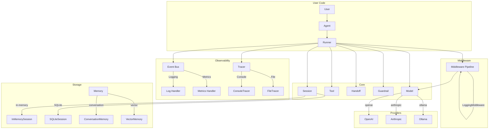
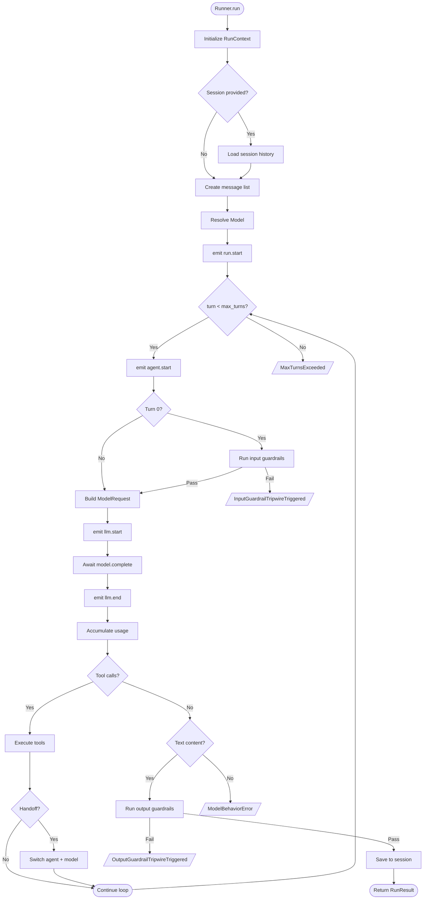
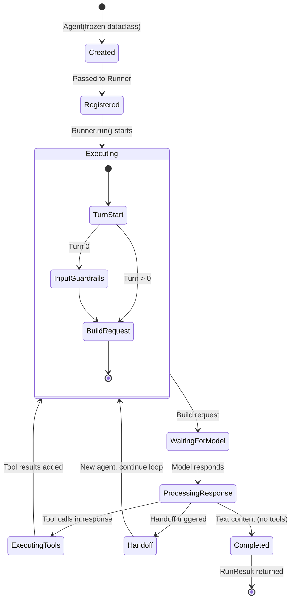
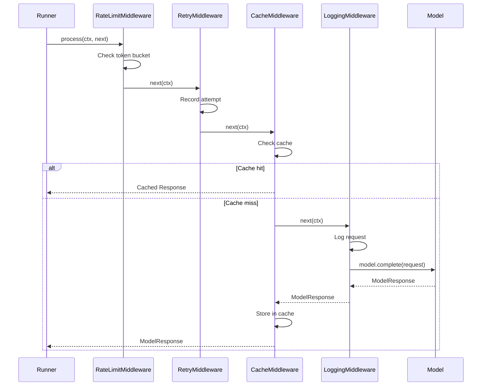
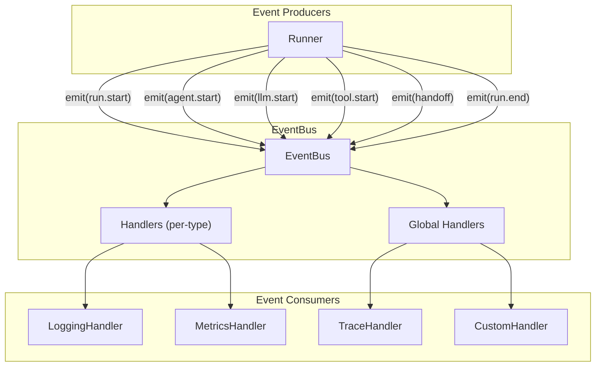
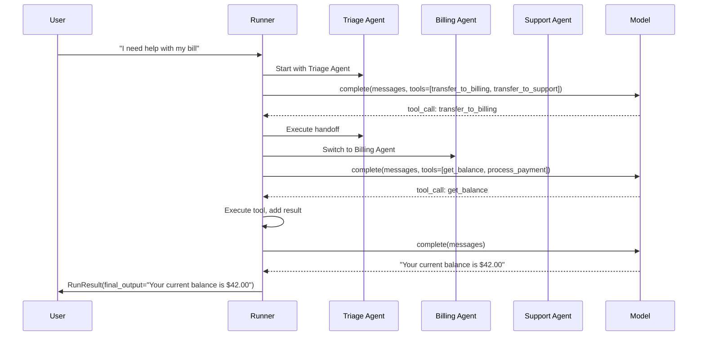
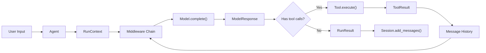
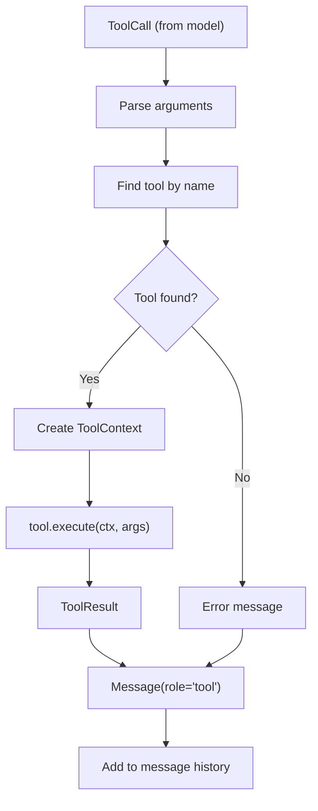

# Architecture Guide

Deep dive into the Flux Agents architecture.

This document explains the design principles, component relationships, execution flow, and extension points of the Flux framework. It is intended for contributors who want to understand the internals before making changes.

---

## Design Principles

Flux Agents is built on six core design principles that guide every architectural decision.

### 1. Protocol over ABC

All major interfaces (`Model`, `Tool`, `Session`, `Memory`, `Span`, `Tracer`) are defined as `typing.Protocol` classes, not abstract base classes. This enables structural subtyping -- any object that implements the required methods satisfies the interface, without needing to inherit from a base class.

```python
from typing import Protocol, runtime_checkable

@runtime_checkable
class Tool(Protocol):
    @property
    def name(self) -> str: ...

    @property
    def description(self) -> str: ...

    @property
    def parameters_schema(self) -> dict[str, Any]: ...

    async def execute(self, ctx: ToolContext, args: dict[str, Any]) -> ToolResult: ...
```

**Why**: Protocols decouple the framework from concrete implementations. You can wrap any existing function as a tool, use any HTTP client as a model provider, and store sessions in any backend -- all without subclassing Flux base classes.

### 2. Async-First

All I/O operations are asynchronous by default: `Runner.run()`, `Tool.execute()`, `Session.get_messages()`, `Model.complete()`, `Memory.search()`. The `Runner.run_sync()` convenience wrapper handles the async-to-sync bridge for simple use cases.

**Why**: Async enables concurrent tool execution, streaming responses, and non-blocking event emission. It also makes Flux natural to integrate with web frameworks (FastAPI, Starlette) that are async-native.

### 3. Zero Core Dependencies

The `flux` package itself has no required third-party dependencies. Provider libraries (`openai`, `anthropic`, `aiohttp`) and optional features (`numpy` for vector memory) are declared as optional extras in `pyproject.toml`.

**Why**: Zero core dependencies minimize installation friction, avoid version conflicts, and keep the framework lightweight. Users install only what they need.

### 4. Middleware over Hooks

Request processing is handled through a middleware pipeline rather than callback hooks. Each middleware wraps the next, forming a chain that can inspect, modify, or short-circuit requests.

```python
@runtime_checkable
class Middleware(Protocol):
    async def process(self, ctx: RequestContext, next: NextFn) -> Response:
        ...
```

**Why**: Middleware is composable, testable, and predictable. The洋葱 (onion) model makes it clear in what order logic executes, unlike scattered hooks that can interact in unpredictable ways.

### 5. Immutable Agents

`Agent` is a frozen dataclass. To modify an agent, use `.clone()` which returns a new instance with the specified fields overridden.

```python
@dataclass(frozen=True)
class Agent:
    name: str
    instructions: str | Callable[..., str] = ""
    model: str | Model | None = None
    tools: tuple[Tool, ...] = ()
    handoffs: tuple[Handoff | Agent, ...] = ()
    guardrails: tuple[InputGuardrail | OutputGuardrail, ...] = ()
    ...

    def clone(self, **kwargs: Any) -> Agent:
        return replace(self, **kwargs)
```

**Why**: Immutability eliminates shared-state bugs in multi-agent systems. Handoffs between agents don't risk mutation of the original agent definition. `tuple` (not `list`) for collections reinforces this guarantee.

### 6. Event-Driven Observability

The `EventBus` decouples observability from execution logic. Framework components emit events (`agent.start`, `llm.end`, `tool.start`, etc.) without knowing who is listening.

```python
bus = get_event_bus()
bus.on("tool.start", my_handler)
bus.emit(Event(type="tool.start", data={"tool": "search"}))
```

**Why**: Events enable logging, metrics, tracing, and alerting without modifying framework internals. Subscribers can be added or removed independently.

---

## Component Relationships



### Component Descriptions

| Component | File | Role |
|---|---|---|
| **Agent** | `agent.py` | Immutable definition: name, instructions, tools, handoffs, guardrails, model |
| **Runner** | `runner.py` | Execution engine: orchestrates the agent loop, tool calls, handoffs, guardrails |
| **Model** | `models/base.py` | Protocol for LLM providers: `complete()` and `stream()` |
| **Tool** | `tools/base.py` | Protocol for executable tools: `name`, `description`, `parameters_schema`, `execute()` |
| **Handoff** | `handoffs/handoff.py` | Agent-to-agent routing with conditional transfer |
| **Guardrail** | `guardrails/base.py` | Input/output safety checks that can block content |
| **Middleware** | `middleware/base.py` | Composable request processing pipeline |
| **Session** | `sessions/base.py` | Protocol for conversation persistence |
| **Memory** | `memory/base.py` | Protocol for long-term knowledge storage |
| **EventBus** | `events/bus.py` | Decoupled pub/sub for observability |
| **Tracer** | `tracing/base.py` | Protocol for distributed tracing spans |
| **RunContext** | `context.py` | Typed context carried through a run (usage, turn count, metadata) |

---

## Execution Flow

The `Runner.run()` method is the heart of the framework. Here is the detailed execution flow:

### Step-by-Step Walkthrough

1. **Initialize**: Create `RunContext`, load session history, resolve the model from the registry
2. **Emit `run.start`**: Signal the beginning of the run
3. **Enter turn loop** (up to `max_turns`):
    1. Emit `agent.start`
    2. **Input guardrails** (turn 0 only): Run all `InputGuardrail` instances against the user input. Raise `InputGuardrailTripwireTriggered` if any fail.
    3. **Build request**: Construct `ModelRequest` from messages, system prompt, tool definitions, and model settings
    4. Emit `llm.start`
    5. **Call model**: `await model.complete(request)`
    6. Emit `llm.end`
    7. **Accumulate usage**: Add response token counts to total usage
    8. **Process response**:
        - **If tool calls present**: Execute each tool, check for handoffs, append tool result messages, continue loop
        - **If handoff triggered**: Switch to target agent, resolve new model, continue loop
        - **If text content**: Run output guardrails, save to session, return `RunResult`
        - **If empty**: Raise `ModelBehaviorError`
4. **Exceeded max turns**: Raise `MaxTurnsExceeded`
5. **Finally**: Emit `run.end`

### Execution Flow Diagram



---

## Mermaid Diagrams

### 1. Framework Architecture Overview

```mermaid
graph LR
    subgraph "User-Facing API"
        A[Agent]
        R[Runner]
        T1[@tool decorator]
    end

    subgraph "Core Engine"
        RC[RunContext]
        TC[ToolContext]
        CFG[FluxConfig]
    end

    subgraph "Provider Layer"
        M[Model Protocol]
        MR[ModelRegistry]
        OAI[OpenAI]
        ANT[Anthropic]
        OLL[Ollama]
    end

    subgraph "Extension Points"
        MW[Middleware]
        GR[Guardrails]
        HO[Handoffs]
        EB[EventBus]
        TR[Tracer]
    end

    subgraph "Storage"
        SS[Session]
        MEM[Memory]
    end

    A --> R
    R --> RC
    R --> TC
    R --> CFG
    R --> M
    M --> MR
    MR --> OAI
    MR --> ANT
    MR --> OLL
    R --> MW
    A --> GR
    A --> HO
    R --> EB
    R --> TR
    R --> SS
    A --> MEM
```

### 2. Agent Lifecycle



### 3. Middleware Pipeline



### 4. Event Bus



### 5. Multi-Agent Handoff Flow



---

## Data Flow

### Request Lifecycle



### Message Types

Messages flow through the system in a structured format:

| Role | Source | Description |
|---|---|---|
| `user` | User input | The user's message |
| `assistant` | Model response | Model text or tool call requests |
| `tool` | Tool execution | Tool results returned to the model |
| `system` | Agent instructions | System prompt (sent separately in `ModelRequest`) |

### Tool Execution Flow



---

## Extension Points

Flux is designed to be extended at every layer. Here are the primary extension points:

### Custom Model Providers

Implement the `Model` protocol to add support for any LLM provider:

```python
from flux import Model, ModelRequest, ModelResponse, StreamChunk

class MyCustomProvider:
    async def complete(self, request: ModelRequest) -> ModelResponse:
        # Call your LLM API
        ...

    async def stream(self, request: ModelRequest) -> AsyncIterator[StreamChunk]:
        # Stream your LLM response
        ...
        yield
```

Register it in the `ModelRegistry` or pass directly to `Runner.run(model=...)`.

### Custom Tools

Implement the `Tool` protocol or use the `@tool` decorator:

```python
# Protocol implementation
class MyTool:
    @property
    def name(self) -> str:
        return "my_tool"

    @property
    def description(self) -> str:
        return "Does something useful"

    @property
    def parameters_schema(self) -> dict:
        return {"type": "object", "properties": {"query": {"type": "string"}}}

    async def execute(self, ctx: ToolContext, args: dict) -> ToolResult:
        result = await do_something(args["query"])
        return ToolResult(output=result)

# Or using @tool decorator
from flux import tool

@tool(description="Does something useful")
async def my_tool(ctx: ToolContext, query: str) -> str:
    return await do_something(query)
```

### Custom Middleware

Implement the `Middleware` protocol to add cross-cutting concerns:

```python
from flux import Middleware, RequestContext, Response, NextFn

class ProfilingMiddleware:
    """Measures execution time of each request."""

    async def process(self, ctx: RequestContext, next: NextFn) -> Response:
        start = time.monotonic()
        response = await next(ctx)
        elapsed = time.monotonic() - start
        logger.info("Request took %.3fs", elapsed)
        return response
```

### Custom Guardrails

Subclass `InputGuardrail` or `OutputGuardrail`:

```python
from flux import InputGuardrail, GuardrailResult

class ContentLengthGuardrail(InputGuardrail):
    @property
    def name(self) -> str:
        return "content_length"

    async def check(self, user_input: str, context=None) -> GuardrailResult:
        if len(user_input) > 5000:
            return GuardrailResult(
                passed=False,
                message="Input too long",
            )
        return GuardrailResult(passed=True)
```

### Custom Session Backends

Implement the `Session` protocol for any storage backend:

```python
from flux import Session

class RedisSession:
    def __init__(self, redis_client, session_id: str):
        self._redis = redis_client
        self._session_id = session_id

    @property
    def session_id(self) -> str:
        return self._session_id

    async def get_messages(self, limit=None):
        # Fetch from Redis
        ...

    async def add_messages(self, messages):
        # Store to Redis
        ...

    async def clear(self):
        # Clear from Redis
        ...
```

### Custom Tracers

Implement the `Tracer` and `Span` protocols for any tracing backend:

```python
from flux import Tracer, Span

class OTelTracer:
    """OpenTelemetry tracer integration."""

    def start_span(self, name, attributes=None):
        # Create an OpenTelemetry span
        ...

    def flush(self):
        # Flush pending spans
        ...
```

### Custom Event Handlers

Subscribe to the event bus for custom observability:

```python
from flux import get_event_bus, Event

bus = get_event_bus()

# Per-event handler
def on_tool_start(event: Event):
    metrics.increment("tool.invocations", tags={"tool": event.data["tool"]})

bus.on("tool.start", on_tool_start)

# Global handler (all events)
def audit_log(event: Event):
    audit_logger.log(event.type, event.data, event.timestamp)

bus.on_all(audit_log)
```

### Custom Memory Backends

Implement the `Memory` protocol for any knowledge store:

```python
from flux import Memory, MemoryEntry

class PineconeMemory:
    async def search(self, query: str, limit: int = 5) -> list[MemoryEntry]:
        # Query Pinecone index
        ...

    async def store(self, content: str, metadata=None) -> None:
        # Upsert to Pinecone
        ...

    async def clear(self):
        # Delete all vectors
        ...
```

---

## Summary

| Principle | Implementation | File |
|---|---|---|
| Protocol over ABC | `typing.Protocol` for all interfaces | `models/base.py`, `tools/base.py`, `sessions/base.py`, `memory/base.py`, `tracing/base.py`, `middleware/base.py` |
| Async-first | All I/O is `async/await` | `runner.py`, every tool/session/model implementation |
| Zero core deps | Optional extras only | `pyproject.toml` |
| Middleware over hooks | `Middleware.process(ctx, next)` chain | `middleware/base.py` |
| Immutable agents | `frozen=True` dataclass + `.clone()` | `agent.py` |
| Event-driven | `EventBus.emit()` / `.on()` | `events/bus.py` |
