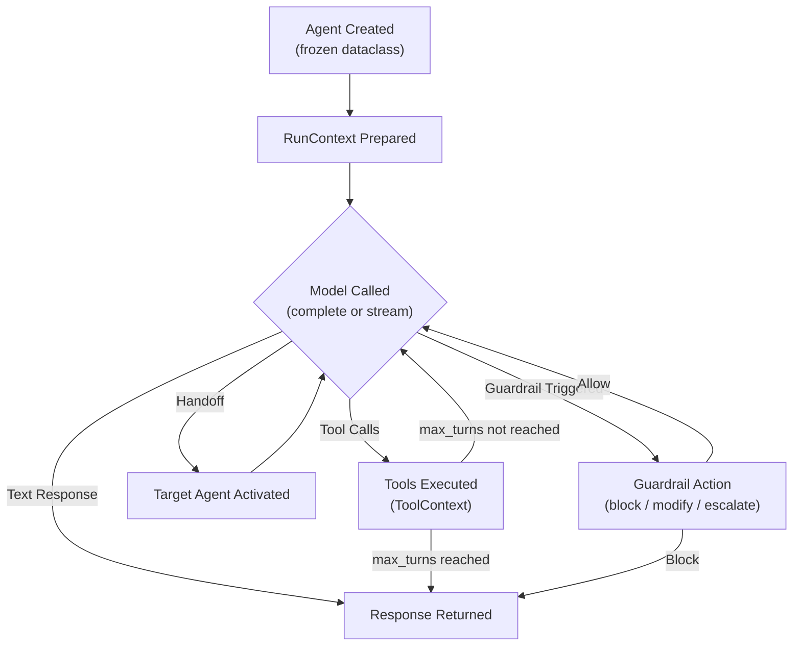

# Agents

Understanding the Agent abstraction -- the core building block of Flux.

---

## Overview

The **Agent** is the central abstraction in Flux. It represents an AI entity that can follow instructions, use tools, hand off to other agents, and enforce guardrails -- all configured through a single, immutable dataclass.

Every interaction in Flux begins with an Agent. Whether you are building a simple question-answering bot or a complex multi-agent system, you define your behavior through one or more Agent instances.

---

## The Agent Dataclass

Agent is a **frozen (immutable) dataclass** defined in `flux/agent.py`:

```python
from dataclasses import dataclass, field, replace
from flux.agent import Agent, AgentSettings

@dataclass(frozen=True)
class Agent:
    name: str
    instructions: str | Callable[..., str] = ""
    model: str | Model | None = None
    tools: tuple[Tool, ...] = ()
    handoffs: tuple[Handoff | Agent, ...] = ()
    guardrails: tuple[InputGuardrail | OutputGuardrail, ...] = ()
    output_type: type | None = None
    settings: AgentSettings = field(default_factory=AgentSettings)
```

Every field is defined at construction time. Once created, an Agent cannot be mutated -- you use `clone()` to create modified copies.

---

## Creating Agents

### Minimal Agent

The simplest agent requires only a name:

```python
from flux.agent import Agent

agent = Agent(name="greeter")
```

### Agent with Instructions

Pass a static instruction string to guide the agent's behavior:

```python
agent = Agent(
    name="assistant",
    instructions="You are a helpful assistant. Be concise and accurate.",
)
```

### Fully Configured Agent

Combine tools, model selection, handoffs, guardrails, and settings:

```python
from flux.agent import Agent, AgentSettings
from flux.tools import tool
from flux.models import ModelSettings

@tool
def get_weather(city: str) -> str:
    """Get the current weather for a city."""
    return f"Sunny, 22C in {city}"

agent = Agent(
    name="weather_bot",
    instructions="You help users check the weather.",
    model="ollama/llama3.2",
    tools=(get_weather,),
    settings=AgentSettings(
        max_turns=5,
        model_settings=ModelSettings(temperature=0.7),
    ),
)
```

---

## Static vs Dynamic Instructions

Agent instructions can be either a **static string** or a **callable** that receives a `RunContext` and returns a string dynamically.

### Static Instructions

```python
agent = Agent(
    name="analyst",
    instructions="You are a data analyst. Always respond with JSON.",
)
```

### Dynamic Instructions (Callable)

Use a callable when instructions depend on runtime context -- for example, user identity, session state, or external configuration:

```python
from flux.context import RunContext

def dynamic_instructions(ctx: RunContext | None) -> str:
    user_name = ctx.user_context if ctx else "Guest"
    return f"You are a helpful assistant for {user_name}. Be friendly and precise."

agent = Agent(
    name="personal_assistant",
    instructions=dynamic_instructions,
)
```

The `get_instructions()` method resolves both forms transparently:

```python
# Resolves static string or calls the callable
instructions = agent.get_instructions(context=run_context)
```

---

## Model Assignment

The `model` field accepts three forms:

| Type | Example | Description |
|---|---|---|
| `str` | `"ollama/llama3.2"` | Resolved via the `ModelRegistry` prefix matching |
| `Model` | `OpenAIModel(model="gpt-4o-mini")` | A provider instance directly |
| `None` | `None` (default) | Falls back to the configuration default model |

```python
from flux.models import OllamaModel, OpenAIModel, AnthropicModel

# String-based resolution
agent_a = Agent(name="a", model="ollama/llama3.2")

# Direct provider instance
agent_b = Agent(name="b", model=OpenAIModel(model="gpt-4o-mini"))

# Explicit provider
agent_c = Agent(name="c", model=AnthropicModel(model="claude-sonnet-4-20250514"))

# Use config default
agent_d = Agent(name="d", model=None)
```

---

## Tools, Handoffs, and Guardrails

All three are stored as **tuples**, making them immutable and hashable:

```python
agent = Agent(
    name="supervisor",
    tools=(tool_a, tool_b),             # Tools this agent can invoke
    handoffs=(agent_a, handoff_to_b),   # Agents or Handoff objects to transfer to
    guardrails=(input_guardrail,),      # Input and output guardrails
)
```

Because tuples are immutable, you cannot append directly. Use `clone()` to add or remove items:

```python
agent_with_tool = agent.clone(tools=agent.tools + (new_tool,))
agent_without_handoff = agent.clone(handoffs=agent.handoffs[:1])
```

---

## Immutability and `clone()`

Agent is **frozen**, meaning attribute assignment raises `FrozenInstanceError`:

```python
agent = Agent(name="test")
agent.name = "other"  # raises dataclasses.FrozenInstanceError
```

Instead, use `clone()` to produce a modified copy:

```python
# Create a variant with different instructions
variant = agent.clone(
    name="test_v2",
    instructions="You are a stricter version of the assistant.",
)

# Add a tool to an existing agent
agent_with_tools = agent.clone(
    tools=agent.tools + (new_tool,),
)

# Change model settings
agent低成本 = agent.clone(
    settings=AgentSettings(
        max_turns=3,
        model_settings=ModelSettings(temperature=0.0),
    ),
)
```

Under the hood, `clone()` uses `dataclasses.replace()`:

```python
def clone(self, **kwargs: Any) -> Agent:
    return replace(self, **kwargs)
```

---

## Agent Settings

The `AgentSettings` dataclass controls agent-level runtime behavior:

```python
@dataclass
class AgentSettings:
    max_turns: int = 10
    model_settings: ModelSettings = field(default_factory=ModelSettings)
```

### `max_turns`

Limits the number of agent turns (model call + tool execution cycles) in a single run. This prevents infinite loops when an agent repeatedly calls tools.

```python
settings = AgentSettings(max_turns=20)  # Allow up to 20 turns
```

### `model_settings`

A `ModelSettings` instance that controls generation parameters:

```python
from flux.models import ModelSettings

settings = AgentSettings(
    max_turns=10,
    model_settings=ModelSettings(
        temperature=0.7,
        top_p=0.9,
        max_tokens=2048,
    ),
)
```

`ModelSettings` supports these fields:

| Field | Type | Description |
|---|---|---|
| `temperature` | `float` | Sampling temperature |
| `top_p` | `float` | Nucleus sampling threshold |
| `max_tokens` | `int` | Maximum tokens in response |
| `frequency_penalty` | `float` | Penalize frequent tokens |
| `presence_penalty` | `float` | Penalize repeated tokens |
| `stop` | `list[str]` | Stop sequences |
| `seed` | `int` | Random seed for reproducibility |
| `tool_choice` | `str \| dict` | Force or disable tool use |
| `parallel_tool_calls` | `bool` | Allow parallel tool calls |
| `extra` | `dict` | Provider-specific overrides |

---

## Agent Lifecycle

The following diagram shows how an Agent moves through a Flux run:



---

## Handoffs Between Agents

Agents can hand off control to other agents, enabling multi-agent orchestration:

```python
from flux.handoffs import Handoff

triage = Agent(
    name="triage",
    instructions="Route the user to the right specialist.",
    handoffs=(billing_agent, technical_agent),
)

billing_agent = Agent(
    name="billing",
    instructions="You handle billing inquiries only.",
)

technical_agent = Agent(
    name="technical",
    instructions="You handle technical support only.",
)
```

When the triage agent decides the user needs billing help, it hands off to `billing_agent`, which takes over the conversation with its own instructions and tools.

---

## Structured Output

Use `output_type` to request structured responses from the agent:

```python
from dataclasses import dataclass

@dataclass
class WeatherReport:
    city: str
    temperature: int
    condition: str

agent = Agent(
    name="weather_reporter",
    instructions="Generate weather reports as structured data.",
    output_type=WeatherReport,
)
```

When `output_type` is set, the runner validates the model's response against the provided schema.

---

## Best Practices

!!! tip "Keep agents focused"
    Give each agent a single responsibility. An agent that tries to do everything will have diluted instructions and poor performance. Use handoffs to compose specialized agents.

!!! tip "Use dynamic instructions for personalization"
    When the same agent serves different users or contexts, use a callable for `instructions` to inject context-specific behavior.

!!! tip "Set max_turns defensively"
    Always consider setting `max_turns` on agents that use tools. A low limit (5-10) prevents runaway loops; a higher limit (15-20) is suitable for complex multi-step tasks.

!!! tip "Prefer clone() over recreation"
    When you need a variant of an existing agent, use `clone()` rather than constructing a new Agent from scratch. This ensures you only change the fields you intend to.

!!! tip "Use tuples, not lists"
    Tools, handoffs, and guardrails are tuples by design. Build them incrementally with concatenation:

    ```python
    tools = (tool_a,)
    tools = tools + (tool_b,)  # Not tools.append()
    ```

!!! warning "Frozen means frozen"
    Agent instances cannot be modified after creation. If you find yourself wanting to mutate an agent, you likely need `clone()` instead.

---

## See Also

- [Tools](tools.md) -- Extending agent capabilities with function calling
- [Providers](providers.md) -- LLM provider architecture and model configuration
- [Sessions](sessions.md) -- Conversation persistence for multi-turn interactions
- [Handoffs](handoffs.md) -- Multi-agent orchestration patterns
- [Guardrails](guardrails.md) -- Input and output validation
