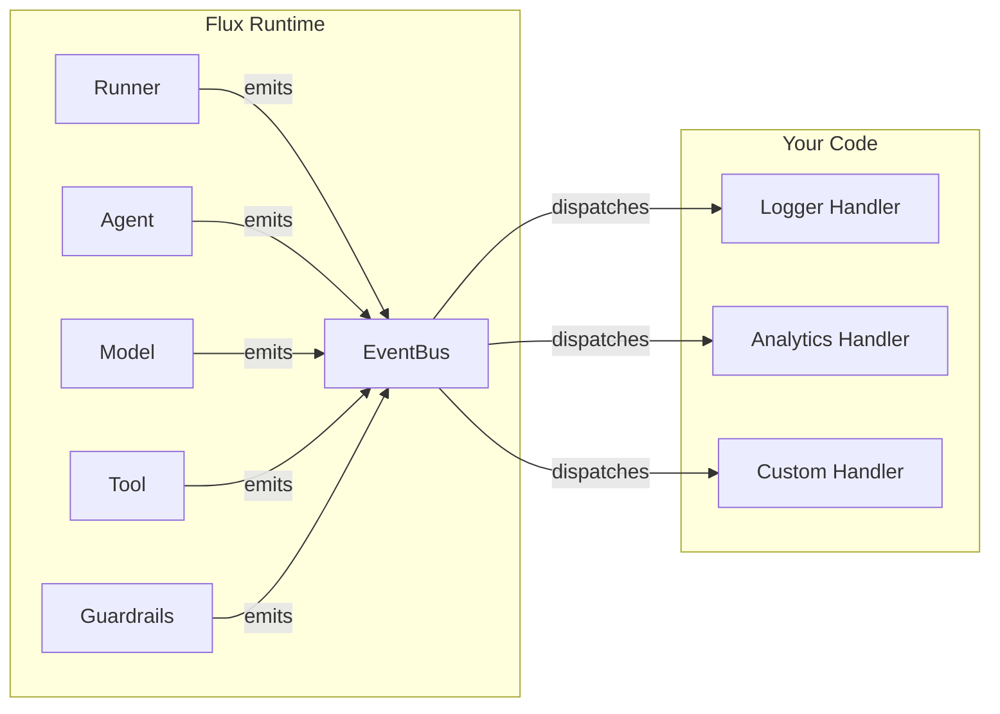
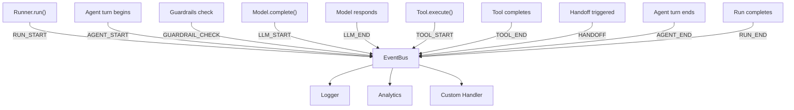

# Events

Event-driven architecture for decoupled observability.

Flux uses an event bus to broadcast lifecycle events throughout the agent execution pipeline. Any code -- logging, analytics, monitoring, custom hooks -- can subscribe to events without coupling to the Runner or Agent internals. This keeps your cross-cutting concerns cleanly separated from your agent logic.

---

## Event System Overview



The event bus is the central nervous system of Flux's observability layer. Instead of hardcoding callbacks into the Runner, Flux emits `Event` objects to a global `EventBus`. Your code subscribes to the events it cares about and ignores the rest.

---

## Event Type Constants

Flux defines these event type constants for use with the event bus:

| Constant | Value | When Emitted |
|----------|-------|--------------|
| `AGENT_START` | `"agent.start"` | An agent begins processing a turn |
| `AGENT_END` | `"agent.end"` | An agent finishes processing a turn |
| `LLM_START` | `"llm.start"` | A request is sent to the model provider |
| `LLM_END` | `"llm.end"` | A response is received from the model provider |
| `TOOL_START` | `"tool.start"` | A tool begins execution |
| `TOOL_END` | `"tool.end"` | A tool finishes execution |
| `HANDOFF` | `"handoff"` | Control is transferred between agents |
| `GUARDRAIL_CHECK` | `"guardrail.check"` | A guardrail check is about to run |
| `GUARDRAIL_TRIGGERED` | `"guardrail.triggered"` | A guardrail blocked input or output |
| `STREAM_CHUNK` | `"stream.chunk"` | A streaming response chunk arrives |
| `RUN_START` | `"run.start"` | `Runner.run()` begins |
| `RUN_END` | `"run.end"` | `Runner.run()` completes |

```python
from flux.events import (
    AGENT_START, AGENT_END,
    LLM_START, LLM_END,
    TOOL_START, TOOL_END,
    HANDOFF,
    GUARDRAIL_CHECK, GUARDRAIL_TRIGGERED,
    STREAM_CHUNK,
    RUN_START, RUN_END,
)
```

---

## Event Dataclass

Every event is a frozen (immutable) dataclass:

```python
from dataclasses import dataclass, field
import time

@dataclass(frozen=True)
class Event:
    type: str
    data: dict[str, Any] = field(default_factory=dict)
    timestamp: float = field(default_factory=time.time)
```

- **`type`** -- The event type string (matches one of the constants above, or a custom string).
- **`data`** -- Arbitrary payload. The keys vary by event type.
- **`timestamp`** -- Unix timestamp when the event was created (auto-populated).

Because `Event` is frozen, you cannot mutate it after creation. This ensures thread safety when events are shared across handlers.

---

## EventBus API

The `EventBus` class manages subscriptions and dispatch.

### Subscribing to Specific Events

```python
from flux.events import Event, EventBus

bus = EventBus()

def on_agent_start(event: Event):
    print(f"Agent started: {event.data.get('agent')}")

bus.on("agent.start", on_agent_start)
```

### Subscribing to All Events

```python
def global_handler(event: Event):
    print(f"Event: {event.type} at {event.timestamp}")

bus.on_all(global_handler)
```

### Emitting Events

```python
from flux.events import Event

# Synchronous emission (sync handlers only)
bus.emit(Event(type="agent.start", data={"agent": "my_agent"}))

# Async emission (handles both sync and async handlers)
await bus.emit_async(Event(type="agent.start", data={"agent": "my_agent"}))
```

!!! info "emit vs emit_async"
    `emit()` calls handlers synchronously. `emit_async()` uses `asyncio.iscoroutinefunction()` to detect async handlers and `await`s them. If your handlers are coroutines, always use `emit_async`.

### Unsubscribing

```python
bus.off("agent.start", on_agent_start)
```

### Clearing All Handlers

```python
bus.clear()  # Removes all subscriptions
```

---

## Global Event Bus

Flux maintains a global event bus singleton so you can subscribe from anywhere in your application without passing references around.

```python
from flux.events import get_event_bus, set_event_bus, EventBus

# Get the default global bus
bus = get_event_bus()

# Or create and install a custom bus
custom_bus = EventBus()
set_event_bus(custom_bus)
```

!!! tip "Use the global bus for app-wide concerns"
    The global event bus is the right place to attach logging, analytics, or monitoring handlers that should receive events from any agent run in your process.

---

## Subscribing to Events

### Basic Subscription

```python
from flux.events import get_event_bus, Event

bus = get_event_bus()

def log_handoffs(event: Event):
    source = event.data.get("source")
    target = event.data.get("target")
    print(f"Handoff: {source} -> {target}")

bus.on("handoff", log_handoffs)
```

### Tracking LLM Calls

```python
from flux.events import get_event_bus, Event

bus = get_event_bus()

llm_call_count = 0

def count_llm_calls(event: Event):
    global llm_call_count
    llm_call_count += 1
    provider = event.data.get("provider", "unknown")
    model = event.data.get("model", "unknown")
    print(f"LLM call #{llm_call_count}: {provider}/{model}")

bus.on("llm.start", count_llm_calls)
```

### Monitoring Guardrails

```python
from flux.events import get_event_bus, Event

bus = get_event_bus()

def on_guardrail_triggered(event: Event):
    guardrail = event.data.get("guardrail_name", "unknown")
    reason = event.data.get("reason", "no reason provided")
    print(f"GUARDRAIL BLOCKED by {guardrail}: {reason}")

bus.on("guardrail.triggered", on_guardrail_triggered)
```

---

## Async Handlers

The event bus supports both sync and async handler functions. When using `emit_async`, async handlers are properly awaited:

```python
import asyncio
from flux.events import get_event_bus, Event

bus = get_event_bus()

# Async handler
async def async_analytics(event: Event):
    await send_to_analytics_service(event.type, event.data)

bus.on("run.end", async_analytics)

# Sync handler (also supported)
def sync_logger(event: Event):
    print(f"[{event.type}] {event.data}")

bus.on("run.start", sync_logger)
```

!!! warning "Async handlers and emit"
    If you attach an async handler, you must use `emit_async` to dispatch events. The synchronous `emit` method will not await async handlers -- they will be scheduled but may not complete before the event handler returns.

---

## Custom Events

You are not limited to the built-in event types. You can emit and subscribe to any string event type:

```python
from flux.events import get_event_bus, Event

bus = get_event_bus()

# Define your own event types
BUSINESS_METRIC = "business.metric"
USER_FEEDBACK = "user.feedback"

def on_metric(event: Event):
    metric_name = event.data.get("metric")
    value = event.data.get("value")
    print(f"Metric: {metric_name} = {value}")

bus.on(BUSINESS_METRIC, on_metric)

# Emit custom events
bus.emit(Event(type=BUSINESS_METRIC, data={"metric": "response_time", "value": 1.2}))
bus.emit(Event(type=USER_FEEDBACK, data={"rating": 5, "comment": "Great response"}))
```

---

## Event Pipeline Diagram



---

## Best Practices

**Subscribe early.** Attach your event handlers before starting agent runs. The global bus is the easiest way to ensure handlers are in place from the start.

**Keep handlers lightweight.** Event handlers run in the same async event loop as your agent. Slow handlers (e.g., network calls without `await`) will block the entire pipeline. Use `asyncio.create_task()` for fire-and-forget work that shouldn't block.

**Use the global bus for cross-cutting concerns.** Logging, metrics, and alerting belong on the global bus. Use local `EventBus` instances when you need isolated event streams for specific subsystems.

**Clean up handlers when done.** If you're building a library or long-running process that creates and destroys event handlers, call `off()` or `clear()` to prevent memory leaks.

**Leverage `data` for context.** The `data` dict on each event carries relevant context. Check the event type constants documentation for which keys are available for each event type.

**Emit custom events for your own workflow.** The event bus is not limited to Flux internals. Emit your own events to coordinate between components, track business metrics, or trigger downstream workflows.
