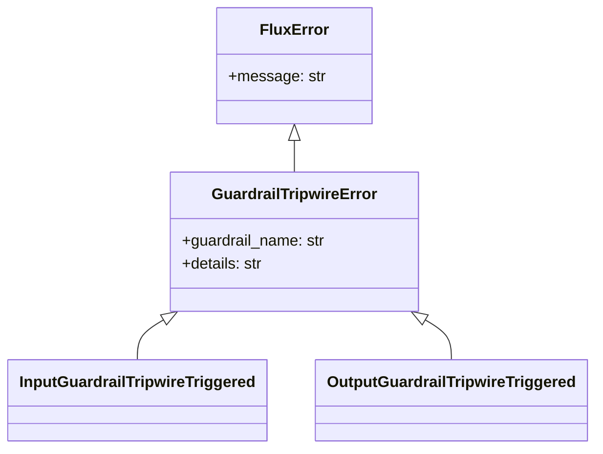
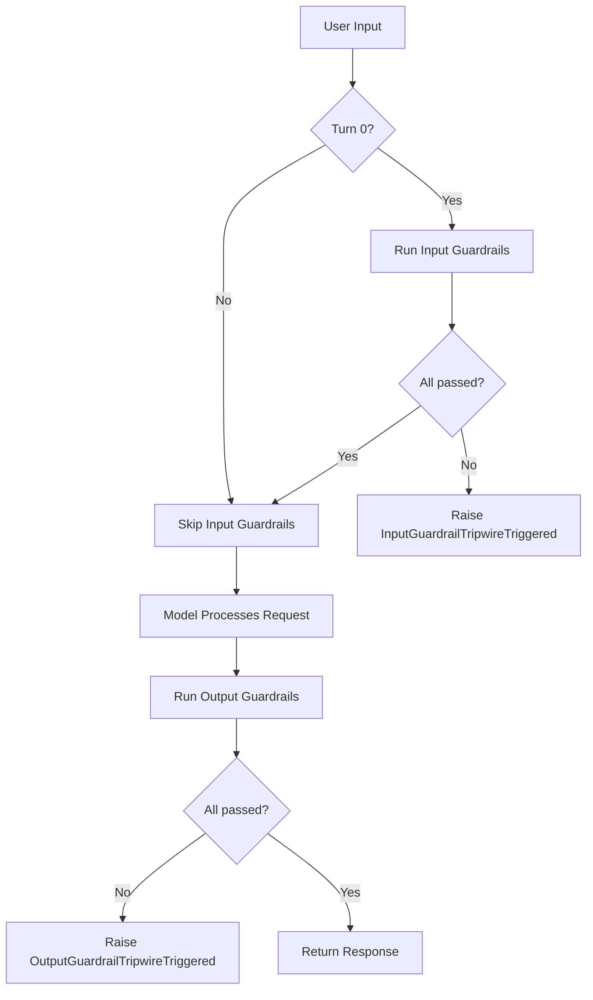

# Guardrails

Input/output validation for safe agent behavior.

Guardrails are checks that run on user input (before the model processes it) and on model output (before it is returned to the caller). They let you enforce content policies, prevent data leakage, and catch policy violations automatically. When a guardrail fails, Flux raises a specific exception so your application can handle it gracefully.

---

## Guardrail Types

Flux provides two base classes corresponding to the two validation points:

| Type | Base Class | When It Runs | `guardrail_type` |
|------|-----------|--------------|-------------------|
| Input | `InputGuardrail` | Before the model sees the user message (first turn only) | `"input"` |
| Output | `OutputGuardrail` | After the model produces a response, before it is returned | `"output"` |

```python
from flux.guardrails.base import InputGuardrail, OutputGuardrail, GuardrailResult
```

### InputGuardrail

Runs on the user's message before it is sent to the model. Use it to reject or filter inappropriate, dangerous, or off-topic input.

```python
class InputGuardrail:
    guardrail_type: str = "input"

    @property
    def name(self) -> str:
        return self.__class__.__name__

    async def check(self, user_input: str, context: Any = None) -> GuardrailResult:
        return GuardrailResult(passed=True)
```

### OutputGuardrail

Runs on the model's text response before it is returned to the caller. Use it to filter, redact, or block model output that violates your policies.

```python
class OutputGuardrail:
    guardrail_type: str = "output"

    @property
    def name(self) -> str:
        return self.__class__.__name__

    async def check(self, output: str, context: Any = None) -> GuardrailResult:
        return GuardrailResult(passed=True)
```

---

## GuardrailResult

Every `check` method returns a `GuardrailResult`:

```python
@dataclass
class GuardrailResult:
    passed: bool                            # True = input/output is acceptable
    message: str | None = None              # Human-readable explanation (on failure)
    metadata: dict[str, Any] = field(default_factory=dict)  # Additional context
```

**Success:**

```python
return GuardrailResult(passed=True)
```

**Failure:**

```python
return GuardrailResult(
    passed=False,
    message="PII detected: email, phone",
    metadata={"pii_types": ["email", "phone"]},
)
```

---

## Built-in Guardrails

### LengthGuardrail

Rejects text that exceeds a maximum character count. An `InputGuardrail` by default.

```python
from flux.guardrails import LengthGuardrail

guardrail = LengthGuardrail(max_chars=10000)
```

| Parameter | Type | Default | Description |
|-----------|------|---------|-------------|
| `max_chars` | `int` | `10000` | Maximum allowed character count |

**Check logic:**

```python
async def check(self, text: str, context=None) -> GuardrailResult:
    if len(text) > self.max_chars:
        return GuardrailResult(
            passed=False,
            message=f"Text length {len(text)} exceeds maximum {self.max_chars}",
        )
    return GuardrailResult(passed=True)
```

### ProfanityGuardrail

Checks for prohibited words using case-insensitive substring matching. An `InputGuardrail` by default.

```python
from flux.guardrails import ProfanityGuardrail

guardrail = ProfanityGuardrail(word_list=["spam", "scam", "phishing"])
```

| Parameter | Type | Default | Description |
|-----------|------|---------|-------------|
| `word_list` | `list[str] \| None` | `None` | List of prohibited words (case-insensitive) |

**Check logic:**

- Converts all text and words to lowercase.
- Returns `passed=False` if any word from the list appears as a substring in the text.
- Includes the matched word in `metadata["word"]`.

!!! tip "Word list configuration"
    Load your word list from a configuration file or database rather than hardcoding it. This lets you update the list without changing code.

### PIIGuardrail

Detects personally identifiable information (emails, phone numbers, and Social Security numbers) using regex patterns. An `InputGuardrail` by default.

```python
from flux.guardrails import PIIGuardrail

guardrail = PIIGuardrail()
```

**Detection patterns:**

| PII Type | Regex Pattern | Example Match |
|----------|--------------|---------------|
| Email | `[a-zA-Z0-9._%+-]+@[a-zA-Z0-9.-]+\.[a-zA-Z]{2,}` | `user@example.com` |
| Phone | `\b\d{3}[-.]?\d{3}[-.]?\d{4}\b` | `555-123-4567` |
| SSN | `\b\d{3}-\d{2}-\d{4}\b` | `123-45-6789` |

**Check logic:**

- Runs all three patterns against the input.
- Returns `passed=False` if any match is found.
- Lists detected PII types in the message and in `metadata["pii_types"]`.

```python
result = await guardrail.check("Contact me at john@example.com or 555-123-4567")
# result.passed = False
# result.message = "PII detected: email, phone"
# result.metadata = {"pii_types": ["email", "phone"]}
```

---

## Custom Guardrails

Create your own guardrails by subclassing `InputGuardrail` or `OutputGuardrail` and implementing the `check` method.

### Custom Output Guardrail: No Code Blocks

Prevent the model from including code blocks in its response:

```python
from flux.guardrails.base import OutputGuardrail, GuardrailResult


class NoCodeOutputGuardrail(OutputGuardrail):
    @property
    def name(self) -> str:
        return "no_code"

    async def check(self, output: str, context=None) -> GuardrailResult:
        if "```" in output:
            return GuardrailResult(
                passed=False,
                message="Code blocks not allowed in output",
            )
        return GuardrailResult(passed=True)
```

### Custom Input Guardrail: Topic Restriction

Restrict the agent to a specific topic:

```python
from flux.guardrails.base import InputGuardrail, GuardrailResult


class TopicGuardrail(InputGuardrail):
    def __init__(self, allowed_topics: list[str]) -> None:
        self.allowed_topics = [t.lower() for t in allowed_topics]

    @property
    def name(self) -> str:
        return "topic_restriction"

    async def check(self, user_input: str, context=None) -> GuardrailResult:
        input_lower = user_input.lower()
        if any(topic in input_lower for topic in self.allowed_topics):
            return GuardrailResult(passed=True)
        return GuardrailResult(
            passed=False,
            message=f"Input must be about one of: {', '.join(self.allowed_topics)}",
        )
```

### Custom Guardrail with Metadata

Use the `metadata` dict to pass structured information about what was detected:

```python
import re
from flux.guardrails.base import InputGuardrail, GuardrailResult


class URLGuardrail(InputGuardrail):
    _URL_RE = re.compile(r'https?://[^\s]+')

    @property
    def name(self) -> str:
        return "no_urls"

    async def check(self, user_input: str, context=None) -> GuardrailResult:
        urls = self._URL_RE.findall(user_input)
        if urls:
            return GuardrailResult(
                passed=False,
                message=f"Found {len(urls)} URL(s) in input",
                metadata={"urls": urls, "count": len(urls)},
            )
        return GuardrailResult(passed=True)
```

---

## Exception Handling

When a guardrail check fails, Flux raises a specific exception. This lets your application handle guardrail violations differently from other errors.

### InputGuardrailTripwireTriggered

Raised when an input guardrail returns `passed=False`:

```python
from flux.exceptions import InputGuardrailTripwireTriggered

try:
    result = await Runner.run(agent, "Some potentially bad input")
except InputGuardrailTripwireTriggered as e:
    print(f"Input blocked: {e.guardrail_name} -- {e.details}")
```

### OutputGuardrailTripwireTriggered

Raised when an output guardrail returns `passed=False`:

```python
from flux.exceptions import OutputGuardrailTripwireTriggered

try:
    result = await Runner.run(agent, "Tell me about PII")
except OutputGuardrailTripwireTriggered as e:
    print(f"Output blocked: {e.guardrail_name} -- {e.details}")
```

### Exception Properties

Both exceptions inherit from `GuardrailTripwireError` and expose:

| Property | Type | Description |
|----------|------|-------------|
| `guardrail_name` | `str` | The `name` property of the guardrail that triggered |
| `details` | `str` | The `message` from the `GuardrailResult` |



---

## Guardrail Flow



!!! note "Input guardrails run once"
    Input guardrails only execute on the first turn of a conversation (turn 0). This prevents repeated blocking on follow-up messages in a multi-turn session.

---

## Using Guardrails with Agents

Pass guardrails to the Agent constructor as a tuple or list:

```python
from flux import Agent
from flux.guardrails import LengthGuardrail, PIIGuardrail, ProfanityGuardrail

agent = Agent(
    name="safe_bot",
    instructions="You are a helpful assistant",
    model="qwen2:0.5b",
    guardrails=[
        LengthGuardrail(max_chars=5000),
        PIIGuardrail(),
        ProfanityGuardrail(word_list=["spam", "scam"]),
    ],
)
```

!!! info "Guardrail order"
    Guardrails execute in the order they appear in the list. The first guardrail that fails short-circuits the rest.

---

## Best Practices

**Layer your guardrails.** Use `LengthGuardrail` to catch oversized input early (cheap check), then run `PIIGuardrail` and domain-specific checks on validated input.

**Use custom guardrails for domain logic.** Built-in guardrails cover general safety. For business rules (topic restriction, format validation, compliance checks), write custom guardrails.

**Handle exceptions gracefully.** Catch `InputGuardrailTripwireTriggered` and `OutputGuardrailTripwireTriggered` in your application code to provide user-friendly error messages rather than crashing.

**Keep guardrail checks fast.** Guardrails run synchronously in the request path. Avoid network calls, database queries, or heavy computation inside `check` methods. If you need external data, load it during initialization.

**Use metadata for structured diagnostics.** Return rich metadata in `GuardrailResult` so your monitoring and logging code can categorize and analyze guardrail triggers without parsing message strings.

**Separate detection from action.** Guardrails detect violations; your application code decides what to do (log, block, redirect, sanitize). This separation makes guardrails reusable and testable.
