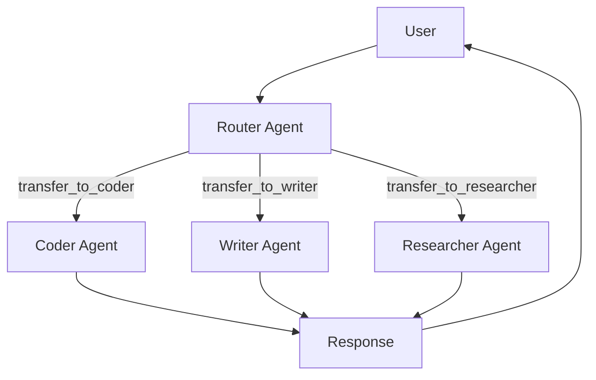
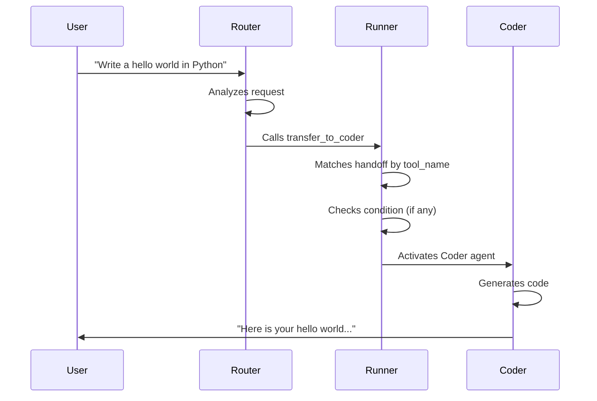

# Handoffs

Agent-to-agent routing for multi-agent systems.

Handoffs let you decompose complex tasks across specialized agents. A "router" agent receives the user's request, decides which specialist should handle it, and transfers control. The specialist processes the request and either responds directly or hands off to another agent. This pattern is fundamental to building scalable, maintainable multi-agent systems.

---

## The Handoff Concept



Each handoff is a directed edge between two agents. The source agent receives a tool (e.g., `transfer_to_coder`) that, when called, switches execution to the target agent. The Runner handles the seamless transfer of conversation context.

---

## The Handoff Dataclass

```python
from dataclasses import dataclass
from typing import Callable

@dataclass
class Handoff:
    source: Agent                                                    # Agent that initiates the handoff
    target: Agent                                                    # Agent that receives control
    description: str = ""                                            # Description shown to the model
    condition: Callable[[ToolContext, str], bool] | None = None      # Optional conditional logic
    input_filter: Callable[[HandoffData], HandoffData] | None = None # Optional input transformation

    @property
    def tool_name(self) -> str:
        """Tool name used to trigger this handoff: transfer_to_{target.name}"""
        return f"transfer_to_{self.target.name}"

    @property
    def tool_description(self) -> str:
        """Description shown to the model for this handoff tool."""
        return self.description or f"Transfer to {self.target.name}"

    def should_handoff(self, ctx: ToolContext, user_input: str) -> bool:
        """Check if handoff should trigger. Always True if no condition is set."""
        if self.condition is None:
            return True
        return self.condition(ctx, user_input)
```

### Properties

| Property | Type | Description |
|----------|------|-------------|
| `tool_name` | `str` | Auto-generated as `transfer_to_{target.name}` |
| `tool_description` | `str` | Falls back to `"Transfer to {target.name}"` if no description is provided |

### Methods

| Method | Returns | Description |
|--------|---------|-------------|
| `should_handoff(ctx, user_input)` | `bool` | Evaluates the condition callable, or returns `True` if no condition is set |

---

## Creating Handoffs

### Basic Handoff

The simplest handoff just defines a source and target:

```python
from flux import Agent
from flux.handoffs.handoff import Handoff

coder = Agent(
    name="coder",
    instructions="You write Python code. Focus on clean, correct code.",
    model="qwen2:1.5b",
)

writer = Agent(
    name="writer",
    instructions="You write clear, engaging content.",
    model="qwen2:1.5b",
)

handoff = Handoff(
    source=coder,
    target=writer,
    description="Transfer to the writer agent for content creation tasks",
)
```

### Handoff with Description

!!! tip "Write descriptive tool descriptions"
    The `description` is shown to the model as the tool definition. A clear, specific description helps the model decide when to use the handoff:

```python
handoff = Handoff(
    source=router,
    target=expert,
    description=(
        "Transfer to the expert agent when the user asks about "
        "technical architecture, system design, or infrastructure."
    ),
)
```

---

## The Router Pattern

The most common multi-agent pattern is a "router" agent whose sole job is to dispatch to specialists. The router has handoffs to each specialist but does not do any work itself.

```python
from flux import Agent, Runner
from flux.handoffs.handoff import Handoff
from flux.models.ollama import OllamaModel

model = OllamaModel(model="qwen2:1.5b")

# Specialist agents
coder = Agent(
    name="coder",
    instructions="You write Python code. Use tools when needed.",
    model=model,
)

writer = Agent(
    name="writer",
    instructions="You write clear, engaging content. Be creative.",
    model=model,
)

researcher = Agent(
    name="researcher",
    instructions="You research topics and provide accurate information.",
    model=model,
)

# Router agent
router = Agent(
    name="router",
    instructions=(
        "You are a triage agent. Analyze the user's request and transfer "
        "to the most appropriate specialist. Do not attempt to answer directly."
    ),
    model=model,
    handoffs=[
        Handoff(source=router, target=coder, description="Transfer to the coder for programming tasks"),
        Handoff(source=router, target=writer, description="Transfer to the writer for content creation"),
        Handoff(source=router, target=researcher, description="Transfer to the researcher for information gathering"),
    ],
)

# Run
result = await Runner.run(router, "Write a Python function to sort a list")
print(f"Final agent: {result.last_agent.name}")
print(f"Output: {result.final_output}")
```

!!! info "How Routing Works"
    When the router agent calls the `transfer_to_coder` tool, the Runner:

    1. Recognizes it as a handoff tool (matching `tool_name`).
    2. Checks the handoff's `condition` (if any).
    3. Applies the `input_filter` (if any) to transform the conversation.
    4. Switches the active agent to the target.
    5. Continues the run loop with the new agent.



---

## Condition-Based Handoffs

Add a `condition` callable to control when a handoff is allowed. The condition receives the `ToolContext` and the user's input text:

```python
from flux.handoffs.handoff import Handoff

def is_coding_request(ctx, user_input: str) -> bool:
    """Only hand off for coding-related requests."""
    coding_keywords = ["code", "python", "function", "script", "debug", "program"]
    return any(kw in user_input.lower() for kw in coding_keywords)

handoff = Handoff(
    source=router,
    target=coder,
    description="Transfer to the coder for programming tasks",
    condition=is_coding_request,
)
```

The condition is evaluated before the handoff executes. If it returns `False`, the handoff is skipped and the current agent continues.

### Combining Multiple Conditions

```python
def is_data_task(ctx, user_input: str) -> bool:
    keywords = ["data", "csv", "pandas", "analyze", "dataset"]
    return any(kw in user_input.lower() for kw in keywords)

def has_file_context(ctx, user_input: str) -> bool:
    # Check if context contains file information
    return ctx is not None and hasattr(ctx, "file_path")

def combined_condition(ctx, user_input: str) -> bool:
    return is_data_task(ctx, user_input) and has_file_context(ctx, user_input)

handoff = Handoff(
    source=router,
    target=data_agent,
    description="Transfer to the data agent for data analysis tasks",
    condition=combined_condition,
)
```

---

## Input Filtering

The `input_filter` callable transforms the `HandoffData` before the target agent processes it. Use this to redact information, summarize context, or reshape the conversation history.

### HandoffData

```python
@dataclass
class HandoffData:
    source_agent_name: str                      # Name of the agent handing off
    target_agent_name: str                      # Name of the agent receiving
    input_text: str                             # The user's input text
    context: dict[str, Any] = field(default_factory=dict)  # Additional context
```

### Example: Redacting Sensitive Information

```python
from flux.handoffs.handoff import Handoff, HandoffData

def redact_sensitive(data: HandoffData) -> HandoffData:
    """Redact potential secrets before handing off."""
    text = data.input_text
    # Simple redaction (replace with your actual logic)
    for keyword in ["password", "secret", "api_key", "token"]:
        text = text.replace(keyword, "[REDACTED]")
    return HandoffData(
        source_agent_name=data.source_agent_name,
        target_agent_name=data.target_agent_name,
        input_text=text,
        context=data.context,
    )

handoff = Handoff(
    source=authenticated_agent,
    target=public_agent,
    description="Transfer to public agent after removing sensitive data",
    input_filter=redact_sensitive,
)
```

### Example: Adding Context

```python
def enrich_context(data: HandoffData) -> HandoffData:
    """Add metadata about the source agent."""
    return HandoffData(
        source_agent_name=data.source_agent_name,
        target_agent_name=data.target_agent_name,
        input_text=data.input_text,
        context={
            **data.context,
            "originated_from": data.source_agent_name,
            "timestamp": time.time(),
        },
    )

handoff = Handoff(
    source=triage_agent,
    target=support_agent,
    description="Transfer to support with context",
    input_filter=enrich_context,
)
```

---

## Handoff Error Handling

If a handoff fails (e.g., the target agent is not found), Flux raises a `HandoffError`:

```python
from flux.exceptions import HandoffError

try:
    result = await Runner.run(router, "Some request")
except HandoffError as e:
    print(f"Handoff failed: {e}")
```

---

## Best Practices

!!! tip "Give the router clear instructions"
    The router's system prompt should emphasize that it should *not* try to answer questions itself -- only dispatch to specialists. Vague router prompts lead to poor routing decisions.

!!! tip "Write descriptive handoff descriptions"
    The `description` is the tool definition the model sees. Make it specific enough that the model can distinguish between similar handoffs. Bad: "Transfer to agent." Good: "Transfer to the coder agent for Python, JavaScript, or any programming task."

!!! info "Use conditions for precision"
    When multiple agents could handle similar requests, add conditions to narrow the decision space. This prevents unnecessary handoffs and reduces latency.

!!! warning "Keep handoff chains short"
    A -> B -> C is fine. A -> B -> C -> D -> E is a debugging nightmare. Prefer hub-and-spoke (router pattern) over long chains.

!!! tip "Use input filters to isolate agents"
    If the specialist agent should not see the full conversation history (for privacy, context window, or focus reasons), use `input_filter` to trim or transform the input.

!!! info "Log handoffs for observability"
    Handoff events are emitted through the event bus (event type `handoff`). Subscribe to them to track routing patterns and diagnose issues in multi-agent systems.

!!! tip "Test each agent independently"
    Before testing the full multi-agent system, verify that each specialist works correctly on its own. Handoff bugs are often really agent configuration bugs.
