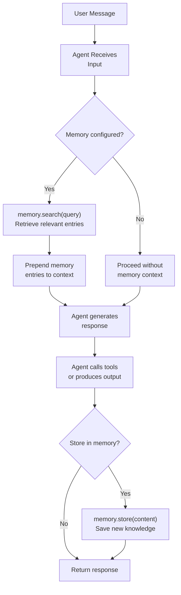

# Memory

Long-term memory with Memory protocol, ConversationMemory, and VectorMemory.

---

## Overview

While sessions store the sequential flow of a conversation, **Memory** provides semantic search and retrieval across past interactions. Memory lets an agent recall relevant information from previous conversations, user preferences, learned facts, and other stored knowledge.

Flux provides a `Memory` protocol with two built-in implementations:

- **ConversationMemory** -- searches over session message history using substring matching
- **VectorMemory** -- uses hash-based embeddings and cosine similarity for semantic search

---

## The Memory Protocol

All memory implementations satisfy the `Memory` protocol defined in `flux/memory/base.py`:

```python
from typing import Any, Protocol, runtime_checkable

@runtime_checkable
class Memory(Protocol):
    async def search(self, query: str, limit: int = 5) -> list[MemoryEntry]: ...
    async def store(self, content: str, metadata: dict[str, Any] | None = None) -> None: ...
    async def clear(self) -> None: ...
```

Three methods define the contract:

| Method | Description |
|---|---|
| `search(query, limit)` | Find relevant memories matching a query string |
| `store(content, metadata)` | Save a new memory entry |
| `clear()` | Remove all stored memories |

### MemoryEntry

The result type for memory searches:

```python
@dataclass
class MemoryEntry:
    content: str
    metadata: dict[str, Any] = field(default_factory=dict)
    score: float = 0.0
```

| Field | Description |
|---|---|
| `content` | The stored text content |
| `metadata` | Arbitrary metadata (source, timestamp, tags, etc.) |
| `score` | Relevance score (higher is more relevant, 0.0-1.0 range for cosine similarity) |

---

## ConversationMemory

A memory implementation that wraps a `Session` and searches over its message history using **substring matching**.

```python
from flux.sessions import InMemorySession
from flux.memory import ConversationMemory

session = InMemorySession()
memory = ConversationMemory(session)
```

### Usage

```python
import asyncio
from flux.sessions import InMemorySession
from flux.memory import ConversationMemory

async def main():
    session = InMemorySession()
    memory = ConversationMemory(session)

    # Store some knowledge by adding it as messages
    await memory.store("The user prefers dark mode in all applications.")
    await memory.store("Their favorite programming language is Python.")
    await memory.store("They work on a project called Flux Agents.")

    # Search for relevant memories
    results = await memory.search("programming preferences")
    # Returns entries where content contains "programming" (case-insensitive)

    for entry in results:
        print(f"{entry.content} (score: {entry.score})")
```

### How It Works

1. **Store**: Adds the content as a `user` role message to the underlying session
2. **Search**: Retrieves all messages from the session and performs case-insensitive substring matching against the query
3. **Limit**: Returns at most `limit` matching entries
4. **Clear**: Delegates to `session.clear()`, removing all session messages

### Metadata

When storing with metadata, it is attached to the message dict:

```python
await memory.store(
    "User completed the onboarding flow",
    metadata={"event": "onboarding", "timestamp": "2026-01-15"},
)

results = await memory.search("onboarding")
if results:
    print(results[0].metadata)  # {"event": "onboarding", "timestamp": "..."}
```

### Characteristics

- **Simple**: No external dependencies beyond a session
- **Exact matching**: Substring search finds literal text matches
- **Session-bound**: All memories are stored as session messages, sharing the session's lifecycle
- **No scoring**: Results are returned with `score=0.0` since substring matching does not produce relevance scores
- **Case-insensitive**: Search is lowercased for case-insensitive matching

### When to Use

- Prototyping and development
- Small memory stores where exact text matching is sufficient
- When you want memories to coexist with conversation history in the same session
- Applications that need a simple, dependency-free memory solution

---

## VectorMemory

An in-memory vector store that uses **hash-based embeddings** and **cosine similarity** for semantic search. No external embedding service is required.

```python
from flux.memory import VectorMemory

memory = VectorMemory()
```

### Usage

```python
import asyncio
from flux.memory import VectorMemory

async def main():
    memory = VectorMemory()

    # Store knowledge
    await memory.store(
        "The user prefers dark mode in all applications.",
        metadata={"category": "preferences"},
    )
    await memory.store(
        "Their favorite programming language is Python.",
        metadata={"category": "skills"},
    )
    await memory.store(
        "They are building a multi-agent system with Flux.",
        metadata={"category": "projects"},
    )
    await memory.store(
        "Their cat's name is Luna.",
        metadata={"category": "personal"},
    )

    # Semantic search
    results = await memory.search("what coding language do they like?")
    for entry in results:
        print(f"{entry.content} (score: {entry.score:.4f})")
    # The Python-related entry should rank highest
```

### How It Works

1. **Text to Vector**: Each text is converted to a 32-dimensional vector using MD5-based shingling (3-character n-grams hashed into 32 buckets)
2. **Storage**: Vectors and their corresponding `MemoryEntry` objects are stored in an in-memory list
3. **Search**: The query is converted to a vector, cosine similarity is computed against all stored vectors, and results are sorted by score (descending)
4. **Normalization**: Vectors are L2-normalized before storage and during comparison

The embedding algorithm:

```python
def _text_to_vector(text: str) -> list[float]:
    """Convert text to a 32-dimensional hash-based vector."""
    text = text.lower()
    vec = [0.0] * 32
    for i in range(len(text) - 2):
        shingle = text[i : i + 3]            # 3-char n-gram
        h = int(hashlib.md5(shingle.encode()).hexdigest(), 16)
        idx = h % 32                          # Map to one of 32 dimensions
        vec[idx] += 1.0
    norm = math.sqrt(sum(x * x for x in vec)) or 1.0
    return [x / norm for x in vec]
```

### Characteristics

- **Semantic-ish**: Catches related concepts that share common n-grams (e.g., "Python language" and "coding in Python")
- **No external dependencies**: Uses only `hashlib` and `math` from the standard library
- **In-memory only**: Data is lost when the process exits
- **Fast**: Cosine similarity over 32-dimensional vectors is O(n) where n is the number of stored entries
- **Limited fidelity**: 32 dimensions with hash-based embeddings are far less expressive than neural embeddings

### When to Use

- Prototyping semantic search without external embedding services
- Small to medium memory stores (up to thousands of entries)
- Development and testing environments
- As a fallback when real embedding services are unavailable

!!! info "Production Recommendation"
    For production use cases requiring high-fidelity semantic search, replace VectorMemory with a real embedding provider (e.g., sentence-transformers, OpenAI embeddings, or Cohere). The `Memory` protocol makes this swap straightforward.

---

## Custom Memory Implementations

Implement the `Memory` protocol for any storage backend:

```python
import chromadb
from flux.memory.base import Memory, MemoryEntry

class ChromaMemory:
    """Memory backed by ChromaDB for production vector search."""

    def __init__(self, collection_name: str = "flux_memory"):
        client = chromadb.Client()
        self._collection = client.get_or_create_collection(collection_name)

    async def search(self, query: str, limit: int = 5) -> list[MemoryEntry]:
        results = self._collection.query(
            query_texts=[query],
            n_results=limit,
        )
        entries = []
        for i, doc in enumerate(results["documents"][0]):
            score = 1.0 - results["distances"][0][i]  # Convert distance to similarity
            meta = results["metadatas"][0][i] if results["metadatas"] else {}
            entries.append(MemoryEntry(
                content=doc,
                metadata=meta,
                score=score,
            ))
        return entries

    async def store(self, content: str, metadata: dict | None = None) -> None:
        import uuid
        self._collection.add(
            documents=[content],
            metadatas=[metadata or {}],
            ids=[str(uuid.uuid4())],
        )

    async def clear(self) -> None:
        self._collection.delete(where={})  # Delete all
```

---

## Memory Flow

The following diagram shows how memory integrates with the agent lifecycle:



### Typical Integration Pattern

```python
from flux.agent import Agent
from flux.memory import ConversationMemory, VectorMemory
from flux.sessions import SQLiteSession

# Choose a memory backend
session = SQLiteSession(db_path="chat.db")
memory = ConversationMemory(session)
# or
memory = VectorMemory()

# Use in a custom runner or middleware to inject
# relevant memories into the agent's context
relevant = await memory.search("user preferences", limit=3)
context = "\n".join(e.content for e in relevant)

agent = Agent(
    name="assistant",
    instructions=f"You are a helpful assistant.\n\nKnown facts about the user:\n{context}",
)
```

---

## ConversationMemory vs VectorMemory

| Feature | ConversationMemory | VectorMemory |
|---|---|---|
| Storage backend | Wraps a `Session` | In-memory list |
| Search method | Substring matching | Cosine similarity |
| Relevance scoring | None (`score=0.0`) | Cosine similarity (0.0-1.0) |
| Semantic search | No | Partial (n-gram based) |
| External dependencies | Requires a Session | None |
| Persistence | Depends on Session | In-memory only |
| Best for | Exact text lookup | Conceptual similarity |
| Scalability | Limited by Session | Thousands of entries |

---

## Best Practices

!!! tip "Start with ConversationMemory"
    Use `ConversationMemory` for development and prototyping. It is simple, requires no configuration, and works with any session backend. Upgrade to vector search when substring matching is not sufficient.

!!! tip "Store structured metadata"
    Attach meaningful metadata to memory entries for filtering and context:

    ```python
    await memory.store(
        "User upgraded to Pro plan",
        metadata={"event": "upgrade", "plan": "pro", "date": "2026-03-15"},
    )
    ```

!!! tip "Limit search results"
    Always set an appropriate `limit` on `search()` to control how much context is injected. Too much memory context can confuse the model and increase token costs:

    ```python
    results = await memory.search(query, limit=3)  # Usually sufficient
    ```

!!! tip "Combine session and memory"
    Use sessions for the current conversation and memory for cross-conversation knowledge. They serve complementary purposes:

    - **Session**: "What did we just discuss?"
    - **Memory**: "What do I know about this user from past interactions?"

!!! warning "VectorMemory is not production-grade"
    The hash-based embeddings in `VectorMemory` are a convenience for development. For production deployments, use a real embedding service and vector database for accurate semantic search.

!!! warning "Clear memory when appropriate"
    Implement memory clearing logic when users request it (e.g., "forget everything about me") or when data retention policies require it.

---

## See Also

- [Sessions](sessions.md) -- Conversation persistence that ConversationMemory wraps
- [Agents](agents.md) -- How agents are configured and can use memory
- [Middleware](middleware.md) -- Intercepting memory operations in the middleware pipeline
- [RAG Pipeline Guide](../guides/rag.md) -- Building retrieval-augmented generation with memory
