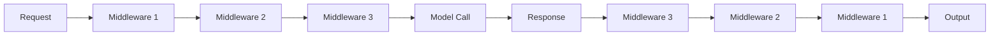
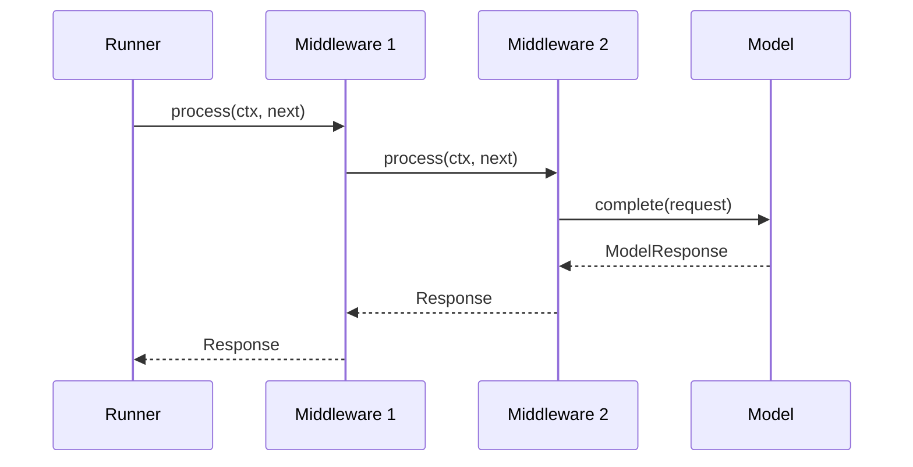
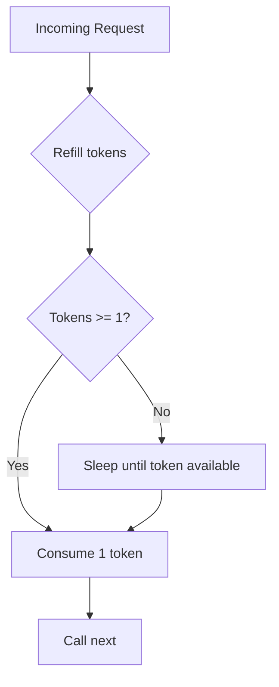
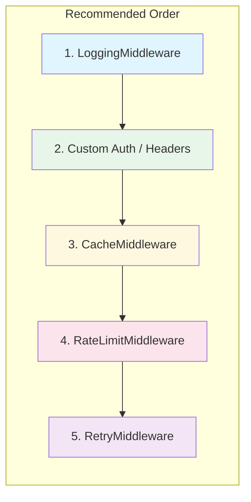

# Middleware

Composable middleware for logging, caching, retry, and rate limiting.

Flux uses a middleware pattern to intercept requests before they reach the model and responses after they return. This lets you add cross-cutting concerns -- logging, caching, rate limiting, retries -- without modifying your agent code. Middleware is composable: stack multiple layers, and they execute in order like an onion.

---

## The Middleware Protocol

Every middleware in Flux implements a single method, `process`, which receives the request context and a `next` function to call the next layer in the chain.

```python
from typing import Protocol, runtime_checkable, Awaitable, Callable
from flux.middleware import RequestContext, Response

NextFn = Callable[[RequestContext], Awaitable[Response]]

@runtime_checkable
class Middleware(Protocol):
    async def process(self, ctx: RequestContext, next: NextFn) -> Response: ...
```

Because this is a `@runtime_checkable` Protocol, any class with a matching `process` method qualifies -- no base class inheritance is required.

### RequestContext

The `RequestContext` dataclass carries information about the current request through the middleware chain:

```python
@dataclass
class RequestContext:
    agent_name: str                                      # Name of the agent handling the request
    messages: list[Any] = field(default_factory=list)    # Conversation messages
    metadata: dict[str, Any] = field(default_factory=dict)  # Arbitrary metadata
```

### Response

The `Response` dataclass represents the model's output flowing back through the chain:

```python
@dataclass
class Response:
    content: str | None = None                           # Text response content
    tool_calls: list[Any] = field(default_factory=list)  # Tool calls requested by the model
    metadata: dict[str, Any] = field(default_factory=dict)  # Arbitrary metadata
```

### NextFn

```python
NextFn = Callable[[RequestContext], Awaitable[Response]]
```

Calling `await next(ctx)` is what passes the request to the next middleware (or to the model itself if this is the last middleware). If you don't call `next`, the request short-circuits and the model is never invoked.

---

## Middleware Chain Flow

Middleware executes in list order. Each layer wraps the one after it, creating an "onion" where the request flows inward and the response flows back outward.





The key rule: **order matters**. The first middleware in the list is the outermost layer -- it sees the raw request first and the final response last.

---

## Built-in Middleware

Flux ships with four production-ready middleware implementations.

### LoggingMiddleware

Logs requests and responses using Python's standard `logging` module. Useful during development and for audit trails in production.

```python
import logging
from flux.middleware import LoggingMiddleware

middleware = LoggingMiddleware(level=logging.DEBUG)
```

**Parameters:**

| Parameter | Type | Default | Description |
|-----------|------|---------|-------------|
| `level` | `int` | `logging.DEBUG` | Log level for all middleware log messages |

**What it logs:**

- **On request:** Agent name and message count (`"Agent: my_bot, messages: 3"`)
- **On response:** First 200 characters of the response content

Both messages go to the `flux.middleware` logger, so you can configure the handler independently:

```python
import logging

logging.basicConfig(level=logging.INFO)
logger = logging.getLogger("flux.middleware")
logger.setLevel(logging.DEBUG)
```

### CacheMiddleware

Caches model responses by hashing the request context with SHA-256. Cached entries expire after a configurable TTL.

```python
from flux.middleware import CacheMiddleware

middleware = CacheMiddleware(ttl_seconds=300.0)
```

**Parameters:**

| Parameter | Type | Default | Description |
|-----------|------|---------|-------------|
| `ttl_seconds` | `float` | `300.0` | Time-to-live for cached entries in seconds |

**How it works:**

1. Generates a cache key by serializing `{agent, messages}` to JSON and taking the first 32 characters of its SHA-256 hash.
2. If a valid (non-expired) entry exists, returns it immediately -- skipping the model call.
3. Otherwise, calls `next(ctx)`, stores the response, and returns it.
4. Expired entries are evicted on access.

**Cache key derivation:**

```python
def _cache_key(self, ctx: RequestContext) -> str:
    data = json.dumps(
        {"agent": ctx.agent_name, "messages": ctx.messages},
        default=str,
        sort_keys=True,
    )
    return hashlib.sha256(data.encode()).hexdigest()[:32]
```

**Manual invalidation:**

```python
cache = CacheMiddleware(ttl_seconds=300.0)
# ... later ...
cache.clear()  # Evict all cached entries
```

!!! warning "Cache key sensitivity"
    The cache key is derived from `agent_name` and `messages` only. If your middleware adds metadata that should affect caching (like a user ID), you'll need to customize the key derivation.

### RateLimitMiddleware

Token bucket rate limiter that throttles model calls to a configured rate. Uses `asyncio.Lock` for thread safety and `time.monotonic()` for drift-free timing.

```python
from flux.middleware import RateLimitMiddleware

middleware = RateLimitMiddleware(max_per_second=10.0)
```

**Parameters:**

| Parameter | Type | Default | Description |
|-----------|------|---------|-------------|
| `max_per_second` | `float` | `10.0` | Maximum requests allowed per second |

**How it works:**

1. On each request, refills tokens based on elapsed time since the last request.
2. If at least 1 token is available, consumes it and proceeds.
3. If tokens are depleted, calculates the wait time and calls `asyncio.sleep()` until a token becomes available.



!!! tip "Production usage"
    For cloud-hosted models with strict API rate limits, set `max_per_second` slightly below the provider's actual limit to account for burst patterns. For example, if the provider allows 60 requests per minute, set `max_per_second=0.9` rather than `1.0`.

### RetryMiddleware

Retries failed requests with exponential backoff. Catches `ProviderError` and `ToolError` and retries up to the configured maximum.

```python
from flux.middleware import RetryMiddleware

middleware = RetryMiddleware(max_retries=3, backoff_base=1.0)
```

**Parameters:**

| Parameter | Type | Default | Description |
|-----------|------|---------|-------------|
| `max_retries` | `int` | `3` | Maximum number of retry attempts |
| `backoff_base` | `float` | `1.0` | Base delay in seconds for exponential backoff |

**Backoff formula:** `wait = backoff_base * (2 ** attempt)`

With the defaults, retry delays are: 1s, 2s, 4s.

**What it retries:**

| Exception | Retried? |
|-----------|----------|
| `ProviderError` | Yes |
| `ToolError` | Yes |
| Other exceptions | No (propagated immediately) |

After exhausting all retries, the last exception is re-raised.

---

## Custom Middleware

Any class with an `async def process(self, ctx, next)` method qualifies as middleware. No inheritance required.

### Timing Middleware

Measure how long each model call takes:

```python
import time
from flux.middleware import RequestContext, Response, NextFn


class TimingMiddleware:
    async def process(self, ctx: RequestContext, next: NextFn) -> Response:
        start = time.time()
        response = await next(ctx)
        elapsed = time.time() - start
        print(f"[Timing] {ctx.agent_name}: {elapsed:.2f}s")
        return response
```

### Content Filtering Middleware

Block or modify requests based on content:

```python
from flux.middleware import RequestContext, Response, NextFn


class ProfanityFilterMiddleware:
    def __init__(self, blocked_words: list[str]) -> None:
        self.blocked = {w.lower() for w in blocked_words}

    async def process(self, ctx: RequestContext, next: NextFn) -> Response:
        for msg in ctx.messages:
            if isinstance(msg, dict) and "content" in msg:
                text = msg.get("content", "").lower()
                if any(w in text for w in self.blocked):
                    return Response(content="I'm sorry, I can't process that request.")
        return await next(ctx)
```

### Metrics Middleware

Collect performance metrics for monitoring:

```python
import time
from flux.middleware import RequestContext, Response, NextFn


class MetricsMiddleware:
    def __init__(self) -> None:
        self.call_count = 0
        self.total_time = 0.0

    async def process(self, ctx: RequestContext, next: NextFn) -> Response:
        self.call_count += 1
        start = time.time()
        try:
            response = await next(ctx)
            return response
        finally:
            self.total_time += time.time() - start
```

---

## Assembling a Middleware Stack

Pass your middleware to the Agent constructor as an ordered list:

```python
from flux import Agent
from flux.middleware import (
    LoggingMiddleware,
    CacheMiddleware,
    RateLimitMiddleware,
    RetryMiddleware,
)

agent = Agent(
    name="my_bot",
    instructions="You are helpful",
    model="qwen2:0.5b",
    middleware=[
        LoggingMiddleware(),                       # Outermost: logs everything
        CacheMiddleware(ttl_seconds=60.0),          # Check cache before rate limiting
        RateLimitMiddleware(max_per_second=5.0),    # Throttle after cache miss
        RetryMiddleware(max_retries=2),             # Innermost: retry on failure
    ],
)
```

!!! note "Order matters"
    Middleware executes top-to-bottom for requests and bottom-to-top for responses. Place logging first to capture everything. Place retry closest to the model so it only retries the actual API call.

---

## Best Practices

**Keep middleware focused.** Each middleware should do one thing. A `LoggingMiddleware` logs. A `CacheMiddleware` caches. Compose them together rather than building a single middleware that does everything.

**Always call `next` unless you mean to block.** If a middleware doesn't call `await next(ctx)`, the model is never invoked. This is useful for cache hits or content filtering, but accidental omission is a common source of bugs.

**Use `metadata` for cross-middleware communication.** The `metadata` dict on `RequestContext` and `Response` lets middleware pass data without tight coupling. For example, a timing middleware can store elapsed time in `response.metadata["elapsed"]`, and a logging middleware downstream can read and log it.

**Make middleware idempotent when possible.** Middleware that modifies `ctx.messages` in-place can cause issues if the same context is reused. Prefer creating new objects over mutating existing ones.

**Handle errors gracefully.** If your middleware raises an exception, it will propagate up the chain and potentially crash the run. Wrap risky operations in try/except blocks and return sensible fallback `Response` objects.



---

## Summary

| Middleware | Purpose | Key Parameter |
|------------|---------|---------------|
| `LoggingMiddleware` | Request/response logging | `level` |
| `CacheMiddleware` | Response caching with TTL | `ttl_seconds` |
| `RateLimitMiddleware` | Token bucket rate limiting | `max_per_second` |
| `RetryMiddleware` | Exponential backoff retries | `max_retries`, `backoff_base` |
| Custom middleware | Any cross-cutting concern | Your design |
