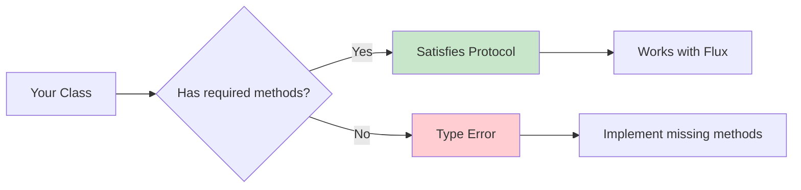

# Protocols

Structural typing and Protocol-based design throughout Flux.

Flux is built on Python's `typing.Protocol` for structural (duck) typing. Instead of requiring you to inherit from abstract base classes, Flux defines protocols -- contracts that any class can satisfy by implementing the right methods and properties. This means you can integrate third-party libraries, existing code, or your own implementations with zero inheritance and minimal boilerplate.

---

## Why Protocols over ABCs

The central design principle of Flux is **"Protocol over ABC"**. Here is why:

### Traditional Approach (ABC)

```python
from abc import ABC, abstractmethod

class Model(ABC):
    @abstractmethod
    async def complete(self, request: ModelRequest) -> ModelResponse: ...

    @abstractmethod
    async def stream(self, request: ModelRequest) -> AsyncIterator[StreamChunk]: ...

# Must inherit to satisfy the interface
class MyModel(Model):
    async def complete(self, request): ...
    async def stream(self, request): ...
        yield
```

### Flux Approach (Protocol)

```python
from typing import Protocol, runtime_checkable

@runtime_checkable
class Model(Protocol):
    async def complete(self, request: ModelRequest) -> ModelResponse: ...
    async def stream(self, request: ModelRequest) -> AsyncIterator[StreamChunk]: ...

# No inheritance needed -- just implement the methods
class MyModel:
    async def complete(self, request): ...
    async def stream(self, request): ...
        yield

# isinstance(MyModel(), Model) works at runtime
```

### Benefits

!!! info "Protocol vs ABC comparison"
    | Aspect | ABC | Protocol |
    |--------|-----|----------|
    | Inheritance required | Yes | No |
    | Can wrap third-party classes | No (without adapter) | Yes |
    | `isinstance` checks | Works | Works (`@runtime_checkable`) |
    | IDE support | Excellent | Excellent (with type checker) |
    | Coupling | Tight (must import base) | Loose (structural match) |

---

## Protocol Reference

### Model Protocol

The `Model` protocol defines how Flux interacts with LLM providers:

```python
from typing import Protocol, runtime_checkable, AsyncIterator
from flux.models.base import ModelRequest, ModelResponse, StreamChunk

@runtime_checkable
class Model(Protocol):
    async def complete(self, request: ModelRequest) -> ModelResponse:
        """Get a complete (non-streaming) response from the model."""
        ...

    async def stream(self, request: ModelRequest) -> AsyncIterator[StreamChunk]:
        """Stream a response from the model."""
        ...
        yield  # Required for async generator protocol
```

**Key types:**

- `ModelRequest` -- Contains messages, system prompt, tools, output schema, and settings.
- `ModelResponse` -- Contains content, tool calls, usage info, and finish reason.
- `StreamChunk` -- Contains delta text, optional tool call, usage, and done flag.

**Implementing a custom model:**

```python
from flux.models.base import ModelRequest, ModelResponse, StreamChunk
from flux.context import Usage

class MyCustomModel:
    """Any class with complete() and stream() satisfies Model."""

    async def complete(self, request: ModelRequest) -> ModelResponse:
        # Call your LLM here
        response_text = await my_llm_api(request.messages)
        return ModelResponse(
            content=response_text,
            usage=Usage(prompt_tokens=0, completion_tokens=0),
            finish_reason="stop",
        )

    async def stream(self, request: ModelRequest):
        chunks = await my_llm_stream(request.messages)
        for chunk in chunks:
            yield StreamChunk(
                delta_text=chunk.text,
                done=chunk.is_last,
            )
```

### Tool Protocol

The `Tool` protocol defines how agents interact with tools:

```python
from typing import Protocol, runtime_checkable
from flux.tools.base import ToolResult
from flux.context import ToolContext

@runtime_checkable
class Tool(Protocol):
    @property
    def name(self) -> str:
        """Unique name of the tool."""
        ...

    @property
    def description(self) -> str:
        """Description shown to the model."""
        ...

    @property
    def parameters_schema(self) -> dict[str, Any]:
        """JSON Schema for the tool's parameters."""
        ...

    async def execute(self, ctx: ToolContext, args: dict[str, Any]) -> ToolResult:
        """Execute the tool with the given arguments."""
        ...
```

**Implementing a custom tool:**

```python
from flux.tools.base import ToolResult
from flux.context import ToolContext

class WeatherTool:
    """Fetches weather data -- satisfies the Tool protocol."""

    @property
    def name(self) -> str:
        return "get_weather"

    @property
    def description(self) -> str:
        return "Get current weather for a city"

    @property
    def parameters_schema(self) -> dict:
        return {
            "type": "object",
            "properties": {
                "city": {"type": "string", "description": "City name"}
            },
            "required": ["city"],
        }

    async def execute(self, ctx: ToolContext, args: dict) -> ToolResult:
        city = args["city"]
        weather = await fetch_weather(city)
        return ToolResult(output=f"Weather in {city}: {weather}")
```

### Session Protocol

The `Session` protocol defines how conversation history is persisted:

```python
from typing import Protocol, runtime_checkable

@runtime_checkable
class Session(Protocol):
    @property
    def session_id(self) -> str:
        """Unique session identifier."""
        ...

    async def get_messages(self, limit: int | None = None) -> list[dict[str, Any]]:
        """Retrieve stored messages."""
        ...

    async def add_messages(self, messages: list[dict[str, Any]]) -> None:
        """Store messages."""
        ...

    async def clear(self) -> None:
        """Clear all messages."""
        ...
```

**Built-in implementations:**

- `InMemorySession` -- Ephemeral, lost on restart. Good for testing.
- `SQLiteSession` -- Persistent, survives restarts. Good for production.

**Custom session:**

```python
import redis.asyncio as redis

class RedisSession:
    """Redis-backed session -- satisfies the Session protocol."""

    def __init__(self, session_id: str, redis_url: str = "redis://localhost") -> None:
        self._session_id = session_id
        self._redis = redis.from_url(redis_url)
        self._key = f"flux:session:{session_id}"

    @property
    def session_id(self) -> str:
        return self._session_id

    async def get_messages(self, limit=None) -> list[dict]:
        messages = await self._redis.lrange(self._key, 0, -1)
        result = [json.loads(m) for m in messages]
        if limit:
            return result[-limit:]
        return result

    async def add_messages(self, messages: list[dict]) -> None:
        for msg in messages:
            await self._redis.rpush(self._key, json.dumps(msg))

    async def clear(self) -> None:
        await self._redis.delete(self._key)
```

### Memory Protocol

The `Memory` protocol defines long-term knowledge storage:

```python
from typing import Protocol, runtime_checkable
from flux.memory.base import MemoryEntry

@runtime_checkable
class Memory(Protocol):
    async def search(self, query: str, limit: int = 5) -> list[MemoryEntry]:
        """Search memory for relevant entries."""
        ...

    async def store(self, content: str, metadata: dict[str, Any] | None = None) -> None:
        """Store a memory entry."""
        ...

    async def clear(self) -> None:
        """Clear all memories."""
        ...
```

**Built-in implementations:**

- `ConversationMemory` -- Wraps a Session for conversational memory.
- `VectorMemory` -- Hash-based embedding search for semantic retrieval.

### Middleware Protocol

```python
from typing import Protocol, runtime_checkable, Callable, Awaitable

NextFn = Callable[[RequestContext], Awaitable[Response]]

@runtime_checkable
class Middleware(Protocol):
    async def process(self, ctx: RequestContext, next: NextFn) -> Response:
        """Process the request, calling next() to continue the chain."""
        ...
```

See [Middleware](middleware.md) for full details.

### Tracer Protocol

The `Tracer` protocol defines a backend for distributed tracing:

```python
from typing import Protocol, runtime_checkable

@runtime_checkable
class Tracer(Protocol):
    def start_span(self, name: str, attributes: dict[str, Any] | None = None) -> Span:
        """Start a new trace span."""
        ...

    def flush(self) -> None:
        """Flush any buffered trace data."""
        ...
```

**Built-in implementations:**

- `ConsoleTracer` -- Prints spans to stdout.
- `FileTracer` -- Writes spans as JSON lines to a file.

### Span Protocol

The `Span` protocol represents a single unit of work in a trace:

```python
@runtime_checkable
class Span(Protocol):
    @property
    def trace_id(self) -> str: ...

    @property
    def span_id(self) -> str: ...

    @property
    def name(self) -> str: ...

    def set_attribute(self, key: str, value: Any) -> None: ...
    def set_error(self, error: SpanError) -> None: ...
    def finish(self) -> None: ...

    # Context manager support
    def __enter__(self) -> Span: ...
    def __exit__(self, *args) -> None: ...
    async def __aenter__(self) -> Span: ...
    async def __aexit__(self, *args) -> None: ...
```

Spans support both sync and async context managers:

```python
# Sync usage
with tracer.start_span("my_operation") as span:
    span.set_attribute("key", "value")
    # Do work
    span.finish()

# Async usage
async with tracer.start_span("my_operation") as span:
    span.set_attribute("key", "value")
    # Do async work
    span.finish()
```

---

## Protocol Relationships

```mermaid
flowchart TD
    subgraph "Flux Protocols"
        M[Model Protocol]
        T[Tool Protocol]
        S[Session Protocol]
        ME[Memory Protocol]
        MW[Middleware Protocol]
        TR[Tracer Protocol]
        SP[Span Protocol]
    end

    subgraph "Flux Core"
        AG[Agent]
        RU[Runner]
    end

    AG -->|uses| M
    AG -->|uses| T
    AG -->|uses| MW
    RU -->|creates| S
    RU -->|uses| TR
    TR -->|creates| SP
    AG -.->|optional| ME

    subgraph "Built-in Implementations"
        M1[OllamaModel]
        M2[OpenAIModel]
        M3[AnthropicModel]
        T1[ShellTool]
        T2[FileReadTool]
        T3[FileWriteTool]
        S1[InMemorySession]
        S2[SQLiteSession]
        ME1[ConversationMemory]
        ME2[VectorMemory]
        MW1[LoggingMiddleware]
        MW2[CacheMiddleware]
        MW3[RateLimitMiddleware]
        MW4[RetryMiddleware]
        TR1[ConsoleTracer]
        TR2[FileTracer]
    end

    M1 -.->|satisfies| M
    M2 -.->|satisfies| M
    M3 -.->|satisfies| M
    T1 -.->|satisfies| T
    T2 -.->|satisfies| T
    T3 -.->|satisfies| T
    S1 -.->|satisfies| S
    S2 -.->|satisfies| S
    ME1 -.->|satisfies| ME
    ME2 -.->|satisfies| ME
    MW1 -.->|satisfies| MW
    MW2 -.->|satisfies| MW
    MW3 -.->|satisfies| MW
    MW4 -.->|satisfies| MW
    TR1 -.->|satisfies| TR
    TR2 -.->|satisfies| TR
```



---

## Structural Typing in Practice



### Duck Typing with isinstance

Because all Flux protocols use `@runtime_checkable`, you can verify protocol conformance at runtime:

```python
from flux.models.base import Model

class MyModel:
    async def complete(self, request): ...
    async def stream(self, request): ...
        yield

print(isinstance(MyModel(), Model))  # True -- no inheritance needed
```

### Integrating Third-Party Libraries

Structural typing makes it trivial to wrap existing libraries:

```python
# Wrapping the httpx library as a Session (conceptual example)
import httpx

class HTTPSession:
    """Not a real Session, but demonstrates structural typing."""

    def __init__(self, base_url: str) -> None:
        self._client = httpx.AsyncClient(base_url=base_url)
        self._session_id = "http-session"

    @property
    def session_id(self) -> str:
        return self._session_id

    async def get_messages(self, limit=None):
        resp = await self._client.get("/messages")
        return resp.json()["messages"][-limit:] if limit else resp.json()["messages"]

    async def add_messages(self, messages):
        for msg in messages:
            await self._client.post("/messages", json=msg)

    async def clear(self):
        await self._client.delete("/messages")
```

### Type Checking

For static type checking (mypy, pyright), protocols give you compile-time safety without runtime overhead:

```python
from flux.models.base import Model, ModelRequest, ModelResponse

def process_model(model: Model, request: ModelRequest) -> ModelResponse:
    """Type checkers verify that model has complete() and stream()."""
    return await model.complete(request)  # Checked at type-check time
```

---

## Best Practices

!!! tip "Implement, don't inherit"
    The whole point of protocols is that your classes don't need to know about Flux's types at import time. Just implement the methods with the right signatures and you're done.

!!! info "Use @runtime_checkable for safety"
    Flux's protocols use `@runtime_checkable` so you can verify conformance with `isinstance()` when needed. This is especially useful during debugging and testing.

!!! tip "Prefer composition over inheritance"
    Rather than subclassing `InMemorySession` to add caching, compose a new class that wraps it. This keeps your code flexible and testable.

!!! warning "Keep protocol implementations focused"
    Each class should satisfy exactly one protocol. If you find a class implementing both `Tool` and `Middleware`, it's likely doing too much.

!!! warning "Use property accessors where the protocol defines them"
    The `Tool` protocol defines `name`, `description`, and `parameters_schema` as `@property`. Use `@property` in your implementations too, not plain attributes -- this ensures `isinstance` checks work correctly with `@runtime_checkable`.

!!! tip "Document which protocols your class satisfies"
    Even though inheritance isn't required, docstrings and type annotations help other developers understand the contract:

```python
class MyTool:
    """A custom tool that satisfies the Tool protocol.

    Implements: name, description, parameters_schema, execute()
    """
```

**Leverage the no-op implementations.** Flux provides `_NoopTracer` and `_NoopSpan` internally. For your own optional subsystems, follow the same pattern -- provide a "do nothing" implementation so callers don't need null checks.
