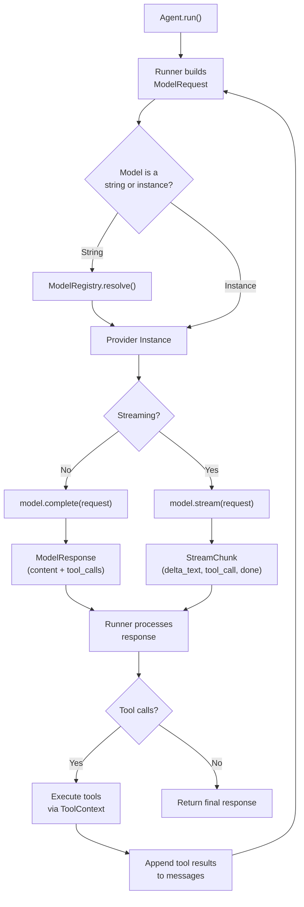

# Providers

LLM provider architecture -- Ollama, OpenAI, Anthropic, and custom providers.

---

## Overview

Flux is **provider-agnostic**. The `Model` protocol defines a common interface for interacting with any LLM provider, and Flux ships with three built-in implementations:

- **OllamaModel** -- for local models via Ollama
- **OpenAIModel** -- for OpenAI, OpenRouter, DeepSeek, Groq, and any OpenAI-compatible API
- **AnthropicModel** -- for Anthropic Claude models

Because providers are protocol-based, you can implement your own for any LLM API.

---

## The Model Protocol

All providers satisfy the `Model` protocol defined in `flux/models/base.py`:

```python
from typing import AsyncIterator, Protocol, runtime_checkable

@runtime_checkable
class Model(Protocol):
    async def complete(self, request: ModelRequest) -> ModelResponse: ...
    async def stream(self, request: ModelRequest) -> AsyncIterator[StreamChunk]: ...
```

Two methods, both async:

- **`complete()`** -- sends a request and returns the full response at once
- **`stream()`** -- sends a request and yields response chunks as they arrive

### ModelRequest

The input to any model call:

```python
@dataclass
class ModelRequest:
    messages: list[Message]
    system_prompt: str | None = None
    tools: list[ToolDef] | None = None
    output_schema: dict[str, Any] | None = None
    settings: ModelSettings = field(default_factory=ModelSettings)
    stream: bool = False
    extra: dict[str, Any] = field(default_factory=dict)
```

### ModelResponse

The output from a non-streaming call:

```python
@dataclass
class ModelResponse:
    content: str | None = None
    tool_calls: list[ToolCall] = field(default_factory=list)
    usage: Usage | None = None
    finish_reason: str | None = None
    raw: Any = None  # Provider-specific raw response
```

### StreamChunk

A single chunk from a streaming call:

```python
@dataclass
class StreamChunk:
    delta_text: str | None = None       # Incremental text content
    tool_call: ToolCall | None = None   # A completed tool call
    usage: Usage | None = None          # Token usage (usually on final chunk)
    done: bool = False                  # Whether the stream is finished
    raw: Any = None                     # Provider-specific raw chunk
```

### Supporting Types

```python
@dataclass
class Message:
    role: str                           # "system", "user", "assistant", "tool"
    content: str | None = None
    tool_call_id: str | None = None
    name: str | None = None
    tool_calls: list[ToolCall] | None = None

@dataclass
class ToolCall:
    id: str
    name: str
    arguments: str                      # JSON-encoded arguments

@dataclass
class ToolDef:
    name: str
    description: str
    parameters: dict[str, Any]          # JSON Schema
    strict: bool = True
```

---

## Provider Implementations

### OllamaModel

Connects to a local Ollama server. Ideal for development and offline use.

```python
from flux.models import OllamaModel

model = OllamaModel(
    model="llama3.2",
    base_url="http://localhost:11434",
)
```

| Parameter | Type | Default | Description |
|---|---|---|---|
| `model` | `str` | `"llama3.2"` | Ollama model name |
| `base_url` | `str` | `"http://localhost:11434"` | Ollama server URL |

**Requirements:** `aiohttp` package. Install with:

```bash
pip install flux-agents[ollama]
```

**Features:**

- Tool calling support (automatically retries without tools if the model does not support them)
- Streaming via Ollama's streaming API
- Maps `ModelSettings` to Ollama's `options` format (`temperature`, `top_p`, `num_predict`, `stop`)

### OpenAIModel

Works with OpenAI and any OpenAI-compatible API (OpenRouter, DeepSeek, Groq, etc.).

```python
from flux.models import OpenAIModel

# OpenAI direct
model = OpenAIModel(
    model="gpt-4o-mini",
    api_key="sk-...",      # or set OPENAI_API_KEY env var
)

# OpenRouter
model = OpenAIModel(
    model="meta-llama/llama-3.1-8b-instruct",
    api_key="sk-or-...",
    base_url="https://openrouter.ai/api/v1",
)

# DeepSeek
model = OpenAIModel(
    model="deepseek-chat",
    api_key="...",
    base_url="https://api.deepseek.com/v1",
)
```

| Parameter | Type | Default | Description |
|---|---|---|---|
| `model` | `str` | `"gpt-4o-mini"` | Model identifier |
| `api_key` | `str \| None` | `None` | API key (falls back to `OPENAI_API_KEY` env var) |
| `base_url` | `str \| None` | `None` | Custom API base URL |

**Requirements:** `openai` package. Install with:

```bash
pip install flux-agents[openai]
```

**Features:**

- Full tool calling support with parallel tool calls
- Streaming with tool call accumulation
- Structured output via `response_format` with JSON Schema
- Maps all `ModelSettings` fields to OpenAI parameters

### AnthropicModel

Connects to Anthropic's Claude models.

```python
from flux.models import AnthropicModel

model = AnthropicModel(
    model="claude-sonnet-4-20250514",
    api_key="sk-ant-...",  # or set ANTHROPIC_API_KEY env var
)
```

| Parameter | Type | Default | Description |
|---|---|---|---|
| `model` | `str` | `"claude-sonnet-4-20250514"` | Claude model identifier |
| `api_key` | `str \| None` | `None` | API key (falls back to `ANTHROPIC_API_KEY` env var) |

**Requirements:** `anthropic` package. Install with:

```bash
pip install flux-agents[anthropic]
```

**Features:**

- Tool calling with Anthropic's content block format
- Streaming with content block events
- System prompt handled separately (Anthropic's native format)
- Maps `ModelSettings` fields to Anthropic parameters

---

## ModelSettings

Shared configuration that applies across all providers:

```python
from flux.models import ModelSettings

settings = ModelSettings(
    temperature=0.7,
    top_p=0.9,
    max_tokens=4096,
    frequency_penalty=0.0,
    presence_penalty=0.0,
    stop=["END"],
    seed=42,
    tool_choice="auto",
    parallel_tool_calls=True,
    extra={"response_format": {"type": "json_object"}},
)
```

| Field | Type | Description |
|---|---|---|
| `temperature` | `float` | Sampling temperature (0.0-2.0) |
| `top_p` | `float` | Nucleus sampling threshold |
| `max_tokens` | `int` | Maximum tokens in response |
| `frequency_penalty` | `float` | Penalize frequent tokens |
| `presence_penalty` | `float` | Penalize repeated tokens |
| `stop` | `list[str]` | Stop sequences |
| `seed` | `int` | Random seed for reproducibility |
| `tool_choice` | `str \| dict` | Force (`"auto"`, `"none"`, or specific tool) |
| `parallel_tool_calls` | `bool` | Allow parallel tool calls |
| `extra` | `dict` | Provider-specific overrides |

Settings can be layered using the `resolve()` method, which merges non-None values from an override onto a base:

```python
base = ModelSettings(temperature=0.5, max_tokens=2048)
override = ModelSettings(temperature=1.0)
merged = base.resolve(override)
# ModelSettings(temperature=1.0, max_tokens=2048, ...)
```

---

## ModelRegistry

The `ModelRegistry` resolves model name strings to `Model` instances. It supports two resolution strategies:

### Exact Match

Register a model by its exact name:

```python
from flux.models import ModelRegistry, OpenAIModel

registry = ModelRegistry()
registry.register("gpt-4o-mini", OpenAIModel(model="gpt-4o-mini"))
registry.register("my-custom-model", MyCustomModel())

model = registry.resolve("gpt-4o-mini")  # Returns the OpenAIModel instance
```

### Prefix Matching

Register a provider by prefix. Any model name starting with `prefix/` resolves to that provider:

```python
from flux.models import OllamaModel, OpenAIModel, AnthropicModel

registry = ModelRegistry()
registry.register_provider("ollama", OllamaModel())
registry.register_provider("openai", OpenAIModel())
registry.register_provider("anthropic", AnthropicModel())

# "ollama/llama3.2" -> OllamaModel (model name is set on the provider)
model = registry.resolve("ollama/llama3.2")
model = registry.resolve("openai/gpt-4o")
model = registry.resolve("anthropic/claude-sonnet-4-20250514")
```

### Global Registry

Flux maintains a global default registry accessible via singleton functions:

```python
from flux.models.registry import get_default_registry, set_default_registry

# Get the global registry
registry = get_default_registry()

# Register providers at startup
registry.register_provider("ollama", OllamaModel(model="llama3.2"))
registry.register_provider("openai", OpenAIModel(model="gpt-4o-mini"))

# Agents using string-based model names resolve through this registry
agent = Agent(name="assistant", model="ollama/llama3.2")
```

---

## Custom Model Implementation

Implement the `Model` protocol to add support for any LLM provider:

```python
from typing import AsyncIterator
from flux.models import Model, ModelRequest, ModelResponse, StreamChunk

class MyCustomModel:
    """Custom model provider for a proprietary API."""

    def __init__(self, api_key: str, model: str = "my-model-v1") -> None:
        self.api_key = api_key
        self.model = model

    async def complete(self, request: ModelRequest) -> ModelResponse:
        # Build request for your API
        payload = self._build_payload(request)

        async with aiohttp.ClientSession() as session:
            async with session.post(
                "https://api.example.com/v1/chat",
                json=payload,
                headers={"Authorization": f"Bearer {self.api_key}"},
            ) as resp:
                data = await resp.json()

        # Parse into ModelResponse
        return ModelResponse(
            content=data["choices"][0]["message"]["content"],
            tool_calls=[],  # Parse tool calls if supported
            usage=Usage(
                input_tokens=data["usage"]["prompt_tokens"],
                output_tokens=data["usage"]["completion_tokens"],
                total_tokens=data["usage"]["total_tokens"],
            ),
        )

    async def stream(self, request: ModelRequest) -> AsyncIterator[StreamChunk]:
        payload = self._build_payload(request)

        async with aiohttp.ClientSession() as session:
            async with session.post(
                "https://api.example.com/v1/chat",
                json={**payload, "stream": True},
                headers={"Authorization": f"Bearer {self.api_key}"},
            ) as resp:
                async for line in resp.content:
                    chunk_data = json.loads(line.decode().strip())
                    yield StreamChunk(
                        delta_text=chunk_data.get("delta", ""),
                        done=chunk_data.get("done", False),
                    )

    def _build_payload(self, request: ModelRequest) -> dict:
        # Translate ModelRequest to your API format
        ...
```

Register it for use with agents:

```python
from flux.models.registry import get_default_registry

registry = get_default_registry()
registry.register_provider("custom", MyCustomModel(api_key="..."))

agent = Agent(name="agent", model="custom/my-model-v1")
```

---

## Provider Flow

The following diagram shows how a request flows from an Agent through a Provider:



---

## Choosing a Provider

| Provider | Best For | Requires |
|---|---|---|
| **OllamaModel** | Local development, privacy-sensitive workloads, offline use | `aiohttp`, running Ollama server |
| **OpenAIModel** | Production cloud deployments, OpenAI-compatible APIs | `openai` package, API key |
| **AnthropicModel** | Complex reasoning, safety-critical applications | `anthropic` package, API key |
| **Custom** | Proprietary or self-hosted models | Your own implementation |

---

## Best Practices

!!! tip "Use environment variables for API keys"
    Never hardcode API keys. The built-in providers fall back to standard environment variables:

    - `OPENAI_API_KEY` for OpenAIModel
    - `ANTHROPIC_API_KEY` for AnthropicModel

!!! tip "Leverage prefix matching for flexibility"
    Register providers by prefix so agents can switch models by changing a string, not code:

    ```python
    # Same agent, different model -- just change the string
    agent = Agent(name="assistant", model="ollama/llama3.2")
    # vs
    agent = Agent(name="assistant", model="openai/gpt-4o-mini")
    ```

!!! tip "Use ModelSettings for reproducibility"
    Set `seed` in `ModelSettings` during development for reproducible outputs. Remove it in production for natural variation.

!!! tip "Layer settings with resolve()"
    Build base settings shared across agents and override per-agent:

    ```python
    base_settings = ModelSettings(temperature=0.5, max_tokens=2048)
    creative_settings = ModelSettings(temperature=1.0)
    final = base_settings.resolve(creative_settings)
    ```

!!! warning "Handle provider errors gracefully"
    Each provider wraps errors in `ProviderError`. Catch these in your application to provide meaningful feedback rather than raw stack traces.

!!! warning "Provider-specific features"
    The `extra` field on `ModelSettings` and `ModelRequest` lets you pass provider-specific parameters. These are forwarded as-is and will cause errors with incompatible providers. Use with care.

---

## See Also

- [Agents](agents.md) -- How agents reference and use providers
- [Tools](tools.md) -- How tool calls flow through providers
- [Custom Provider Guide](../guides/custom-provider.md) -- Step-by-step guide to building a custom provider
- [Streaming Guide](../guides/streaming.md) -- Working with streaming responses
