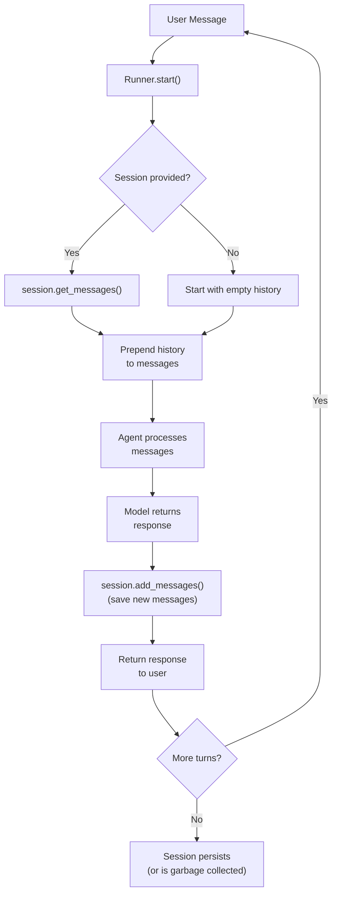

# Sessions

Conversation persistence with Session protocol, InMemorySession, and SQLiteSession.

---

## Overview

Sessions provide **conversation persistence** -- the ability to store, retrieve, and continue conversations across multiple agent runs. Without sessions, each agent call starts from scratch with no memory of prior exchanges.

Flux defines sessions through a simple `Session` protocol with two built-in implementations:

- **InMemorySession** -- fast, ephemeral, backed by a `deque`
- **SQLiteSession** -- persistent, backed by SQLite with WAL mode

---

## The Session Protocol

All session implementations satisfy the `Session` protocol defined in `flux/sessions/base.py`:

```python
from typing import Any, Protocol, runtime_checkable

@runtime_checkable
class Session(Protocol):
    @property
    def session_id(self) -> str: ...

    async def get_messages(self, limit: int | None = None) -> list[dict[str, Any]]: ...

    async def add_messages(self, messages: list[dict[str, Any]]) -> None: ...

    async def clear(self) -> None: ...
```

Four members define the contract:

| Member | Description |
|---|---|
| `session_id` | Unique identifier for this conversation |
| `get_messages(limit)` | Retrieve stored messages, optionally limited to the most recent N |
| `add_messages(messages)` | Append a list of message dicts to the session |
| `clear()` | Remove all messages from the session |

### Message Format

Messages are plain dictionaries with at minimum a `role` and `content`:

```python
{"role": "user", "content": "What is the weather?"}
{"role": "assistant", "content": "It is sunny today."}
{"role": "assistant", "content": None, "tool_calls": [{"id": "call_1", "name": "get_weather", "arguments": "..."}]}
{"role": "tool", "tool_call_id": "call_1", "content": "22C, sunny"}
```

---

## InMemorySession

A fast, ephemeral session backed by a `deque`. Messages are lost when the process exits.

```python
from flux.sessions import InMemorySession

session = InMemorySession(max_messages=1000)
```

| Parameter | Type | Default | Description |
|---|---|---|---|
| `max_messages` | `int` | `1000` | Maximum messages to retain (oldest messages are discarded) |

### Usage

```python
from flux.sessions import InMemorySession

async def main():
    session = InMemorySession()

    # Add messages
    await session.add_messages([
        {"role": "user", "content": "Hello!"},
        {"role": "assistant", "content": "Hi there! How can I help you today?"},
    ])

    # Retrieve all messages
    messages = await session.get_messages()
    # [{"role": "user", "content": "Hello!"}, {"role": "assistant", "content": "..."}]

    # Retrieve the last 5 messages
    recent = await session.get_messages(limit=5)

    # Clear the session
    await session.clear()
```

### Characteristics

- **Fast**: All operations are in-memory list operations
- **Ephemeral**: No data survives process restarts
- **Bounded**: The `max_messages` limit prevents unbounded memory growth
- **Unique ID**: Each session gets a random 16-character hex ID via `uuid.uuid4()`
- **Thread-safe for reads**: `deque` operations are atomic, but concurrent writes may need external synchronization

### When to Use

- Development and testing
- Short-lived request-response cycles
- Prototyping and experimentation
- Scenarios where conversation history is reconstructed from another source

---

## SQLiteSession

A persistent session backed by SQLite with WAL (Write-Ahead Logging) mode for concurrent read performance.

```python
from flux.sessions import SQLiteSession

session = SQLiteSession(
    db_path="flux_sessions.db",
    session_id="my-session-123",
)
```

| Parameter | Type | Default | Description |
|---|---|---|---|
| `db_path` | `str` | `"flux_sessions.db"` | Path to the SQLite database file |
| `session_id` | `str \| None` | `None` | Explicit session ID (random 16-char hex if omitted) |

### Usage

```python
from flux.sessions import SQLiteSession

async def main():
    # Create a new session
    session = SQLiteSession(db_path="conversations.db")

    # Add messages
    await session.add_messages([
        {"role": "user", "content": "Explain quantum computing."},
        {"role": "assistant", "content": "Quantum computing uses qubits..."},
    ])

    # Later, even after restart, retrieve messages
    messages = await session.get_messages()

    # Resume a specific session by ID
    resumed = SQLiteSession(
        db_path="conversations.db",
        session_id=session.session_id,
    )
    history = await resumed.get_messages()
    assert len(history) == 2

    # Clear only messages for this session
    await session.clear()
```

### Database Schema

SQLiteSession creates a `messages` table on initialization:

```sql
CREATE TABLE IF NOT EXISTS messages (
    id INTEGER PRIMARY KEY AUTOINCREMENT,
    session_id TEXT NOT NULL,
    role TEXT NOT NULL,
    content TEXT,
    metadata TEXT,           -- JSON-encoded metadata
    created_at TIMESTAMP DEFAULT CURRENT_TIMESTAMP
);

CREATE INDEX IF NOT EXISTS idx_session ON messages(session_id);
```

The `metadata` column stores arbitrary JSON data alongside messages, useful for tracking token usage, model responses, or custom application state.

### Characteristics

- **Persistent**: Data survives process restarts and system reboots
- **WAL mode**: Enables concurrent reads while writing
- **Session-scoped**: Each session_id has its own isolated message history
- **Indexed**: Fast lookups by session_id
- **Portable**: Standard SQLite file, no server required

### When to Use

- Production applications
- Multi-turn conversations that span user sessions
- Applications that need to audit or replay conversation history
- Systems where conversation state must survive restarts

---

## Multi-Turn Conversations

Sessions enable multi-turn conversations by maintaining message history across agent runs:

```python
from flux.agent import Agent
from flux.sessions import InMemorySession
from flux.runner import Runner

async def chat():
    agent = Agent(
        name="assistant",
        instructions="You are a helpful assistant.",
        model="ollama/llama3.2",
    )

    session = InMemorySession()
    runner = Runner()

    # Turn 1
    response1 = await runner.run(
        agent,
        messages=[{"role": "user", "content": "My name is Alice."}],
        session=session,
    )
    print(response1)  # "Nice to meet you, Alice!"

    # Turn 2 -- session remembers the name
    response2 = await runner.run(
        agent,
        messages=[{"role": "user", "content": "What's my name?"}],
        session=session,
    )
    print(response2)  # "Your name is Alice."

    # Turn 3 -- full history is maintained
    response3 = await runner.run(
        agent,
        messages=[{"role": "user", "content": "Summarize our conversation."}],
        session=session,
    )
```

### Session with SQLite for Persistence

```python
from flux.sessions import SQLiteSession

async def persistent_chat():
    session = SQLiteSession(db_path="chat.db", session_id="user-123")

    # First conversation
    response1 = await runner.run(agent, messages=[...], session=session)

    # Later (maybe hours or days later)...
    # Resume the same conversation
    session_resumed = SQLiteSession(db_path="chat.db", session_id="user-123")
    response2 = await runner.run(agent, messages=[...], session=session_resumed)
```

---

## Custom Session Implementations

You can implement the `Session` protocol for any storage backend:

```python
import redis.asyncio as redis
import json
import uuid
from typing import Any

class RedisSession:
    """Session backed by Redis for distributed applications."""

    def __init__(self, redis_url: str = "redis://localhost", session_id: str | None = None):
        self._session_id = session_id or uuid.uuid4().hex[:16]
        self._redis = redis.from_url(redis_url)
        self._key = f"flux:session:{self._session_id}"

    @property
    def session_id(self) -> str:
        return self._session_id

    async def get_messages(self, limit: int | None = None) -> list[dict[str, Any]]:
        raw = await self._redis.lrange(self._key, 0, -1)
        messages = [json.loads(m) for m in raw]
        if limit:
            messages = messages[-limit:]
        return messages

    async def add_messages(self, messages: list[dict[str, Any]]) -> None:
        pipe = self._redis.pipeline()
        for msg in messages:
            pipe.rpush(self._key, json.dumps(msg))
        await pipe.execute()

    async def clear(self) -> None:
        await self._redis.delete(self._key)
```

---

## Session Flow

The following diagram shows how sessions interact with the agent runner:



---

## Comparing Implementations

| Feature | InMemorySession | SQLiteSession |
|---|---|---|
| Storage | `deque` in RAM | SQLite file on disk |
| Persistence | Lost on restart | Survives restarts |
| Speed | Very fast | Fast (WAL mode) |
| Concurrency | Single-process | Multi-process safe |
| `max_messages` | Built-in via deque | No limit (query with `limit`) |
| Metadata | Not stored | Stored as JSON |
| Dependencies | None | `sqlite3` (stdlib) |
| Best for | Development, testing | Production, persistence |

---

## Best Practices

!!! tip "Use InMemorySession for development"
    Start with `InMemorySession` during development. It requires no setup and is fast. Switch to `SQLiteSession` when you need persistence.

!!! tip "Set explicit session IDs for resumption"
    When using `SQLiteSession`, pass an explicit `session_id` derived from your user or conversation identifier. This makes resumption straightforward:

    ```python
    session = SQLiteSession(db_path="chat.db", session_id=f"user-{user.id}")
    ```

!!! tip "Limit message history for long conversations"
    Use `get_messages(limit=N)` to control how much history the model sees. Long conversations can exceed context windows and increase costs:

    ```python
    messages = await session.get_messages(limit=20)
    ```

!!! tip "Clear sessions when appropriate"
    Call `session.clear()` when starting a new topic or when a conversation is explicitly reset. This keeps the context window focused.

!!! warning "InMemorySession loses data"
    Never rely on `InMemorySession` for data you cannot afford to lose. Use it only for ephemeral state.

!!! warning "SQLiteSession is single-file"
    SQLite handles most workloads well but is not ideal for extremely high write throughput. For those cases, implement a custom session with PostgreSQL, Redis, or another database.

---

## See Also

- [Agents](agents.md) -- How agents are configured and run
- [Memory](memory.md) -- Long-term memory beyond conversation history
- [Runner](../api-reference/agents.md) -- How the runner orchestrates sessions
- [Chatbot Guide](../guides/chatbot.md) -- Building a chatbot with session persistence
