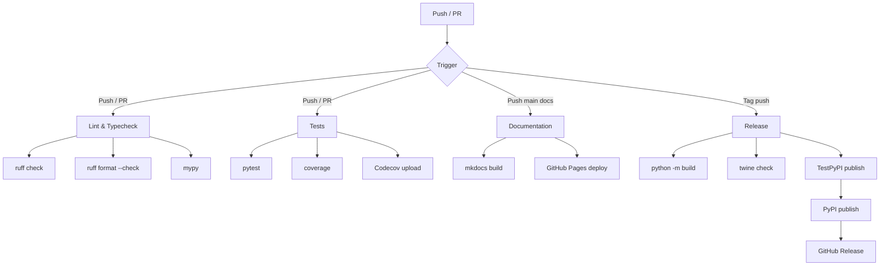

# GitHub Actions CI/CD

Setting up CI/CD with GitHub Actions for the Flux Agents framework.

This guide covers workflows for linting, testing, documentation building, and releasing Flux Agents using GitHub Actions.

---

## Workflow Overview

| Workflow | Trigger | Purpose |
|---|---|---|
| Lint & Typecheck | Push / PR to `main` | Run ruff linter and mypy type checker |
| Tests | Push / PR to `main` | Run pytest test suite |
| Documentation | Push to `main` / PR to `main` | Build and deploy MkDocs documentation |
| Release | Tag push (`v*`) | Build and publish to PyPI |

---

## Lint and Typecheck Workflow

### .github/workflows/lint.yml

```yaml
name: Lint & Typecheck

on:
  push:
    branches: [main]
  pull_request:
    branches: [main]

jobs:
  lint:
    runs-on: ubuntu-latest
    strategy:
      matrix:
        python-version: ['3.11', '3.12', '3.13']

    steps:
      - uses: actions/checkout@v4

      - name: Set up Python ${{ matrix.python-version }}
        uses: actions/setup-python@v5
        with:
          python-version: ${{ matrix.python-version }}

      - name: Cache pip
        uses: actions/cache@v4
        with:
          path: ~/.cache/pip
          key: ${{ runner.os }}-pip-${{ matrix.python-version }}-${{ hashFiles('**/pyproject.toml') }}
          restore-keys: |
            ${{ runner.os }}-pip-${{ matrix.python-version }}-

      - name: Install dependencies
        run: |
          pip install -e ".[dev]"

      - name: Lint with ruff
        run: |
          ruff check flux/ tests/

      - name: Check formatting with ruff
        run: |
          ruff format --check flux/ tests/

      - name: Type check with mypy
        run: |
          mypy flux/
```

---

## Test Workflow

### .github/workflows/test.yml

```yaml
name: Tests

on:
  push:
    branches: [main]
  pull_request:
    branches: [main]

jobs:
  test:
    runs-on: ubuntu-latest
    strategy:
      matrix:
        python-version: ['3.11', '3.12', '3.13']

    steps:
      - uses: actions/checkout@v4

      - name: Set up Python ${{ matrix.python-version }}
        uses: actions/setup-python@v5
        with:
          python-version: ${{ matrix.python-version }}

      - name: Cache pip
        uses: actions/cache@v4
        with:
          path: ~/.cache/pip
          key: ${{ runner.os }}-pip-${{ matrix.python-version }}-${{ hashFiles('**/pyproject.toml') }}
          restore-keys: |
            ${{ runner.os }}-pip-${{ matrix.python-version }}-

      - name: Install dependencies
        run: |
          pip install -e ".[dev]"

      - name: Run tests
        run: |
          pytest tests/ -v --tb=short

      - name: Run tests with coverage
        run: |
          pytest tests/ -v --cov=flux --cov-report=xml --cov-report=term-missing

      - name: Upload coverage to Codecov
        if: matrix.python-version == '3.12'
        uses: codecov/codecov-action@v4
        with:
          files: ./coverage.xml
          fail_ci_if_error: false
        env:
          CODECOV_TOKEN: ${{ secrets.CODECOV_TOKEN }}
```

---

## Documentation Build Workflow

### .github/workflows/docs.yml

```yaml
name: Documentation

on:
  push:
    branches: [main]
    paths:
      - 'docs/**'
      - 'mkdocs.yml'
      - 'flux/**'
  pull_request:
    branches: [main]
    paths:
      - 'docs/**'
      - 'mkdocs.yml'
      - 'flux/**'

permissions:
  contents: write

jobs:
  build:
    runs-on: ubuntu-latest
    steps:
      - uses: actions/checkout@v4
        with:
          fetch-depth: 0

      - uses: actions/setup-python@v5
        with:
          python-version: '3.12'

      - name: Cache pip
        uses: actions/cache@v4
        with:
          path: ~/.cache/pip
          key: ${{ runner.os }}-pip-${{ hashFiles('**/requirements*.txt') }}
          restore-keys: ${{ runner.os }}-pip-

      - name: Install dependencies
        run: |
          pip install mkdocs-material mkdocstrings mkdocstrings-python pymdown-extensions pygments mkdocs-git-revision-date-localized-plugin mike

      - name: Build documentation
        run: mkdocs build --strict

      - name: Deploy to GitHub Pages
        if: github.ref == 'refs/heads/main' && github.event_name == 'push'
        run: |
          git config user.name "github-actions[bot]"
          git config user.email "github-actions[bot]@users.noreply.github.com"
          mkdocs gh-deploy --force
```

---

## Release Workflow

### .github/workflows/release.yml

```yaml
name: Release

on:
  push:
    tags:
      - 'v*'

permissions:
  contents: write
  id-token: write

jobs:
  build:
    runs-on: ubuntu-latest
    steps:
      - uses: actions/checkout@v4

      - name: Set up Python
        uses: actions/setup-python@v5
        with:
          python-version: '3.12'

      - name: Install build tools
        run: |
          pip install build twine

      - name: Build package
        run: |
          python -m build

      - name: Check package
        run: |
          twine check dist/*

      - name: Upload build artifacts
        uses: actions/upload-artifact@v4
        with:
          name: dist
          path: dist/

  publish-testpypi:
    needs: build
    runs-on: ubuntu-latest
    environment: testpypi
    steps:
      - name: Download build artifacts
        uses: actions/download-artifact@v4
        with:
          name: dist
          path: dist/

      - name: Publish to TestPyPI
        uses: pypa/gh-action-pypi-publish@release/v1
        with:
          repository-url: https://test.pypi.org/legacy/
          password: ${{ secrets.TEST_PYPI_TOKEN }}

  publish-pypi:
    needs: [build, publish-testpypi]
    runs-on: ubuntu-latest
    environment: pypi
    steps:
      - name: Download build artifacts
        uses: actions/download-artifact@v4
        with:
          name: dist
          path: dist/

      - name: Publish to PyPI
        uses: pypa/gh-action-pypi-publish@release/v1
        with:
          password: ${{ secrets.PYPI_TOKEN }}

  github-release:
    needs: publish-pypi
    runs-on: ubuntu-latest
    steps:
      - uses: actions/checkout@v4

      - name: Download build artifacts
        uses: actions/download-artifact@v4
        with:
          name: dist
          path: dist/

      - name: Create GitHub Release
        uses: softprops/action-gh-release@v2
        with:
          files: dist/*
          generate_release_notes: true
```

---

## Release Process

### Creating a Release

1. Update the version in `pyproject.toml`
2. Commit and push to `main`
3. Create and push a version tag:

```bash
git tag v0.2.0
git push origin v0.2.0
```

The release workflow will automatically:

1. Build the package (sdist + wheel)
2. Validate with `twine check`
3. Publish to TestPyPI for validation
4. Publish to PyPI
5. Create a GitHub Release with artifacts and auto-generated release notes

### Required Secrets

Configure these secrets in your GitHub repository settings:

| Secret | Purpose |
|---|---|
| `PYPI_TOKEN` | PyPI API token for publishing |
| `TEST_PYPI_TOKEN` | TestPyPI API token for pre-release validation |
| `CODECOV_TOKEN` | Codecov token for coverage reporting |

---

## CI Badge

Add these badges to your README.md:

```markdown
[](https://github.com/OWNER/flux-agents/actions/workflows/test.yml)
[](https://github.com/OWNER/flux-agents/actions/workflows/lint.yml)
[](https://github.com/OWNER/flux-agents/actions/workflows/docs.yml)
[](https://pypi.org/project/flux-agents/)
```

---

## Workflow Diagram



---

## Customization

### Skipping CI

Add `[skip ci]` to a commit message to skip all workflows:

```bash
git commit -m "docs: update README [skip ci]"
```

### Path Filtering

Workflows trigger only when relevant files change. For example, the docs workflow only runs when `docs/`, `mkdocs.yml`, or `flux/` files are modified.

### Matrix Testing

The test and lint workflows run against Python 3.11, 3.12, and 3.13 to ensure compatibility across all supported versions as declared in `pyproject.toml`.

!!! tip "Caching"
    All workflows use `actions/cache@v4` for pip caching. The cache key includes the Python version and `pyproject.toml` hash, ensuring caches are invalidated when dependencies change.

!!! info "Concurrency"
    Add concurrency groups to prevent redundant workflow runs:

    ```yaml
    concurrency:
      group: ${{ github.workflow }}-${{ github.ref }}
      cancel-in-progress: true
    ```
