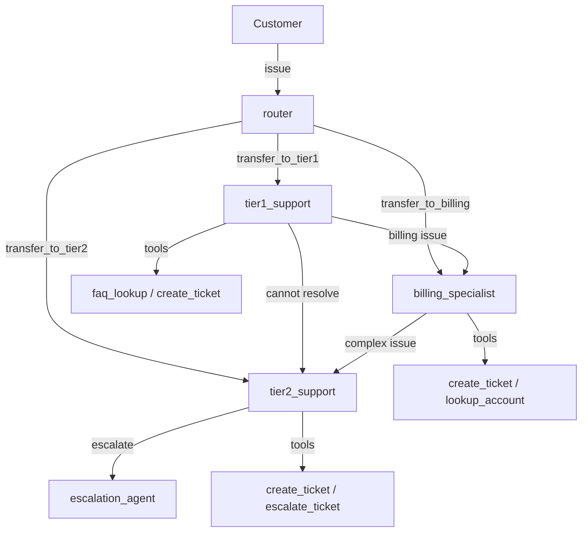

# Customer Support System

A multi-agent customer support system with routing, escalation, and guardrails.

## Overview

This example builds a complete customer support pipeline with three tiers of support agents,
PII protection guardrails, conversation sessions for history, and streaming output.



## Step 1: Define the Support Data

```python
FAQ_DB = {
    "password reset": "Go to Settings > Security > Reset Password. You will receive an email with a link valid for 24 hours.",
    "refund policy": "We offer full refunds within 30 days of purchase. Contact billing for refund requests.",
    "shipping time": "Standard shipping takes 3-5 business days. Express shipping is 1-2 business days.",
    "return policy": "Items can be returned within 30 days in original packaging. Open a ticket to start a return.",
    "account deletion": "Account deletion can be requested through Settings > Account > Delete Account. This is irreversible.",
}

ACCOUNTS = {
    "ACC-001": {"name": "John Doe", "plan": "Premium", "balance": 0.00},
    "ACC-002": {"name": "Jane Smith", "plan": "Free", "balance": 14.99},
    "ACC-003": {"name": "Bob Wilson", "plan": "Premium", "balance": -25.00},
}

TICKETS = []
ticket_counter = 0
```

## Step 2: Define Support Tools

```python
from flux import tool


@tool
def faq_lookup(question: str) -> str:
    """Look up answers to frequently asked questions.

    Args:
        question: The customer's question or keywords to search.

    Returns:
        The relevant FAQ answer, or a message if not found.
    """
    question_lower = question.lower()
    for key, answer in FAQ_DB.items():
        if key in question_lower or any(word in question_lower for word in key.split()):
            return answer
    return "No FAQ entry found. I will connect you with a specialist."


@tool
def create_ticket(subject: str, description: str) -> str:
    """Create a support ticket for the customer.

    Args:
        subject: The ticket subject line.
        description: A detailed description of the issue.

    Returns:
        Confirmation with the ticket ID.
    """
    global ticket_counter
    ticket_counter += 1
    ticket_id = f"TKT-{ticket_counter:04d}"
    TICKETS.append({
        "id": ticket_id,
        "subject": subject,
        "description": description,
        "status": "open",
    })
    return f"Ticket {ticket_id} created successfully. Subject: '{subject}'"


@tool
def escalate_ticket(ticket_id: str, reason: str) -> str:
    """Escalate an existing ticket to a higher support tier.

    Args:
        ticket_id: The ticket ID to escalate (e.g., 'TKT-0001').
        reason: The reason for escalation.

    Returns:
        Confirmation of the escalation.
    """
    for ticket in TICKETS:
        if ticket["id"] == ticket_id:
            ticket["status"] = "escalated"
            return (
                f"Ticket {ticket_id} has been escalated. "
                f"Reason: {reason}"
            )
    return f"Ticket '{ticket_id}' not found."


@tool
def lookup_account(account_id: str) -> str:
    """Look up customer account details.

    Args:
        account_id: The account ID to look up (e.g., 'ACC-001').

    Returns:
        Account details including name, plan, and balance.
    """
    account = ACCOUNTS.get(account_id)
    if not account:
        return f"Account '{account_id}' not found."
    return (
        f"Account: {account_id}\n"
        f"  Name: {account['name']}\n"
        f"  Plan: {account['plan']}\n"
        f"  Balance: ${account['balance']:.2f}"
    )


@tool
def update_account_balance(account_id: str, amount: str) -> str:
    """Adjust a customer's account balance.

    Args:
        account_id: The account ID (e.g., 'ACC-001').
        amount: The amount to adjust (positive for credit, negative for charge).

    Returns:
        Confirmation of the balance update.
    """
    account = ACCOUNTS.get(account_id)
    if not account:
        return f"Account '{account_id}' not found."
    adjustment = float(amount)
    account["balance"] += adjustment
    return (
        f"Balance updated for {account_id}. "
        f"Adjustment: {'+' if adjustment >= 0 else ''}{adjustment:.2f}. "
        f"New balance: ${account['balance']:.2f}"
    )
```

## Step 3: Create the Guardrail

A PII guardrail ensures that customers cannot accidentally expose personal information
through the support chat.

```python
from flux import PIIGuardrail, LengthGuardrail
from flux.guardrails.base import OutputGuardrail, GuardrailResult


class NoPIIOutputGuardrail(OutputGuardrail):
    """Prevents the agent from echoing PII back to the user in output."""

    @property
    def name(self) -> str:
        return "no_pii_output"

    async def check(self, output: str, context=None) -> GuardrailResult:
        import re

        pii_patterns = [
            (r"\b\d{3}-\d{2}-\d{4}\b", "SSN"),
            (r"\b\d{16}\b", "credit card number"),
            (r"[a-zA-Z0-9._%+-]+@[a-zA-Z0-9.-]+\.[a-zA-Z]{2,}", "email"),
        ]
        for pattern, pii_type in pii_patterns:
            if re.search(pattern, output):
                return GuardrailResult(
                    passed=False,
                    message=f"Output contains potential {pii_type} -- redacting.",
                )
        return GuardrailResult(passed=True)
```

## Step 4: Create the Support Agents

Define all specialist agents first, then wire up the router with handoffs. The recommended
pattern is a builder function that constructs agents in dependency order.

```python
from flux import Agent
from flux.models.ollama import OllamaModel


def build_support_system():
    model = OllamaModel(model="llama3.2")

    # Shared guardrails for all agents
    guardrails = (
        PIIGuardrail(),                   # Block PII in customer input
        NoPIIOutputGuardrail(),           # Block PII in agent output
        LengthGuardrail(max_chars=5000),  # Limit response length
    )

    # 1. Define specialists first (they have no handoffs)
    tier2_support = Agent(
        name="tier2_support",
        instructions=(
            "You are a Tier 2 support specialist. Handle complex issues, "
            "investigate account problems, and escalate further when needed."
        ),
        model=model,
        tools=[create_ticket, escalate_ticket, lookup_account, faq_lookup],
        guardrails=guardrails,
    )

    billing_specialist = Agent(
        name="billing_specialist",
        instructions=(
            "You are a billing specialist. Handle refund requests, balance "
            "adjustments, and payment issues. Always verify the account first."
        ),
        model=model,
        tools=[create_ticket, lookup_account, update_account_balance, faq_lookup],
        guardrails=guardrails,
    )

    # 2. Tier 1 has handoffs to tier 2 and billing
    tier1_support = Agent(
        name="tier1_support",
        instructions=(
            "You are Tier 1 support. Use the FAQ for simple questions. "
            "For complex issues, create a ticket and escalate to tier2_support. "
            "For billing questions, transfer to billing_specialist."
        ),
        model=model,
        tools=[faq_lookup, create_ticket],
        guardrails=guardrails,
        handoffs=(tier2_support, billing_specialist),
    )

    # 3. Router connects to all three tiers
    router = Agent(
        name="router",
        instructions=(
            "You are a customer support router. Analyze the issue:\n"
            "- Simple FAQ questions -> tier1_support\n"
            "- Complex technical issues -> tier2_support\n"
            "- Billing, refunds, balance -> billing_specialist"
        ),
        model=model,
        handoffs=(tier1_support, tier2_support, billing_specialist),
    )

    return router


router = build_support_system()
```

!!! info "Why a Builder Function?"
    Because `Agent` is a frozen (immutable) dataclass, you cannot reference agents
    that have not been created yet. The builder pattern ensures agents are constructed
    in the right order: specialists first, then agents that hand off to them.

## Step 5: Multi-Turn Conversations with Sessions

Sessions preserve conversation history across multiple `Runner.run()` calls. Use
`InMemorySession` for demos or `SQLiteSession` for persistence.

```python
from flux import InMemorySession, Runner

# In-memory session (lost on restart -- good for demos)
session = InMemorySession()

# Or persistent SQLite session (survives restarts)
# from flux import SQLiteSession
# session = SQLiteSession(db_path="support_sessions.db")


async def support_chat(customer_message: str) -> str:
    """Process a single customer message in a persistent session."""
    result = await Runner.run(
        router,
        customer_message,
        session=session,
        context={"channel": "web_chat"},
    )
    return result.final_output


async def multi_turn_demo():
    """Demonstrate multi-turn conversation with session persistence."""
    messages = [
        "Hi, I need help with my password",
        "My account ID is ACC-001",
        "Can you check my account balance?",
        "I think I was overcharged last month",
    ]

    for msg in messages:
        print(f"\nCustomer: {msg}")
        result = await Runner.run(router, msg, session=session)
        print(f"Agent ({result.last_agent.name}): {result.final_output}")
```

## Step 6: Streaming with Multi-Agent Visibility

```python
import asyncio
from flux import Runner
from flux.streaming.events import (
    TextDeltaEvent,
    AgentUpdatedEvent,
    ToolCallEvent,
    UsageEvent,
)


async def streaming_support():
    stream = await Runner.run_streamed(
        router,
        "I want to request a refund for my last purchase",
        session=session,
    )

    current_agent = "router"
    async for event in stream:
        match event:
            case AgentUpdatedEvent(agent_name=name):
                if name != current_agent:
                    print(f"\n  [Transferred to: {name}]")
                    current_agent = name
            case TextDeltaEvent(delta=text):
                print(text, end="", flush=True)
            case ToolCallEvent(name=name):
                print(f"\n  [Using tool: {name}]")
            case UsageEvent(total_tokens=tokens):
                print(f"\n  [Tokens: {tokens}]")

    print()
```

## Complete Runnable Script

Save this as `customer_support.py` and run it with `python customer_support.py`.

```python
"""Customer Support System -- multi-agent with routing, escalation, and guardrails."""
import asyncio

from flux import (
    Agent,
    Runner,
    tool,
    PIIGuardrail,
    LengthGuardrail,
    InMemorySession,
)
from flux.guardrails.base import OutputGuardrail, GuardrailResult
from flux.models.ollama import OllamaModel
from flux.streaming.events import (
    TextDeltaEvent,
    AgentUpdatedEvent,
    ToolCallEvent,
)


# ── Data ────────────────────────────────────────────────────────────

FAQ_DB = {
    "password reset": (
        "Go to Settings > Security > Reset Password. You will receive "
        "an email with a link valid for 24 hours."
    ),
    "refund policy": (
        "We offer full refunds within 30 days of purchase. "
        "Contact billing for refund requests."
    ),
    "shipping time": (
        "Standard shipping takes 3-5 business days. "
        "Express shipping is 1-2 business days."
    ),
    "return policy": (
        "Items can be returned within 30 days in original packaging. "
        "Open a ticket to start a return."
    ),
    "account deletion": (
        "Account deletion can be requested through Settings > Account > "
        "Delete Account. This is irreversible."
    ),
}

ACCOUNTS = {
    "ACC-001": {"name": "John Doe", "plan": "Premium", "balance": 0.00},
    "ACC-002": {"name": "Jane Smith", "plan": "Free", "balance": 14.99},
    "ACC-003": {"name": "Bob Wilson", "plan": "Premium", "balance": -25.00},
}

TICKETS: list[dict] = []
ticket_counter = 0


# ── Tools ───────────────────────────────────────────────────────────

@tool
def faq_lookup(question: str) -> str:
    """Look up answers to frequently asked questions."""
    question_lower = question.lower()
    for key, answer in FAQ_DB.items():
        if key in question_lower or any(w in question_lower for w in key.split()):
            return answer
    return "No FAQ entry found. I will connect you with a specialist."


@tool
def create_ticket(subject: str, description: str) -> str:
    """Create a support ticket for the customer."""
    global ticket_counter
    ticket_counter += 1
    ticket_id = f"TKT-{ticket_counter:04d}"
    TICKETS.append({
        "id": ticket_id, "subject": subject,
        "description": description, "status": "open",
    })
    return f"Ticket {ticket_id} created. Subject: '{subject}'"


@tool
def escalate_ticket(ticket_id: str, reason: str) -> str:
    """Escalate an existing ticket to a higher support tier."""
    for ticket in TICKETS:
        if ticket["id"] == ticket_id:
            ticket["status"] = "escalated"
            return f"Ticket {ticket_id} escalated. Reason: {reason}"
    return f"Ticket '{ticket_id}' not found."


@tool
def lookup_account(account_id: str) -> str:
    """Look up customer account details."""
    account = ACCOUNTS.get(account_id)
    if not account:
        return f"Account '{account_id}' not found."
    return (
        f"Account: {account_id}\n"
        f"  Name: {account['name']}\n"
        f"  Plan: {account['plan']}\n"
        f"  Balance: ${account['balance']:.2f}"
    )


@tool
def update_account_balance(account_id: str, amount: str) -> str:
    """Adjust a customer's account balance."""
    account = ACCOUNTS.get(account_id)
    if not account:
        return f"Account '{account_id}' not found."
    adjustment = float(amount)
    account["balance"] += adjustment
    return (
        f"Balance updated. Adjustment: {'+' if adjustment >= 0 else ''}"
        f"{adjustment:.2f}. New balance: ${account['balance']:.2f}"
    )


# ── Custom Guardrail ────────────────────────────────────────────────

class NoPIIOutputGuardrail(OutputGuardrail):
    """Prevents the agent from echoing PII back in output."""

    @property
    def name(self) -> str:
        return "no_pii_output"

    async def check(self, output: str, context=None) -> GuardrailResult:
        import re
        patterns = [
            (r"\b\d{3}-\d{2}-\d{4}\b", "SSN"),
            (r"\b\d{16}\b", "credit card number"),
            (r"[a-zA-Z0-9._%+-]+@[a-zA-Z0-9.-]+\.[a-zA-Z]{2,}", "email"),
        ]
        for pattern, pii_type in patterns:
            if re.search(pattern, output):
                return GuardrailResult(
                    passed=False,
                    message=f"Output contains potential {pii_type}.",
                )
        return GuardrailResult(passed=True)


# ── Agents ──────────────────────────────────────────────────────────

def build_support_system():
    """Build the complete multi-agent support system.

    Returns the router agent with all specialist agents wired up.
    """
    model = OllamaModel(model="llama3.2")

    guardrails = (PIIGuardrail(), NoPIIOutputGuardrail(), LengthGuardrail(max_chars=5000))

    # Define specialists first
    tier2 = Agent(
        name="tier2_support",
        instructions=(
            "You are a Tier 2 support specialist. Handle complex issues, "
            "investigate account problems, and escalate when needed."
        ),
        model=model,
        tools=[create_ticket, escalate_ticket, lookup_account, faq_lookup],
        guardrails=guardrails,
    )

    billing = Agent(
        name="billing_specialist",
        instructions=(
            "You are a billing specialist. Handle refund requests, balance "
            "adjustments, and payment issues. Always verify the account first."
        ),
        model=model,
        tools=[create_ticket, lookup_account, update_account_balance, faq_lookup],
        guardrails=guardrails,
    )

    tier1 = Agent(
        name="tier1_support",
        instructions=(
            "You are Tier 1 support. Use the FAQ for simple questions. "
            "For complex issues, create a ticket and escalate to tier2_support. "
            "For billing questions, transfer to billing_specialist."
        ),
        model=model,
        tools=[faq_lookup, create_ticket],
        guardrails=guardrails,
        handoffs=(tier2, billing),
    )

    # Router connects to all tiers
    router = Agent(
        name="router",
        instructions=(
            "You are a customer support router. Analyze the customer's issue:\n"
            "- Simple FAQ questions -> tier1_support\n"
            "- Complex technical issues -> tier2_support\n"
            "- Billing, refunds, balance -> billing_specialist\n"
            "Always explain who you are connecting them to."
        ),
        model=model,
        handoffs=(tier1, tier2, billing),
    )

    return router


# ── Main ────────────────────────────────────────────────────────────

async def main():
    router = build_support_system()
    session = InMemorySession()

    # Multi-turn conversation
    messages = [
        "Hi, I need help with my password",
        "What is my account balance for ACC-001?",
        "I think I was overcharged, I want a refund",
    ]

    for msg in messages:
        print(f"\nCustomer: {msg}")
        result = await Runner.run(router, msg, session=session)
        print(f"Support ({result.last_agent.name}): {result.final_output}")
        if result.handoffs:
            for h in result.handoffs:
                print(f"  -> Routed from {h['source']} to {h['target']}")
        print(f"  [Turns: {result.turns} | Tokens: {result.usage.total_tokens}]")

    # Streaming example
    print("\n\n=== Streaming Support ===\n")
    stream = await Runner.run_streamed(
        router,
        "How do I delete my account?",
        session=session,
    )

    current_agent = "router"
    async for event in stream:
        match event:
            case AgentUpdatedEvent(agent_name=name):
                if name != current_agent:
                    print(f"\n  [-> {name}]")
                    current_agent = name
            case TextDeltaEvent(delta=text):
                print(text, end="", flush=True)
            case ToolCallEvent(name=name):
                print(f"\n  [tool: {name}]")

    print()


if __name__ == "__main__":
    asyncio.run(main())
```

## Architecture Summary

| Agent | Role | Tools | Handoffs To |
|-------|------|-------|-------------|
| `router` | Analyzes and routes queries | None | tier1, tier2, billing |
| `tier1_support` | Simple FAQ and ticket creation | `faq_lookup`, `create_ticket` | tier2, billing |
| `tier2_support` | Complex issues and escalation | `create_ticket`, `escalate_ticket`, `lookup_account`, `faq_lookup` | -- |
| `billing_specialist` | Billing and account changes | `create_ticket`, `lookup_account`, `update_account_balance`, `faq_lookup` | -- |

### Guardrails

| Guardrail | Type | Purpose |
|-----------|------|---------|
| `PIIGuardrail` | Input | Blocks emails, phone numbers, and SSNs from customer input |
| `NoPIIOutputGuardrail` | Output | Prevents the agent from echoing PII in its responses |
| `LengthGuardrail` | Input | Limits input length to 5000 characters |

!!! info "Running this example"

    ```bash
    ollama pull llama3.2
    python customer_support.py
    ```
