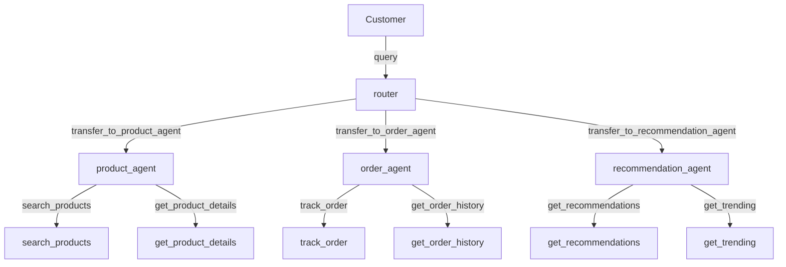

# E-Commerce Assistant

A multi-agent e-commerce system with product search, recommendations, and order tracking.

## Overview

This example demonstrates a complete e-commerce assistant built with Flux's multi-agent
architecture. A router agent directs customer queries to the appropriate specialist agent
using the **handoff system**.



## Step 1: Define the Data Layer

Create simulated product and order data that the tools will query.

```python
# Simulated product catalog
PRODUCTS = {
    "Laptop Pro 15": {
        "id": "SKU-001", "price": 1299.99, "category": "Electronics",
        "description": "15-inch laptop with 16GB RAM and 512GB SSD",
        "rating": 4.7, "in_stock": True,
    },
    "Wireless Headphones": {
        "id": "SKU-002", "price": 199.99, "category": "Electronics",
        "description": "Noise-cancelling over-ear headphones",
        "rating": 4.5, "in_stock": True,
    },
    "Running Shoes": {
        "id": "SKU-003", "price": 89.99, "category": "Sports",
        "description": "Lightweight running shoes with cushion support",
        "rating": 4.3, "in_stock": True,
    },
    "Coffee Maker": {
        "id": "SKU-004", "price": 49.99, "category": "Kitchen",
        "description": "12-cup programmable coffee maker",
        "rating": 4.1, "in_stock": False,
    },
    "Yoga Mat": {
        "id": "SKU-005", "price": 34.99, "category": "Sports",
        "description": "Non-slip exercise yoga mat, 6mm thick",
        "rating": 4.6, "in_stock": True,
    },
}

ORDERS = {
    "ORD-1234": {
        "status": "shipped", "items": ["Laptop Pro 15"],
        "total": 1299.99, "tracking": "TRACK-9876",
    },
    "ORD-5678": {
        "status": "processing", "items": ["Wireless Headphones", "Yoga Mat"],
        "total": 234.98, "tracking": None,
    },
}
```

## Step 2: Define the Tools

Create tools for each specialist agent.

```python
from flux import tool


@tool
def search_products(query: str) -> str:
    """Search the product catalog by name or category.

    Args:
        query: The search term to match against product names and categories.

    Returns:
        A list of matching products with prices.
    """
    results = []
    query_lower = query.lower()
    for name, info in PRODUCTS.items():
        if (query_lower in name.lower() or
                query_lower in info["category"].lower()):
            stock = "In Stock" if info["in_stock"] else "Out of Stock"
            results.append(
                f"  - {name} ({info['id']}): ${info['price']:.2f} | "
                f"Rating: {info['rating']}/5 | {stock}"
            )

    if not results:
        return f"No products found matching '{query}'."

    return f"Found {len(results)} product(s):\n" + "\n".join(results)


@tool
def get_product_details(product_name: str) -> str:
    """Get detailed information about a specific product.

    Args:
        product_name: The name (or partial name) of the product.

    Returns:
        Full product details including description, price, and availability.
    """
    query_lower = product_name.lower()
    for name, info in PRODUCTS.items():
        if query_lower in name.lower():
            stock = "In Stock" if info["in_stock"] else "Out of Stock"
            return (
                f"Product: {name}\n"
                f"  ID: {info['id']}\n"
                f"  Category: {info['category']}\n"
                f"  Price: ${info['price']:.2f}\n"
                f"  Description: {info['description']}\n"
                f"  Rating: {info['rating']}/5\n"
                f"  Availability: {stock}"
            )

    return f"Product '{product_name}' not found in the catalog."


@tool
def track_order(order_id: str) -> str:
    """Track the status of an order.

    Args:
        order_id: The order ID to look up (e.g., 'ORD-1234').

    Returns:
        The current status and tracking information for the order.
    """
    order = ORDERS.get(order_id)
    if not order:
        return f"Order '{order_id}' not found. Please check the order ID."

    items = ", ".join(order["items"])
    tracking = order["tracking"] or "Not yet assigned"
    return (
        f"Order: {order_id}\n"
        f"  Status: {order['status'].title()}\n"
        f"  Items: {items}\n"
        f"  Total: ${order['total']:.2f}\n"
        f"  Tracking: {tracking}"
    )


@tool
def get_order_history(customer_id: str) -> str:
    """Get the order history for a customer.

    Args:
        customer_id: The customer identifier.

    Returns:
        A summary of the customer's recent orders.
    """
    # Simulated -- in production, query by customer_id
    summary_lines = []
    for oid, order in ORDERS.items():
        items = ", ".join(order["items"])
        summary_lines.append(
            f"  {oid}: {order['status'].title()} | "
            f"${order['total']:.2f} | {items}"
        )
    return f"Order history:\n" + "\n".join(summary_lines)


@tool
def get_recommendations(category: str) -> str:
    """Get product recommendations for a given category.

    Args:
        category: The product category (e.g., 'Electronics', 'Sports').

    Returns:
        A list of recommended products with reasons.
    """
    matches = [
        (name, info)
        for name, info in PRODUCTS.items()
        if info["category"].lower() == category.lower()
    ]

    if not matches:
        # Return trending items as fallback
        return get_trending()

    lines = []
    for name, info in matches:
        lines.append(
            f"  - {name}: ${info['price']:.2f} "
            f"(Rating: {info['rating']}/5) -- {info['description']}"
        )

    return f"Recommendations in {category}:\n" + "\n".join(lines)


@tool
def get_trending() -> str:
    """Get currently trending products across all categories."""
    trending = sorted(PRODUCTS.items(), key=lambda x: x[1]["rating"], reverse=True)
    lines = []
    for name, info in trending[:3]:
        lines.append(
            f"  - {name}: ${info['price']:.2f} "
            f"(Rating: {info['rating']}/5)"
        )
    return f"Trending products:\n" + "\n".join(lines)
```

## Step 3: Create the Specialist Agents

Each specialist agent has a focused role and specific tools.

```python
from flux import Agent
from flux.models.ollama import OllamaModel

model = OllamaModel(model="llama3.2")

product_agent = Agent(
    name="product_agent",
    instructions=(
        "You are a product specialist. Help customers find products, "
        "compare options, and get detailed product information. "
        "Always mention price, availability, and rating."
    ),
    model=model,
    tools=[search_products, get_product_details, get_recommendations],
)

order_agent = Agent(
    name="order_agent",
    instructions=(
        "You are an order management specialist. Help customers track "
        "orders, check order status, and view order history. Always "
        "provide the order ID and current status."
    ),
    model=model,
    tools=[track_order, get_order_history],
)

recommendation_agent = Agent(
    name="recommendation_agent",
    instructions=(
        "You are a recommendation specialist. Suggest products based on "
        "customer interests, highlight trending items, and explain why "
        "each product is a good choice."
    ),
    model=model,
    tools=[get_recommendations, get_trending, search_products],
)
```

## Step 4: Create the Router Agent

The router uses the **handoff system** to delegate to the right specialist. Agents can be
passed directly in the `handoffs` tuple -- Flux automatically creates `Handoff` objects with
the tool name `transfer_to_{target.name}`.

```python
router = Agent(
    name="router",
    instructions=(
        "You are a customer service router. Analyze the customer's question "
        "and transfer them to the right specialist:\n"
        "- Product questions (pricing, features, availability) -> product_agent\n"
        "- Order questions (tracking, status, history) -> order_agent\n"
        "- Recommendations and suggestions -> recommendation_agent\n"
        "Always explain which specialist you are connecting them to."
    ),
    model=model,
    handoffs=(
        product_agent,
        order_agent,
        recommendation_agent,
    ),
)
```

!!! tip "Explicit Handoff Objects"
    For more control, use explicit `Handoff` objects with descriptions and conditions:

    ```python
    from flux import Handoff

    router = Agent(
        name="router",
        instructions="Route customers to the right specialist.",
        model=model,
        handoffs=(
            Handoff(
                source=router,
                target=product_agent,
                description="Transfer for product questions, pricing, and availability.",
            ),
            Handoff(
                source=router,
                target=order_agent,
                description="Transfer for order tracking and status updates.",
            ),
            Handoff(
                source=router,
                target=recommendation_agent,
                description="Transfer for product recommendations and suggestions.",
            ),
        ),
    )
    ```

## Step 5: Run the Multi-Agent System

```python
import asyncio
from flux import Runner
from flux.streaming.events import TextDeltaEvent, AgentUpdatedEvent


async def main():
    # Product query -- should route to product_agent
    result = await Runner.run(
        router,
        "I'm looking for electronics under $300"
    )
    print(f"Answer: {result.final_output}")
    print(f"Handled by: {result.last_agent.name}")
    print(f"Handoffs: {result.handoffs}\n")

    # Order query -- should route to order_agent
    result = await Runner.run(
        router,
        "Where is my order ORD-1234?"
    )
    print(f"Answer: {result.final_output}")
    print(f"Handled by: {result.last_agent.name}\n")

    # Recommendation query -- should route to recommendation_agent
    result = await Runner.run(
        router,
        "Can you recommend something in the Sports category?"
    )
    print(f"Answer: {result.final_output}")
    print(f"Handled by: {result.last_agent.name}\n")


asyncio.run(main())
```

## Step 6: Streaming with Handoff Visibility

Track agent changes in real-time as handoffs occur.

```python
import asyncio
from flux import Runner
from flux.streaming.events import (
    TextDeltaEvent,
    AgentUpdatedEvent,
    ToolCallEvent,
)


async def streaming_demo():
    stream = await Runner.run_streamed(
        router,
        "What's your best selling electronics product?"
    )

    current_agent = stream.current_agent.name

    async for event in stream:
        match event:
            case AgentUpdatedEvent(agent_name=name):
                if name != current_agent:
                    print(f"\n  [Router -> {name}]\n")
                    current_agent = name
            case TextDeltaEvent(delta=text):
                print(text, end="", flush=True)
            case ToolCallEvent(name=name, arguments=args):
                print(f"\n  [Tool: {name}]")

    print()


asyncio.run(streaming_demo())
```

## Complete Runnable Script

Save this as `ecommerce_agent.py` and run it with `python ecommerce_agent.py`.

```python
"""E-Commerce Assistant -- multi-agent with handoffs."""
import asyncio

from flux import Agent, Runner, tool
from flux.models.ollama import OllamaModel
from flux.streaming.events import TextDeltaEvent, AgentUpdatedEvent, ToolCallEvent


# ── Data ────────────────────────────────────────────────────────────

PRODUCTS = {
    "Laptop Pro 15": {
        "id": "SKU-001", "price": 1299.99, "category": "Electronics",
        "description": "15-inch laptop with 16GB RAM and 512GB SSD",
        "rating": 4.7, "in_stock": True,
    },
    "Wireless Headphones": {
        "id": "SKU-002", "price": 199.99, "category": "Electronics",
        "description": "Noise-cancelling over-ear headphones",
        "rating": 4.5, "in_stock": True,
    },
    "Running Shoes": {
        "id": "SKU-003", "price": 89.99, "category": "Sports",
        "description": "Lightweight running shoes with cushion support",
        "rating": 4.3, "in_stock": True,
    },
    "Coffee Maker": {
        "id": "SKU-004", "price": 49.99, "category": "Kitchen",
        "description": "12-cup programmable coffee maker",
        "rating": 4.1, "in_stock": False,
    },
    "Yoga Mat": {
        "id": "SKU-005", "price": 34.99, "category": "Sports",
        "description": "Non-slip exercise yoga mat, 6mm thick",
        "rating": 4.6, "in_stock": True,
    },
}

ORDERS = {
    "ORD-1234": {
        "status": "shipped", "items": ["Laptop Pro 15"],
        "total": 1299.99, "tracking": "TRACK-9876",
    },
    "ORD-5678": {
        "status": "processing", "items": ["Wireless Headphones", "Yoga Mat"],
        "total": 234.98, "tracking": None,
    },
}


# ── Product Tools ───────────────────────────────────────────────────

@tool
def search_products(query: str) -> str:
    """Search the product catalog by name or category."""
    results = []
    query_lower = query.lower()
    for name, info in PRODUCTS.items():
        if query_lower in name.lower() or query_lower in info["category"].lower():
            stock = "In Stock" if info["in_stock"] else "Out of Stock"
            results.append(
                f"  - {name} ({info['id']}): ${info['price']:.2f} | "
                f"Rating: {info['rating']}/5 | {stock}"
            )
    if not results:
        return f"No products found matching '{query}'."
    return f"Found {len(results)} product(s):\n" + "\n".join(results)


@tool
def get_product_details(product_name: str) -> str:
    """Get detailed information about a specific product."""
    for name, info in PRODUCTS.items():
        if product_name.lower() in name.lower():
            stock = "In Stock" if info["in_stock"] else "Out of Stock"
            return (
                f"Product: {name}\n"
                f"  ID: {info['id']}\n"
                f"  Category: {info['category']}\n"
                f"  Price: ${info['price']:.2f}\n"
                f"  Description: {info['description']}\n"
                f"  Rating: {info['rating']}/5\n"
                f"  Availability: {stock}"
            )
    return f"Product '{product_name}' not found."


# ── Order Tools ─────────────────────────────────────────────────────

@tool
def track_order(order_id: str) -> str:
    """Track the status of an order."""
    order = ORDERS.get(order_id)
    if not order:
        return f"Order '{order_id}' not found. Please check the order ID."
    items = ", ".join(order["items"])
    tracking = order["tracking"] or "Not yet assigned"
    return (
        f"Order: {order_id}\n"
        f"  Status: {order['status'].title()}\n"
        f"  Items: {items}\n"
        f"  Total: ${order['total']:.2f}\n"
        f"  Tracking: {tracking}"
    )


@tool
def get_order_history(customer_id: str) -> str:
    """Get the order history for a customer."""
    lines = []
    for oid, order in ORDERS.items():
        items = ", ".join(order["items"])
        lines.append(
            f"  {oid}: {order['status'].title()} | "
            f"${order['total']:.2f} | {items}"
        )
    return "Order history:\n" + "\n".join(lines)


# ── Recommendation Tools ────────────────────────────────────────────

@tool
def get_recommendations(category: str) -> str:
    """Get product recommendations for a given category."""
    matches = [
        (name, info)
        for name, info in PRODUCTS.items()
        if info["category"].lower() == category.lower()
    ]
    if not matches:
        trending = sorted(PRODUCTS.items(), key=lambda x: x[1]["rating"], reverse=True)
        lines = [
            f"  - {n}: ${i['price']:.2f} ({i['rating']}/5)"
            for n, i in trending[:3]
        ]
        return f"No items in {category}. Top trending:\n" + "\n".join(lines)

    lines = []
    for name, info in matches:
        lines.append(
            f"  - {name}: ${info['price']:.2f} "
            f"(Rating: {info['rating']}/5) -- {info['description']}"
        )
    return f"Recommendations in {category}:\n" + "\n".join(lines)


@tool
def get_trending() -> str:
    """Get currently trending products across all categories."""
    trending = sorted(PRODUCTS.items(), key=lambda x: x[1]["rating"], reverse=True)
    lines = [
        f"  - {n}: ${i['price']:.2f} ({i['rating']}/5)"
        for n, i in trending[:3]
    ]
    return "Trending products:\n" + "\n".join(lines)


# ── Agents ──────────────────────────────────────────────────────────

def build_system():
    model = OllamaModel(model="llama3.2")

    product_agent = Agent(
        name="product_agent",
        instructions=(
            "You are a product specialist. Help customers find products, "
            "compare options, and get detailed information. Always mention "
            "price, availability, and rating."
        ),
        model=model,
        tools=[search_products, get_product_details, get_recommendations],
    )

    order_agent = Agent(
        name="order_agent",
        instructions=(
            "You are an order management specialist. Help customers track "
            "orders, check status, and view history."
        ),
        model=model,
        tools=[track_order, get_order_history],
    )

    recommendation_agent = Agent(
        name="recommendation_agent",
        instructions=(
            "You are a recommendation specialist. Suggest products based on "
            "customer interests and highlight trending items."
        ),
        model=model,
        tools=[get_recommendations, get_trending, search_products],
    )

    router = Agent(
        name="router",
        instructions=(
            "You are a customer service router. Route the customer:\n"
            "- Product questions -> product_agent\n"
            "- Order questions -> order_agent\n"
            "- Recommendations -> recommendation_agent"
        ),
        model=model,
        handoffs=(product_agent, order_agent, recommendation_agent),
    )

    return router


# ── Main ────────────────────────────────────────────────────────────

async def main():
    router = build_system()

    queries = [
        "I'm looking for electronics under $300",
        "Where is my order ORD-1234?",
        "Can you recommend something in the Sports category?",
    ]

    for query in queries:
        print(f">>> {query}\n")
        result = await Runner.run(router, query)
        print(f"Answer: {result.final_output}")
        print(f"Agent:  {result.last_agent.name}")
        if result.handoffs:
            print(f"Handoffs: {result.handoffs}")
        print()


if __name__ == "__main__":
    asyncio.run(main())
```

!!! info "Running this example"

    ```bash
    ollama pull llama3.2
    python ecommerce_agent.py
    ```
