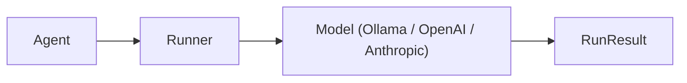

# Hello World

Get started with Flux Agents in 3 lines of code.

## Quick Start

=== "Sync"

    ```python
    from flux import Agent, Runner

    agent = Agent(name="assistant", instructions="You are helpful")
    result = Runner.run_sync(agent, "Hello!")
    print(result.final_output)
    ```

=== "Async"

    ```python
    import asyncio
    from flux import Agent, Runner

    async def main():
        agent = Agent(name="assistant", instructions="You are helpful")
        result = await Runner.run(agent, "Hello!")
        print(result.final_output)

    asyncio.run(main())
    ```

=== "Streaming"

    ```python
    import asyncio
    from flux import Agent, Runner
    from flux.streaming.events import TextDeltaEvent

    async def main():
        agent = Agent(name="assistant", instructions="You are helpful")
        stream = await Runner.run_streamed(agent, "Hello!")

        async for event in stream:
            if isinstance(event, TextDeltaEvent):
                print(event.delta, end="", flush=True)
        print()

    asyncio.run(main())
    ```

## How It Works

1. **Agent** -- An immutable dataclass with a name, system instructions, and optional model/tools/guardrails.
2. **Runner** -- The execution engine. `run_sync` wraps `Runner.run()` for synchronous scripts. `run_streamed` yields streaming events.
3. **RunResult** -- Contains `final_output` (the text), `last_agent`, `usage` (token counts), `messages`, `handoffs`, and `turns`.



## Different Providers

Flux is provider-agnostic. Pass any model object to the `model` parameter of `Agent`.

=== "Ollama (local)"

    ```python
    from flux import Agent, Runner
    from flux.models.ollama import OllamaModel

    model = OllamaModel(model="llama3.2")
    agent = Agent(name="assistant", instructions="You are helpful", model=model)
    result = Runner.run_sync(agent, "Hello!")
    print(result.final_output)
    ```

=== "OpenAI"

    ```python
    from flux import Agent, Runner
    from flux.models.openai_provider import OpenAIModel

    model = OpenAIModel(model="gpt-4o-mini", api_key="sk-...")
    agent = Agent(name="assistant", instructions="You are helpful", model=model)
    result = Runner.run_sync(agent, "Hello!")
    print(result.final_output)
    ```

=== "Anthropic"

    ```python
    from flux import Agent, Runner
    from flux.models.anthropic import AnthropicModel

    model = AnthropicModel(model="claude-sonnet-4-20250514", api_key="sk-ant-...")
    agent = Agent(name="assistant", instructions="You are helpful", model=model)
    result = Runner.run_sync(agent, "Hello!")
    print(result.final_output)
    ```

=== "OpenAI-compatible (OpenRouter)"

    ```python
    from flux import Agent, Runner
    from flux.models.openai_provider import OpenAIModel

    model = OpenAIModel(
        model="meta-llama/llama-3-8b-instruct",
        api_key="sk-or-...",
        base_url="https://openrouter.ai/api/v1",
    )
    agent = Agent(name="assistant", instructions="You are helpful", model=model)
    result = Runner.run_sync(agent, "Hello!")
    print(result.final_output)
    ```

## Custom Model Settings

Use `ModelSettings` to control temperature, token limits, and other generation parameters.

```python
from flux import Agent, Runner, ModelSettings
from flux.models.ollama import OllamaModel

agent = Agent(
    name="creative",
    instructions="You are a creative writer.",
    model=OllamaModel(model="llama3.2"),
    settings={
        "model_settings": ModelSettings(
            temperature=0.9,
            top_p=0.95,
            max_tokens=2048,
        ),
    },
)

result = Runner.run_sync(agent, "Write a haiku about coding.")
print(result.final_output)
```

!!! tip "Settings are hierarchical"
    Model settings on `AgentSettings.model_settings` merge with the global `FluxConfig.default_model_settings`.
    Agent-level values take priority.

## Configuration

You can configure the framework globally with `FluxConfig`:

```python
from flux import FluxConfig, set_config, Agent, Runner
from flux.models.ollama import OllamaModel

# Set global defaults
set_config(FluxConfig(
    default_model="llama3.2",
    default_max_turns=15,
    event_bus_enabled=True,
))

# All agents inherit the global config unless overridden
agent = Agent(name="assistant", instructions="You are helpful")
result = Runner.run_sync(agent, "Hello!")
```

## Complete Runnable Script

Save this as `hello.py` and run it:

```python
"""Hello World example for Flux Agents."""
import asyncio

from flux import Agent, Runner, FluxConfig, set_config
from flux.models.ollama import OllamaModel
from flux.streaming.events import TextDeltaEvent


def main():
    # Configure the framework
    set_config(FluxConfig(
        default_model="llama3.2",
        default_max_turns=10,
    ))

    # Create an agent
    model = OllamaModel(model="llama3.2")
    agent = Agent(
        name="assistant",
        instructions="You are a friendly assistant. Keep responses short.",
        model=model,
    )

    # Synchronous run
    result = Runner.run_sync(agent, "What is 2 + 2?")
    print(f"Answer: {result.final_output}")
    print(f"Agent:  {result.last_agent.name}")
    print(f"Turns:  {result.turns}")
    print(f"Tokens: {result.usage.total_tokens}")


def streaming_example():
    """Show streaming output."""
    model = OllamaModel(model="llama3.2")
    agent = Agent(
        name="streamer",
        instructions="You are a helpful assistant.",
        model=model,
    )

    async def _run():
        stream = await Runner.run_streamed(agent, "Tell me a fun fact.")
        async for event in stream:
            if isinstance(event, TextDeltaEvent):
                print(event.delta, end="", flush=True)
        print()

    asyncio.run(_run())


if __name__ == "__main__":
    main()
    print("\n--- Streaming Example ---\n")
    streaming_example()
```

!!! info "Install Dependencies"

    ```bash
    # Core
    pip install flux-agents

    # With Ollama support
    pip install flux-agents[ollama]

    # With OpenAI
    pip install flux-agents[openai]

    # With Anthropic
    pip install flux-agents[anthropic]

    # Everything
    pip install flux-agents[full]
    ```
