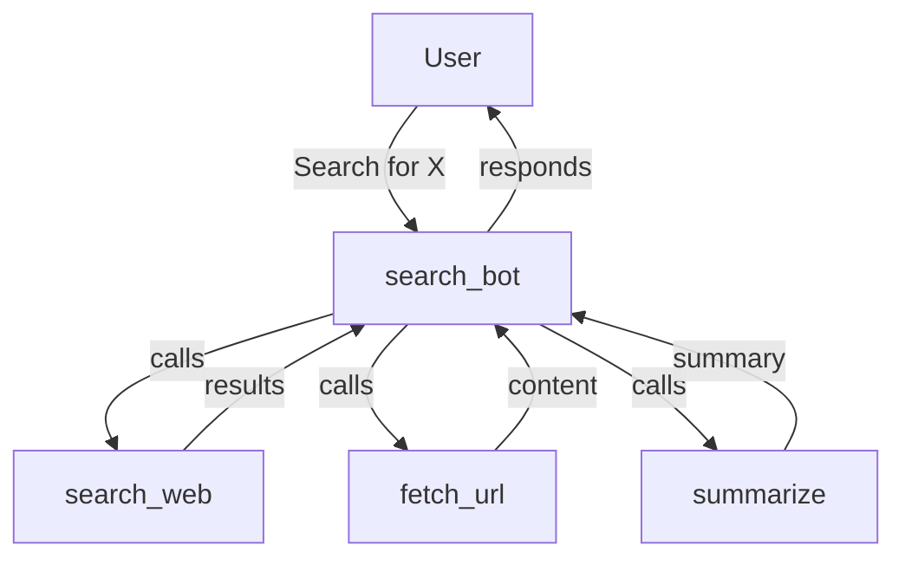

# Web Search Agent

An agent with search, summarization, and URL fetching capabilities.

## Overview

This example builds a search agent that can look up information, fetch web content,
and produce concise summaries -- demonstrating tool composition, async tools,
and structured output with Flux.



## Step 1: Define Search Tools

Create tools that simulate (or connect to real) search and fetch capabilities.

```python
from flux import Agent, Runner, tool
from flux.models.ollama import OllamaModel


@tool
def search_web(query: str) -> str:
    """Search the web for information on a topic.

    Args:
        query: The search query.

    Returns:
        A list of search results with titles and URLs.
    """
    # In production, replace with a real API (SerpAPI, Tavily, Brave, etc.)
    return (
        f"Search results for '{query}':\n"
        f"1. Example Article - https://example.com/article1\n"
        f"   A comprehensive guide about {query}.\n"
        f"2. Deep Dive - https://example.com/article2\n"
        f"   Technical details and best practices for {query}.\n"
        f"3. Overview - https://example.com/article3\n"
        f"   An introduction to {query} for beginners."
    )


@tool
def fetch_url(url: str) -> str:
    """Fetch the content of a web page given its URL.

    Args:
        url: The URL to fetch.

    Returns:
        The text content of the page.
    """
    # In production, use httpx or aiohttp
    return (
        f"Content from {url}:\n"
        f"This is the fetched content of the page. In a real implementation, "
        f"this would contain the full HTML text content."
    )


@tool
def summarize(text: str) -> str:
    """Summarize the given text into a concise paragraph.

    Args:
        text: The text to summarize.

    Returns:
        A summary of the input text.
    """
    sentences = text.strip().split(".")
    short = [s.strip() for s in sentences if len(s.strip()) > 10][:3]
    return ". ".join(short) + "." if short else text[:200]
```

## Step 2: Create the Search Agent

```python
model = OllamaModel(model="llama3.2")

search_agent = Agent(
    name="search_bot",
    instructions=(
        "You are a research assistant. Use search_web to find information, "
        "fetch_url to read specific pages, and summarize to condense long text. "
        "Always cite your sources by URL."
    ),
    model=model,
    tools=[search_web, fetch_url, summarize],
)
```

## Step 3: Async Tool Example

Tools can be async functions. This is useful for I/O-bound operations like network requests.

```python
import asyncio
from flux import Agent, Runner, tool
from flux.context import ToolContext


@tool
async def async_search_web(query: str) -> str:
    """Search the web asynchronously using aiohttp."""
    import aiohttp

    async with aiohttp.ClientSession() as session:
        url = "https://api.search.example/v1/search"
        async with session.get(url, params={"q": query}) as resp:
            data = await resp.json()
            return str(data)
```

!!! note "Sync vs Async Tools"
    The `@tool` decorator handles both sync and async functions transparently.
    The agent's `execute()` method is always async internally, so your sync tools
    work perfectly -- async is only needed when the tool itself performs async I/O.

## Step 4: Using ToolContext

Tools can access the `ToolContext` to read metadata from the current run, such as
the user context, tool name, or tool call ID.

```python
from flux import tool
from flux.context import ToolContext


@tool
def tracked_search(query: str, ctx: ToolContext) -> str:
    """Search with tracking -- logs the query via the run context."""
    # Access the user context passed to Runner.run(..., context=...)
    user = ctx.user_context
    print(f"User {user} searched for: {query}")

    # Access metadata
    ctx.run_context.set_metadata("search_query", query)

    return f"Results for '{query}'"
```

```python
# Pass user context when running
result = Runner.run_sync(
    search_agent,
    "Search for Python testing",
    context={"user_id": "user_123"},
)
```

## Step 5: Streaming Search

Show real-time output as the agent searches, fetches, and summarizes.

```python
import asyncio
from flux import Agent, Runner
from flux.streaming.events import (
    TextDeltaEvent,
    ToolCallEvent,
    MessageCompleteEvent,
    UsageEvent,
    AgentUpdatedEvent,
)
from flux.models.ollama import OllamaModel


async def streaming_search():
    model = OllamaModel(model="llama3.2")
    agent = Agent(
        name="search_bot",
        instructions="You are a research assistant.",
        model=model,
        tools=[search_web, fetch_url, summarize],
    )

    stream = await Runner.run_streamed(
        agent,
        "Search for the latest Python news and summarize the top result.",
    )

    async for event in stream:
        match event:
            case TextDeltaEvent(delta=text):
                print(text, end="", flush=True)
            case ToolCallEvent(name=name, arguments=args):
                print(f"\n  [Tool: {name}]")
            case MessageCompleteEvent(content=content):
                if content:
                    print(f"\n  [Message complete: {len(content)} chars]")
            case AgentUpdatedEvent(agent_name=name):
                print(f"\n  [Agent changed: {name}]")
            case UsageEvent(total_tokens=tokens):
                print(f"\n  [Tokens used: {tokens}]")

    print()


asyncio.run(streaming_search())
```

## Step 6: Search with Sessions and Memory

Combine search results with session-based conversation history for context-aware research.

```python
import asyncio
from flux import Agent, Runner, InMemorySession, VectorMemory
from flux.models.ollama import OllamaModel


async def research_session():
    model = OllamaModel(model="llama3.2")
    agent = Agent(
        name="researcher",
        instructions="You are a research assistant. Remember previous searches.",
        model=model,
        tools=[search_web, summarize],
    )

    session = InMemorySession()
    memory = VectorMemory()

    # First search
    r1 = await Runner.run(agent, "Search for Python async patterns", session=session)
    print(f"Answer: {r1.final_output}\n")

    # Store the result in vector memory for later retrieval
    await memory.store(
        r1.final_output,
        metadata={"topic": "python-async", "source": "search"},
    )

    # Follow-up -- the session remembers the conversation
    r2 = await Runner.run(agent, "Now find something related to that", session=session)
    print(f"Follow-up: {r2.final_output}\n")

    # Search the memory
    results = await memory.search("async", limit=3)
    print("Memory matches:")
    for entry in results:
        print(f"  - {entry.content[:100]}...")


asyncio.run(research_session())
```

## Complete Runnable Script

Save this as `search_agent.py` and run it with `python search_agent.py`.

```python
"""Web Search Agent -- search, fetch, and summarize."""
import asyncio
from datetime import datetime

from flux import (
    Agent,
    Runner,
    tool,
    InMemorySession,
    VectorMemory,
    LengthGuardrail,
    PIIGuardrail,
)
from flux.models.ollama import OllamaModel
from flux.streaming.events import TextDeltaEvent, ToolCallEvent


# ── Tools ───────────────────────────────────────────────────────────

@tool
def search_web(query: str) -> str:
    """Search the web for information on a topic."""
    return (
        f"Search results for '{query}':\n"
        f"1. Example Article - https://example.com/article1\n"
        f"   A comprehensive guide about {query}.\n"
        f"2. Deep Dive - https://example.com/article2\n"
        f"   Technical details and best practices for {query}.\n"
        f"3. Overview - https://example.com/article3\n"
        f"   An introduction to {query} for beginners."
    )


@tool
def fetch_url(url: str) -> str:
    """Fetch the content of a web page given its URL."""
    return (
        f"Content from {url}:\n"
        f"This is the fetched content of the page. In a real implementation, "
        f"this would contain the full HTML text content."
    )


@tool
def summarize(text: str) -> str:
    """Summarize the given text into a concise paragraph."""
    sentences = text.strip().split(".")
    short = [s.strip() for s in sentences if len(s.strip()) > 10][:3]
    return ". ".join(short) + "." if short else text[:200]


# ── Agent ───────────────────────────────────────────────────────────

def build_agent() -> Agent:
    model = OllamaModel(model="llama3.2")
    return Agent(
        name="search_bot",
        instructions=(
            "You are a research assistant. Use search_web to find information, "
            "fetch_url to read specific pages, and summarize to condense long text. "
            "Always cite your sources by URL."
        ),
        model=model,
        tools=[search_web, fetch_url, summarize],
        guardrails=(
            LengthGuardrail(max_chars=5000),
            PIIGuardrail(),
        ),
    )


# ── Main ────────────────────────────────────────────────────────────

async def main():
    agent = build_agent()

    # Basic search
    print("=== Basic Search ===")
    result = await Runner.run(agent, "Search for the latest Python news")
    print(f"Answer: {result.final_output}\n")

    # Search with session history
    print("=== Session Search ===")
    session = InMemorySession()
    memory = VectorMemory()

    r1 = await Runner.run(
        agent,
        "Search for Python testing frameworks",
        session=session,
    )
    print(f"Result 1: {r1.final_output}\n")

    await memory.store(r1.final_output, metadata={"topic": "testing"})

    r2 = await Runner.run(
        agent,
        "Now search for something related",
        session=session,
    )
    print(f"Result 2: {r2.final_output}\n")

    # Memory search
    matches = await memory.search("testing", limit=3)
    print(f"Memory matches: {len(matches)}")

    # Streaming search
    print("\n=== Streaming Search ===")
    stream = await Runner.run_streamed(agent, "Search for web frameworks")
    async for event in stream:
        if isinstance(event, TextDeltaEvent):
            print(event.delta, end="", flush=True)
        elif isinstance(event, ToolCallEvent):
            print(f"\n  [tool: {event.name}]")
    print()


if __name__ == "__main__":
    asyncio.run(main())
```

!!! info "Running this example"

    ```bash
    # Make sure Ollama is running
    ollama pull llama3.2

    # Run the search agent
    python search_agent.py
    ```
