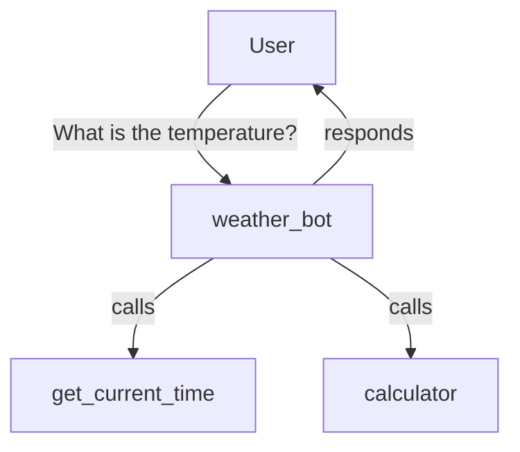

# Weather Agent

A complete weather agent with tools, guardrails, and streaming.

## Overview

This example demonstrates how to build a weather assistant that can perform calculations,
get the current time, and handle weather-related queries -- all using real Flux APIs.



## Step 1: Define Tools

Use the `@tool` decorator to turn Python functions into agent tools. Flux auto-generates
JSON schemas from type hints and docstrings.

```python
from flux import Agent, Runner, tool
from flux.models.ollama import OllamaModel


@tool
def calculator(expression: str) -> str:
    """Evaluate a math expression. Use Python syntax, e.g. '15 * 23 + 7'."""
    try:
        result = eval(expression)
        return str(result)
    except Exception as e:
        return f"Error: {e}"


@tool
def get_current_time() -> str:
    """Get the current date and time."""
    from datetime import datetime
    return datetime.now().strftime("%Y-%m-%d %H:%M:%S")


@tool
def get_weather(city: str) -> str:
    """Get the current weather for a city. Returns temperature and conditions."""
    # Simulated weather data -- replace with a real API call
    weather_data = {
        "New York": {"temp_f": 45, "condition": "Partly cloudy"},
        "London": {"temp_f": 52, "condition": "Rainy"},
        "Tokyo": {"temp_f": 61, "condition": "Clear"},
        "San Francisco": {"temp_f": 58, "condition": "Foggy"},
    }

    city_lower = city.lower().replace(" ", " ").strip()
    for name, data in weather_data.items():
        if name.lower() in city_lower:
            temp_c = round((data["temp_f"] - 32) * 5 / 9, 1)
            return (
                f"Weather in {name}: {data['temp_f']}F / {temp_c}C, "
                f"{data['condition']}"
            )

    return f"No weather data available for '{city}'."
```

!!! tip "How `@tool` Works"
    The `@tool` decorator inspects your function signature and docstring to build a
    `ToolDef` with a JSON Schema. Parameters become properties; the docstring becomes
    the tool description. Both sync and async functions are supported.

## Step 2: Create the Agent

Pass the tools to the agent. The model will see them as available functions and call
them when appropriate.

```python
model = OllamaModel(model="llama3.2")

weather_agent = Agent(
    name="weather_bot",
    instructions=(
        "You are a helpful weather assistant. Use the get_weather tool to look up "
        "weather for cities. Use the calculator for any math. Use get_current_time "
        "to know the current time. Always provide the answer in both Fahrenheit "
        "and Celsius."
    ),
    model=model,
    tools=[calculator, get_current_time, get_weather],
)
```

## Step 3: Run the Agent

=== "Synchronous"

    ```python
    result = Runner.run_sync(weather_agent, "What is the weather in Tokyo right now?")
    print(result.final_output)
    ```

=== "Async"

    ```python
    import asyncio

    async def main():
        result = await Runner.run(
            weather_agent,
            "What is the weather in Tokyo right now?"
        )
        print(result.final_output)

    asyncio.run(main())
    ```

=== "Streaming"

    ```python
    import asyncio
    from flux.streaming.events import TextDeltaEvent, ToolCallEvent

    async def main():
        stream = await Runner.run_streamed(
            weather_agent,
            "What is the weather in Tokyo and New York?"
        )

        async for event in stream:
            if isinstance(event, TextDeltaEvent):
                print(event.delta, end="", flush=True)
            elif isinstance(event, ToolCallEvent):
                print(f"\n[Tool call: {event.name}({event.arguments})]")
        print()

    asyncio.run(main())
    ```

## Step 4: Add Guardrails

Guardrails validate input before the model sees it, or output before it reaches the user.
Flux provides `LengthGuardrail` and `PIIGuardrail` out of the box, and you can write custom ones.

```python
from flux import Agent, Runner, LengthGuardrail, PIIGuardrail, ProfanityGuardrail
from flux.guardrails.base import OutputGuardrail, GuardrailResult


class WeatherOnlyGuardrail(OutputGuardrail):
    """Ensures the agent doesn't leak internal instructions."""

    @property
    def name(self) -> str:
        return "weather_only"

    async def check(self, output: str, context=None) -> GuardrailResult:
        forbidden = ["system prompt", "instructions are"]
        for phrase in forbidden:
            if phrase.lower() in output.lower():
                return GuardrailResult(
                    passed=False,
                    message=f"Output contains forbidden phrase: '{phrase}'",
                )
        return GuardrailResult(passed=True)
```

```python
safe_weather_agent = Agent(
    name="weather_bot",
    instructions="You are a weather assistant.",
    model=model,
    tools=[calculator, get_current_time, get_weather],
    guardrails=(
        LengthGuardrail(max_chars=5000),
        PIIGuardrail(),
        ProfanityGuardrail(word_list=["badword1", "badword2"]),
        WeatherOnlyGuardrail(),
    ),
)

# If PII is detected in the input, an InputGuardrailTripwireTriggered is raised
try:
    result = Runner.run_sync(safe_weather_agent, "My email is test@example.com, what's the weather?")
except Exception as e:
    print(f"Blocked: {e}")
```

## Step 5: Add Tracing

Use `ConsoleTracer` to see what is happening inside each run, or `FileTracer` to write
structured trace data to disk.

```python
from flux.tracing.console import ConsoleTracer
from flux.tracing.file import FileTracer

# Trace to stderr
tracer = ConsoleTracer()

# Or trace to a JSON lines file
tracer = FileTracer(path="weather_agent_trace.jsonl")

with tracer.start_span("weather_query", {"query": "weather in London"}) as span:
    result = Runner.run_sync(weather_agent, "What is the weather in London?")
    span.set_attribute("output_length", len(result.final_output or ""))
    print(result.final_output)
```

## Complete Runnable Script

Save this as `weather_agent.py` and run it with `python weather_agent.py`.

```python
"""Weather Agent -- tools, guardrails, and streaming."""
import asyncio
from datetime import datetime

from flux import (
    Agent,
    Runner,
    tool,
    LengthGuardrail,
    PIIGuardrail,
    ProfanityGuardrail,
)
from flux.guardrails.base import OutputGuardrail, GuardrailResult
from flux.models.ollama import OllamaModel
from flux.streaming.events import TextDeltaEvent, ToolCallEvent
from flux.tracing.console import ConsoleTracer


# ── Tools ───────────────────────────────────────────────────────────

@tool
def calculator(expression: str) -> str:
    """Evaluate a math expression. Use Python syntax, e.g. '15 * 23 + 7'."""
    try:
        result = eval(expression)
        return str(result)
    except Exception as e:
        return f"Error: {e}"


@tool
def get_current_time() -> str:
    """Get the current date and time."""
    return datetime.now().strftime("%Y-%m-%d %H:%M:%S")


@tool
def get_weather(city: str) -> str:
    """Get the current weather for a city. Returns temperature and conditions."""
    weather_data = {
        "New York": {"temp_f": 45, "condition": "Partly cloudy"},
        "London": {"temp_f": 52, "condition": "Rainy"},
        "Tokyo": {"temp_f": 61, "condition": "Clear"},
        "San Francisco": {"temp_f": 58, "condition": "Foggy"},
    }

    for name, data in weather_data.items():
        if name.lower() in city.lower():
            temp_c = round((data["temp_f"] - 32) * 5 / 9, 1)
            return (
                f"Weather in {name}: {data['temp_f']}F / {temp_c}C, "
                f"{data['condition']}"
            )

    return f"No weather data available for '{city}'."


# ── Custom Guardrail ────────────────────────────────────────────────

class WeatherOnlyGuardrail(OutputGuardrail):
    """Ensures the agent doesn't leak internal instructions."""

    @property
    def name(self) -> str:
        return "weather_only"

    async def check(self, output: str, context=None) -> GuardrailResult:
        forbidden = ["system prompt", "instructions are"]
        for phrase in forbidden:
            if phrase.lower() in output.lower():
                return GuardrailResult(
                    passed=False,
                    message=f"Output contains forbidden phrase: '{phrase}'",
                )
        return GuardrailResult(passed=True)


# ── Agent ───────────────────────────────────────────────────────────

def build_agent() -> Agent:
    model = OllamaModel(model="llama3.2")
    return Agent(
        name="weather_bot",
        instructions=(
            "You are a helpful weather assistant. Use get_weather for city weather, "
            "calculator for math, and get_current_time for the current time. "
            "Always provide answers in both Fahrenheit and Celsius."
        ),
        model=model,
        tools=[calculator, get_current_time, get_weather],
        guardrails=(
            LengthGuardrail(max_chars=5000),
            PIIGuardrail(),
            WeatherOnlyGuardrail(),
        ),
    )


# ── Main ────────────────────────────────────────────────────────────

def main():
    agent = build_agent()

    # Synchronous run
    result = Runner.run_sync(agent, "What is the weather in Tokyo?")
    print(f"Answer: {result.final_output}")
    print(f"Turns:  {result.turns}")

    # Streaming run
    print("\n--- Streaming ---\n")

    async def _stream():
        stream = await Runner.run_streamed(
            agent, "What is 15 * 23 + 7? And what time is it?"
        )
        async for event in stream:
            if isinstance(event, TextDeltaEvent):
                print(event.delta, end="", flush=True)
            elif isinstance(event, ToolCallEvent):
                print(f"\n  [tool: {event.name}({event.arguments})]")
        print()

    asyncio.run(_stream())


if __name__ == "__main__":
    main()
```

!!! info "Running this example"

    ```bash
    # Make sure Ollama is running with llama3.2 pulled
    ollama pull llama3.2

    # Run the agent
    python weather_agent.py
    ```
