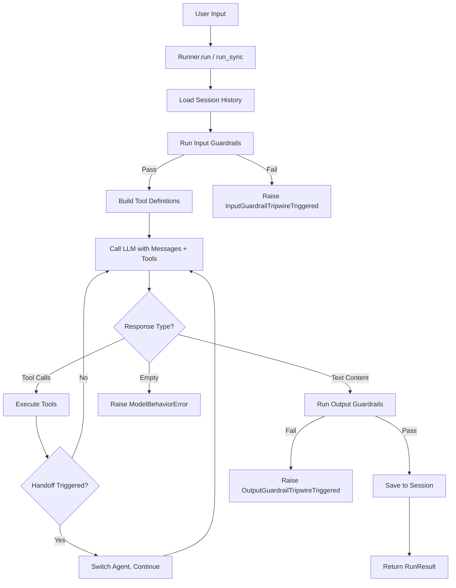

# Your First Agent

A step-by-step tutorial to build your first Flux agent with tools, streaming, and sessions.

## Overview

In this tutorial you will build an agent step by step, starting with the simplest possible setup and progressively adding:

1. A basic agent with instructions and a model
2. Synchronous execution with `Runner.run_sync()`
3. Custom tools with the `@tool` decorator
4. Streaming output with `Runner.run_streamed()`
5. Session persistence with `InMemorySession`
6. Input and output guardrails

By the end, you will understand the core abstractions of the Flux Agents framework.

## Prerequisites

- Python 3.11+
- Ollama installed with `llama3.2` pulled (`ollama pull llama3.2`)
- Flux Agents installed: `pip install "flux-agents[ollama]"`

## The Agent Lifecycle

Before diving in, here is how a Flux agent execution flows:



---

## Step 1: Create an Agent

An `Agent` is the core abstraction in Flux. It is an **immutable** dataclass that defines:

- A **name** for identification
- **Instructions** (a system prompt) that tell the agent how to behave
- A **model** to use for reasoning
- Optionally: **tools**, **handoffs**, **guardrails**, and **settings**

```python
from flux import Agent
from flux.models.ollama import OllamaModel

agent = Agent(
    name="assistant",
    instructions="You are a helpful assistant. Answer questions clearly and concisely.",
    model=OllamaModel(model="llama3.2"),
)

print(f"Agent: {agent.name}")
print(f"Instructions: {agent.instructions}")
```

!!! note "Immutable agents"
    `Agent` is a frozen dataclass. Once created, you cannot modify it directly. Use `agent.clone(...)` to create a modified copy:

    ```python
    focused_agent = agent.clone(
        name="focused_assistant",
        instructions="You answer in exactly one sentence.",
    )
    ```

### Instructions as a Function

Instructions can also be a callable that receives the run context and returns a string. This is useful for dynamic prompts:

```python
from flux import Agent
from flux.context import RunContext

agent = Agent(
    name="adaptive_assistant",
    instructions=lambda ctx: f"You are a helpful assistant. Turn {ctx.turn_count} of the conversation.",
    model=OllamaModel(model="llama3.2"),
)
```

---

## Step 2: Run with Runner.run_sync()

The `Runner` is the execution engine. It handles the conversation loop, tool execution, handoffs, guardrails, and session management.

```python
from flux import Agent, Runner
from flux.models.ollama import OllamaModel

agent = Agent(
    name="assistant",
    instructions="You are a helpful assistant. Answer questions clearly and concisely.",
    model=OllamaModel(model="llama3.2"),
)

# Synchronous execution -- simplest way to run an agent
result = Runner.run_sync(agent, "What is the capital of France?")

print(f"Output: {result.final_output}")
print(f"Turns: {result.turns}")
print(f"Tokens: {result.usage.total_tokens}")
```

Expected output:

```
Output: The capital of France is Paris.
Turns: 1
Tokens: 89
```

The `RunResult` contains:

| Field | Description |
|---|---|
| `final_output` | The agent's final text response |
| `last_agent` | The agent that produced the final output (may differ from the start agent if handoffs occurred) |
| `usage` | Token usage tracking (`input_tokens`, `output_tokens`, `total_tokens`) |
| `messages` | Full conversation history for this run |
| `handoffs` | List of handoff events that occurred |
| `turns` | Number of LLM turns taken |

### Using Async

For async applications, use `await Runner.run()`:

```python
import asyncio
from flux import Agent, Runner
from flux.models.ollama import OllamaModel

agent = Agent(
    name="assistant",
    instructions="You are a helpful assistant.",
    model=OllamaModel(model="llama3.2"),
)

async def main():
    result = await Runner.run(agent, "What is the capital of France?")
    print(result.final_output)

asyncio.run(main())
```

---

## Step 3: Add Tools with @tool

Tools let your agent interact with external systems. Create a tool by decorating a Python function with `@tool`:

```python
import asyncio
from flux import Agent, Runner, tool
from flux.models.ollama import OllamaModel


@tool
def calculate(expression: str) -> str:
    """Evaluate a mathematical expression.

    Args:
        expression: A mathematical expression to evaluate, like "2 + 3 * 4".
    """
    try:
        result = eval(expression)  # Only for demo -- use a safe evaluator in production
        return str(result)
    except Exception as e:
        return f"Error: {e}"


@tool
def get_population(city: str) -> str:
    """Get the approximate population of a city.

    Args:
        city: The name of the city.
    """
    populations = {
        "New York": "8,336,817",
        "London": "8,982,000",
        "Tokyo": "13,960,000",
        "Paris": "2,161,000",
    }
    return populations.get(city, f"Population data not available for {city}")


agent = Agent(
    name="math_geography_bot",
    instructions="You are a helpful assistant that can calculate math and look up city populations.",
    model=OllamaModel(model="llama3.2"),
    tools=[calculate, get_population],
)


async def main():
    result = await Runner.run(
        agent,
        "What is the population of Paris divided by 1000?",
    )
    print(result.final_output)
    print(f"\nTool calls made: {sum(1 for m in result.messages if m.tool_calls)}")


asyncio.run(main())
```

Expected output:

```
The population of Paris is 2,161,000. Divided by 1,000, that equals 2,161.

Tool calls made: 2
```

### How the @tool Decorator Works

The `@tool` decorator automatically:

1. **Names** the tool using the function name (override with `@tool(name="custom_name")`)
2. **Describes** the tool using the docstring (override with `@tool(description="Custom description")`)
3. **Generates a JSON Schema** from type hints and parameter annotations
4. **Supports async functions** -- just use `async def`
5. **Injects context** -- if your function accepts a parameter named `ctx` or `context` with a `ToolContext` annotation, it receives the tool invocation context automatically

### Tools with Context Access

If your tool needs access to the run context (e.g., to access user data or metadata):

```python
from flux import tool
from flux.context import ToolContext


@tool
def get_user_info(query: str, ctx: ToolContext) -> str:
    """Look up user information.

    Args:
        query: What to look up about the user.
    """
    user = ctx.user_context  # Access the user context passed to Runner.run()
    return f"User {user} asked about: {query}"
```

When running, pass the user context to `Runner.run()`:

```python
result = await Runner.run(agent, "Look up my info", context="Alice")
```

---

## Step 4: Add Streaming

Streaming gives you real-time output as the model generates tokens, instead of waiting for the complete response:

```python
import asyncio
from flux import Agent, Runner, tool
from flux.models.ollama import OllamaModel
from flux.streaming.events import (
    TextDeltaEvent,
    ToolCallEvent,
    MessageCompleteEvent,
    UsageEvent,
    AgentUpdatedEvent,
)


@tool
def get_weather(city: str) -> str:
    """Get the current weather for a city."""
    return f"The weather in {city} is sunny and 72F"


agent = Agent(
    name="weather_bot",
    instructions="You are a helpful weather assistant.",
    model=OllamaModel(model="llama3.2"),
    tools=[get_weather],
)


async def main():
    result = await Runner.run_streamed(agent, "What's the weather in New York?")

    print("Response: ", end="")
    async for event in result:
        if isinstance(event, TextDeltaEvent):
            # Print each token as it arrives
            print(event.delta, end="", flush=True)

        elif isinstance(event, ToolCallEvent):
            print(f"\n  [Tool Call] {event.name}({event.arguments})")

        elif isinstance(event, UsageEvent):
            print(f"\n  [Usage] {event.total_tokens} tokens")

        elif isinstance(event, AgentUpdatedEvent):
            print(f"\n  [Handoff] Switched to {event.agent_name}")

    print()  # Final newline


asyncio.run(main())
```

Expected output:

```
Response: The weather in New York is sunny and 72F!
  [Usage] 134 tokens
```

### Streaming Event Types

| Event | Description |
|---|---|
| `TextDeltaEvent(delta)` | Incremental text token. Print `event.delta` to stream output. |
| `ToolCallEvent(tool_call_id, name, arguments)` | A complete tool call with name and JSON arguments. |
| `MessageCompleteEvent(content, tool_calls)` | The full assembled message from the model. |
| `UsageEvent(input_tokens, output_tokens, total_tokens)` | Token usage update, emitted when available. |
| `AgentUpdatedEvent(agent_name)` | The active agent changed due to a handoff. |
| `ErrorEvent(message, details)` | An error occurred during streaming. |

---

## Step 5: Add Session Persistence

Sessions maintain conversation history across multiple `Runner.run()` calls. Without a session, each call is stateless.

```python
import asyncio
from flux import Agent, Runner, tool
from flux.models.ollama import OllamaModel
from flux.sessions.in_memory import InMemorySession


@tool
def get_weather(city: str) -> str:
    """Get the current weather for a city."""
    weather = {"New York": "Sunny, 72F", "London": "Cloudy, 58F"}
    return weather.get(city, f"No weather data for {city}")


agent = Agent(
    name="weather_bot",
    instructions="You are a helpful weather assistant. Remember what the user has asked before.",
    model=OllamaModel(model="llama3.2"),
    tools=[get_weather],
)


async def main():
    session = InMemorySession()

    # First message
    result1 = await Runner.run(
        agent,
        "What's the weather in New York?",
        session=session,
    )
    print(f"Turn 1: {result1.final_output}")

    # Follow-up -- the agent remembers the previous context
    result2 = await Runner.run(
        agent,
        "And what about London?",
        session=session,
    )
    print(f"Turn 2: {result2.final_output}")

    # Check session history
    messages = await session.get_messages()
    print(f"\nSession has {len(messages)} stored messages")


asyncio.run(main())
```

Expected output:

```
Turn 1: The weather in New York is sunny and 72F!
Turn 2: In London, it's cloudy and 58F.

Session has 4 stored messages
```

### Session Types

Flux provides two built-in session implementations:

| Session | Storage | Use Case |
|---|---|---|
| `InMemorySession` | Python deque (lost on exit) | Development, testing |
| `SQLiteSession` | SQLite database file | Production persistence |

Using `SQLiteSession` for persistent storage:

```python
from flux.sessions.sqlite import SQLiteSession

session = SQLiteSession(db_path="my_app.db", session_id="user-123")

# Later, resume the same session
session = SQLiteSession(db_path="my_app.db", session_id="user-123")
```

---

## Step 6: Add Guardrails

Guardrails validate input and output to ensure your agent behaves correctly. Flux includes built-in guardrails and lets you create custom ones.

### Using Built-in Guardrails

```python
import asyncio
from flux import Agent, Runner
from flux.models.ollama import OllamaModel
from flux.guardrails.builtins import LengthGuardrail, PIIGuardrail
from flux.exceptions import InputGuardrailTripwireTriggered


agent = Agent(
    name="safe_assistant",
    instructions="You are a helpful assistant.",
    model=OllamaModel(model="llama3.2"),
    guardrails=(
        LengthGuardrail(max_chars=500),  # Reject inputs over 500 characters
        PIIGuardrail(),                  # Detect emails, phone numbers, SSNs
    ),
)


async def main():
    # This works fine
    result = await Runner.run(agent, "What is 2 + 2?")
    print(f"Response: {result.final_output}")

    # This triggers the PII guardrail
    try:
        result = await Runner.run(agent, "My email is john@example.com")
    except InputGuardrailTripwireTriggered as e:
        print(f"Guardrail triggered: {e.guardrail_name} -- {e.message}")


asyncio.run(main())
```

Expected output:

```
Response: 2 + 2 equals 4.
Guardrail triggered: pii_guardrail -- PII detected: email
```

### Built-in Guardrails

| Guardrail | Type | Description |
|---|---|---|
| `LengthGuardrail(max_chars)` | Input | Rejects text exceeding a character limit |
| `ProfanityGuardrail(word_list)` | Input | Checks for prohibited words (case-insensitive) |
| `PIIGuardrail()` | Input | Detects emails, phone numbers, and SSNs via regex |

### Creating Custom Guardrails

Subclass `InputGuardrail` or `OutputGuardrail` and implement the `check` method:

```python
from flux.guardrails.base import InputGuardrail, GuardrailResult


class NoCodeInjectionGuardrail(InputGuardrail):
    """Rejects inputs that look like code injection attempts."""

    @property
    def name(self) -> str:
        return "no_code_injection"

    async def check(self, user_input: str, context=None) -> GuardrailResult:
        forbidden = ["eval(", "exec(", "__import__", "os.system"]
        for pattern in forbidden:
            if pattern in user_input:
                return GuardrailResult(
                    passed=False,
                    message=f"Potentially dangerous input detected: {pattern}",
                )
        return GuardrailResult(passed=True)
```

Use it in an agent:

```python
agent = Agent(
    name="safe_coder",
    instructions="You are a helpful coding assistant.",
    model=OllamaModel(model="llama3.2"),
    guardrails=(NoCodeInjectionGuardrail(),),
)
```

### Output Guardrails

Output guardrails validate the model's response before it is returned:

```python
from flux.guardrails.base import OutputGuardrail, GuardrailResult


class NoProfanityOutputGuardrail(OutputGuardrail):
    """Ensures the agent does not produce inappropriate content."""

    @property
    def name(self) -> str:
        return "output_profanity"

    async def check(self, output: str, context=None) -> GuardrailResult:
        # Add your checks here
        return GuardrailResult(passed=True)
```

!!! warning "Guardrail exceptions"
    When a guardrail fails, the Runner raises `InputGuardrailTripwireTriggered` or `OutputGuardrailTripwireTriggered`. Always handle these exceptions in production code.

---

## Complete Example

Here is the full agent combining all features from this tutorial:

```python
import asyncio
from flux import Agent, Runner, tool
from flux.models.ollama import OllamaModel
from flux.sessions.in_memory import InMemorySession
from flux.guardrails.builtins import LengthGuardrail
from flux.exceptions import InputGuardrailTripwireTriggered
from flux.streaming.events import TextDeltaEvent, UsageEvent


@tool
def calculate(expression: str) -> str:
    """Evaluate a mathematical expression.

    Args:
        expression: A math expression like "2 + 3 * 4".
    """
    try:
        return str(eval(expression))
    except Exception as e:
        return f"Error: {e}"


@tool
def get_weather(city: str) -> str:
    """Get the current weather for a city.

    Args:
        city: The name of the city.
    """
    weather = {
        "New York": "Sunny, 72F",
        "London": "Cloudy, 58F",
        "Tokyo": "Rainy, 65F",
    }
    return weather.get(city, f"No weather data for {city}")


# Build the agent
agent = Agent(
    name="multi_tool_bot",
    instructions=(
        "You are a helpful assistant that can calculate math expressions "
        "and look up weather. Use your tools when appropriate."
    ),
    model=OllamaModel(model="llama3.2"),
    tools=[calculate, get_weather],
    guardrails=(LengthGuardrail(max_chars=1000),),
)


async def main():
    session = InMemorySession()

    # --- Run 1: Sync execution ---
    print("=" * 50)
    print("RUN 1: Synchronous with tools")
    print("=" * 50)

    result = Runner.run_sync(agent, "What is 15 * 7 + 3?", session=session)
    print(f"Answer: {result.final_output}")
    print(f"Turns: {result.turns}, Tokens: {result.usage.total_tokens}")

    # --- Run 2: Async with streaming ---
    print("\n" + "=" * 50)
    print("RUN 2: Streaming")
    print("=" * 50)

    result = await Runner.run_streamed(
        agent,
        "What's the weather in Tokyo?",
        session=session,
    )
    async for event in result:
        if isinstance(event, TextDeltaEvent):
            print(event.delta, end="", flush=True)
        elif isinstance(event, UsageEvent):
            print(f"\n  [Tokens: {event.total_tokens}]")
    print()

    # --- Run 3: Guardrail demonstration ---
    print("\n" + "=" * 50)
    print("RUN 3: Guardrail test")
    print("=" * 50)

    try:
        # This triggers the LengthGuardrail
        long_input = "Hi " * 500
        await Runner.run(agent, long_input, session=session)
    except InputGuardrailTripwireTriggered as e:
        print(f"Guardrail caught: {e.guardrail_name} -- {e.message}")

    # --- Session summary ---
    messages = await session.get_messages()
    print(f"\nSession total: {len(messages)} messages stored")


asyncio.run(main())
```

---

## Tips and Best Practices

1. **Start simple**: Begin with a basic agent and add features incrementally. You can always add tools, guardrails, and sessions later.

2. **Be specific with instructions**: Clear, detailed instructions produce better results. Instead of "You are helpful", try "You are a weather assistant. Always use the get_weather tool to answer weather questions. Respond in one or two sentences."

3. **Use type hints in tools**: The `@tool` decorator generates JSON Schema from your function's type hints. Good type hints mean better tool use by the model.

4. **Handle guardrail exceptions**: Always wrap `Runner.run()` in a try/except when using guardrails:

    ```python
    try:
        result = await Runner.run(agent, user_input)
    except InputGuardrailTripwireTriggered:
        return "Sorry, I cannot process that input."
    except OutputGuardrailTripwireTriggered:
        return "Sorry, I generated an inappropriate response. Please try again."
    ```

5. **Use sessions for multi-turn conversations**: Without a session, each `Runner.run()` call is stateless. Pass a session to maintain context.

6. **Prefer async in production**: Use `await Runner.run()` and `await Runner.run_streamed()` in production applications. Reserve `Runner.run_sync()` for scripts and quick tests.

7. **Clone agents for variations**: Since agents are immutable, use `clone()` to create modified copies:

    ```python
    concise_agent = agent.clone(
        name="concise_bot",
        instructions="Answer in exactly one sentence.",
        settings=AgentSettings(max_turns=3),
    )
    ```

---

## Next Steps

- [Project Structure](project-structure.md) -- Understand the Flux Agents architecture and how all the modules fit together
- Revisit the [Quickstart](quickstart.md) for a condensed reference
