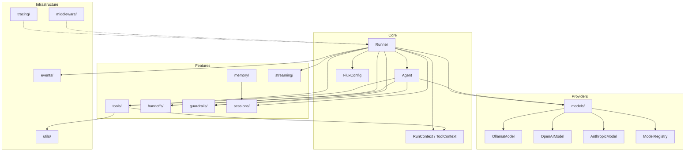

# Project Structure

Understanding the Flux Agents project layout and architecture.

## Package Layout

Flux Agents is organized into focused modules, each handling a specific concern:

```
flux/
├── __init__.py          # Public API — all re-exports for convenient imports
├── agent.py             # Agent and AgentSettings dataclasses
├── runner.py            # Runner execution engine (run, run_sync, run_streamed)
├── context.py           # RunContext, ToolContext, Usage tracking
├── config.py            # FluxConfig global configuration
├── exceptions.py        # Exception hierarchy
├── cli.py               # CLI entry point (flux / flux-agents commands)
│
├── models/              # LLM provider implementations
│   ├── base.py          # Model protocol, Message, ModelRequest, ModelResponse, ModelSettings
│   ├── registry.py      # ModelRegistry — resolve model names to providers
│   ├── ollama.py        # OllamaModel — local models via Ollama
│   ├── openai_provider.py  # OpenAIModel — OpenAI, OpenRouter, DeepSeek, Groq
│   └── anthropic.py     # AnthropicModel — Claude models
│
├── tools/               # Tool system
│   ├── base.py          # Tool protocol, ToolResult
│   ├── decorator.py     # @tool decorator, FunctionTool
│   ├── registry.py      # ToolRegistry for managing tool collections
│   ├── schema.py        # JSON Schema generation from function signatures
│   └── builtins.py      # ShellTool, FileReadTool, FileWriteTool
│
├── handoffs/            # Agent-to-agent routing
│   ├── handoff.py       # Handoff and HandoffData dataclasses
│   └── router.py        # Handoff lookup utilities
│
├── guardrails/          # Input and output validation
│   ├── base.py          # InputGuardrail, OutputGuardrail base classes
│   └── builtins.py      # LengthGuardrail, ProfanityGuardrail, PIIGuardrail
│
├── sessions/            # Conversation persistence
│   ├── base.py          # Session protocol
│   ├── in_memory.py     # InMemorySession — transient storage
│   └── sqlite.py        # SQLiteSession — persistent storage
│
├── memory/              # Long-term memory
│   ├── base.py          # Memory protocol, MemoryEntry
│   ├── conversation.py  # ConversationMemory — wraps a Session for search
│   └── vector.py        # VectorMemory — hash-based similarity search
│
├── streaming/           # Real-time output
│   └── events.py        # TextDeltaEvent, ToolCallEvent, MessageCompleteEvent, etc.
│
├── middleware/           # Composable request/response pipeline
│   ├── base.py          # Middleware protocol, RequestContext, Response
│   ├── logging.py       # LoggingMiddleware
│   ├── rate_limit.py    # RateLimitMiddleware (token bucket)
│   ├── cache.py         # CacheMiddleware (hash-based, TTL)
│   └── retry.py         # RetryMiddleware (exponential backoff)
│
├── events/              # Decoupled event bus
│   └── bus.py           # EventBus, Event, type constants (AGENT_START, LLM_START, etc.)
│
├── tracing/             # Observability
│   ├── base.py          # Span, Tracer protocols
│   ├── console.py       # ConsoleTracer — prints spans to stderr
│   └── file.py          # FileTracer — writes JSON lines to file
│
└── utils/               # Shared utilities
    ├── schema.py        # function_to_schema — JSON Schema from Python signatures
    ├── tokens.py        # count_tokens, truncate_to_tokens (tiktoken-based)
    └── pretty.py        # Pretty-printing for results, errors, and stream deltas
```

## Module Relationships



## Key Design Principles

### 1. Immutable Core Types

The `Agent` dataclass is `frozen=True`. Once created, it cannot be modified. Use `agent.clone(**kwargs)` to create modified copies. This ensures thread safety and predictable behavior:

```python
# Agents are immutable
agent = Agent(name="bot", instructions="Be helpful.")

# Create modified copies -- never mutate
concise_bot = agent.clone(name="concise_bot", instructions="Be brief.")
```

### 2. Async-First

The entire framework is built on `async/await`. Every model provider, tool, guardrail, session, and memory store uses async interfaces. Synchronous wrappers (`Runner.run_sync()`) are provided for convenience, but the async path is the primary design:

```python
# Async (primary)
result = await Runner.run(agent, input)

# Sync (convenience wrapper)
result = Runner.run_sync(agent, input)
```

### 3. Protocol-Based Extensibility

Flux uses Python's `Protocol` class (structural subtyping) instead of abstract base classes. This means you can implement any interface without inheriting from a base class -- you just need to match the method signatures:

```python
# You don't need to subclass Model -- just implement the protocol
class MyCustomModel:
    async def complete(self, request: ModelRequest) -> ModelResponse:
        ...
    async def stream(self, request: ModelRequest) -> AsyncIterator[StreamChunk]:
        ...
        yield
```

The same applies to `Tool`, `Session`, `Memory`, `Middleware`, `Tracer`, and `Span`.

### 4. Zero-Required-Dependencies

The core package has no third-party dependencies. Model providers are optional extras (`aiohttp` for Ollama, `openai` for OpenAI, `anthropic` for Anthropic). This keeps the dependency footprint minimal and lets you choose only what you need.

### 5. Composable Middleware

The middleware system follows the classic onion/wrapper pattern. Each middleware receives a request context and a `next` function, allowing it to inspect, modify, or short-circuit the request:

```python
class MyMiddleware:
    async def process(self, ctx: RequestContext, next: NextFn) -> Response:
        # Before: inspect or modify the request
        print(f"Request from {ctx.agent_name}")

        # Continue the chain
        response = await next(ctx)

        # After: inspect or modify the response
        print(f"Response: {response.content[:100]}")
        return response
```

### 6. Event-Driven Observability

The event bus emits typed events at every stage of execution (agent start/end, LLM call, tool execution, handoff, run start/end). Subscribe to specific event types or all events for logging, metrics, or debugging:

```python
from flux import get_event_bus
from flux.events import AGENT_START, TOOL_START

bus = get_event_bus()
bus.on(AGENT_START, lambda e: print(f"Agent started: {e.data['agent']}"))
bus.on(TOOL_START, lambda e: print(f"Tool called: {e.data['tool']}"))
```

## How to Extend the Framework

### Adding a Custom Model Provider

Implement the `Model` protocol by providing `complete()` and `stream()` methods:

```python
from flux.models.base import Model, ModelRequest, ModelResponse, StreamChunk


class MyModelProvider:
    """Custom model provider."""

    def __init__(self, api_key: str, model: str = "my-model"):
        self.api_key = api_key
        self.model = model

    async def complete(self, request: ModelRequest) -> ModelResponse:
        # Call your LLM API here
        content = await self._call_api(request)
        return ModelResponse(content=content)

    async def stream(self, request: ModelRequest) -> AsyncIterator[StreamChunk]:
        # Stream tokens from your LLM API
        async for token in self._stream_api(request):
            yield StreamChunk(delta_text=token)
        yield StreamChunk(done=True)
```

### Adding a Custom Tool

Implement the `Tool` protocol or use the `@tool` decorator:

```python
# Using the @tool decorator (recommended)
from flux import tool


@tool(name="search_db", description="Search the database")
def search_database(query: str, limit: int = 10) -> str:
    """Search the product database.

    Args:
        query: The search query.
        limit: Maximum results to return.
    """
    # Your database logic here
    return f"Found results for: {query}"


# Implementing the Tool protocol directly
from flux.tools.base import Tool, ToolResult
from flux.context import ToolContext


class DatabaseSearchTool:
    """Manual tool implementation."""

    @property
    def name(self) -> str:
        return "search_db"

    @property
    def description(self) -> str:
        return "Search the product database."

    @property
    def parameters_schema(self) -> dict:
        return {
            "type": "object",
            "properties": {
                "query": {"type": "string", "description": "Search query"},
                "limit": {"type": "integer", "description": "Max results"},
            },
            "required": ["query"],
        }

    async def execute(self, ctx: ToolContext, args: dict) -> ToolResult:
        query = args["query"]
        limit = args.get("limit", 10)
        return ToolResult(output=f"Results for {query} (limit={limit})")
```

### Adding a Custom Guardrail

Subclass `InputGuardrail` or `OutputGuardrail`:

```python
from flux.guardrails.base import InputGuardrail, OutputGuardrail, GuardrailResult


class profanity_guardrail(InputGuardrail):
    """Custom input guardrail."""

    @property
    def name(self) -> str:
        return "custom_profanity"

    async def check(self, user_input: str, context=None) -> GuardrailResult:
        # Your validation logic
        if "badword" in user_input.lower():
            return GuardrailResult(
                passed=False,
                message="Inappropriate content detected",
            )
        return GuardrailResult(passed=True)


class fact_check_guardrail(OutputGuardrail):
    """Custom output guardrail."""

    @property
    def name(self) -> str:
        return "fact_check"

    async def check(self, output: str, context=None) -> GuardrailResult:
        # Your output validation logic
        return GuardrailResult(passed=True)
```

### Adding a Custom Middleware

Implement the `Middleware` protocol:

```python
from flux.middleware.base import Middleware, RequestContext, Response, NextFn


class TokenLimitMiddleware:
    """Truncate messages that exceed a token limit."""

    def __init__(self, max_tokens: int = 4000):
        self._max_tokens = max_tokens

    async def process(self, ctx: RequestContext, next: NextFn) -> Response:
        # Modify request before passing to next middleware
        if len(ctx.messages) > self._max_tokens:
            ctx.messages = ctx.messages[-self._max_tokens:]
        return await next(ctx)
```

### Adding a Custom Session

Implement the `Session` protocol:

```python
import json
from flux.sessions.base import Session


class RedisSession:
    """Session backed by Redis."""

    def __init__(self, redis_url: str, session_id: str):
        self._url = redis_url
        self._session_id = session_id

    @property
    def session_id(self) -> str:
        return self._session_id

    async def get_messages(self, limit: int | None = None) -> list[dict]:
        # Fetch from Redis
        ...

    async def add_messages(self, messages: list[dict]) -> None:
        # Store in Redis
        ...

    async def clear(self) -> None:
        # Clear Redis key
        ...
```

### Adding a Custom Tracer

Implement the `Tracer` protocol:

```python
from flux.tracing.base import Tracer, Span, SpanData, SpanError
import uuid


class DatadogTracer:
    """Send traces to Datadog."""

    def __init__(self, api_key: str):
        self._api_key = api_key

    def start_span(
        self, name: str, attributes: dict | None = None
    ) -> Span:
        # Create and return a Datadog span
        ...

    def flush(self) -> None:
        # Flush pending traces to Datadog
        ...
```

## Exception Hierarchy

All framework exceptions inherit from `FluxError`, making it easy to catch any Flux-specific error:

```
FluxError
├── MaxTurnsExceeded          # Agent exceeded max_turns
├── ModelBehaviorError        # Model returned empty or invalid response
├── UserError                 # Developer misuse of the framework
├── ToolError                 # Tool execution failure
├── ToolTimeoutError          # Tool execution timeout
├── GuardrailTripwireError    # Base for guardrail violations
│   ├── InputGuardrailTripwireTriggered
│   └── OutputGuardrailTripwireTriggered
├── HandoffError              # Agent handoff failure
├── ProviderError             # LLM provider returned an error
└── ConfigurationError        # Invalid configuration
```

Catch specific exceptions for fine-grained error handling, or catch `FluxError` as a fallback:

```python
from flux.exceptions import (
    FluxError,
    InputGuardrailTripwireTriggered,
    ProviderError,
    ToolError,
)

try:
    result = await Runner.run(agent, user_input)
except InputGuardrailTripwireTriggered:
    return "Input rejected by guardrail"
except ToolError as e:
    logger.error(f"Tool '{e.tool_name}' failed: {e.tool_error}")
except ProviderError as e:
    logger.error(f"Provider '{e.provider}' error: {e}")
except FluxError as e:
    logger.error(f"Flux error: {e}")
```

---

## Next Steps

- [Installation](installation.md) -- Set up Flux Agents and optional providers
- [Quickstart](quickstart.md) -- Build your first agent in 5 minutes
- [Your First Agent](first-agent.md) -- Step-by-step tutorial with tools, streaming, sessions, and guardrails
