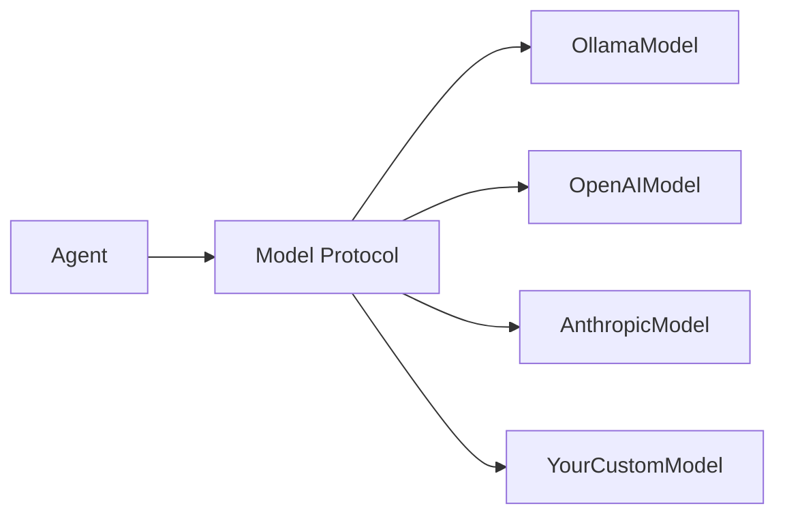
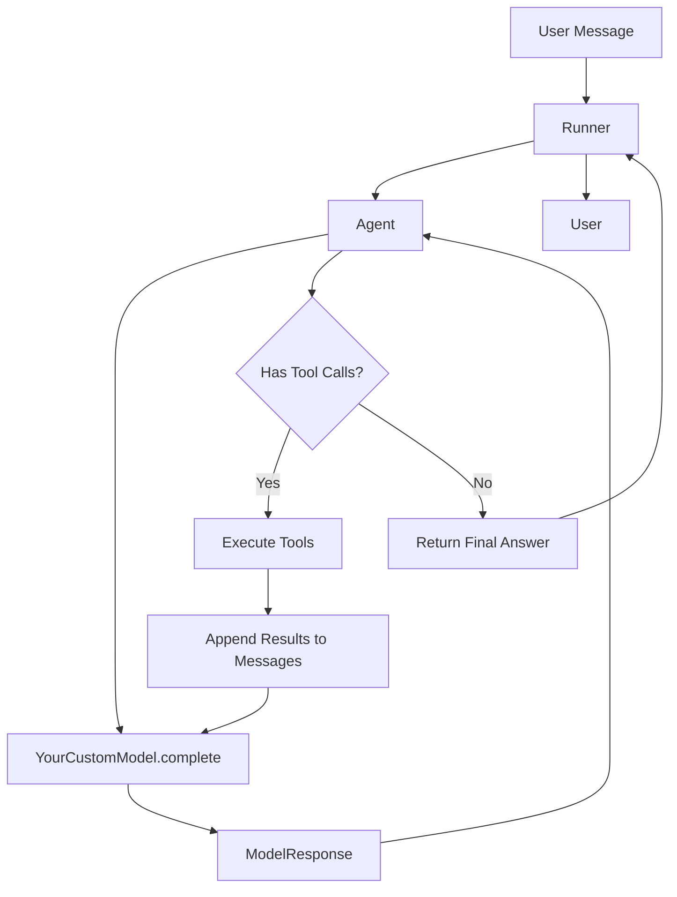

# Custom Provider Guide

Implementing your own LLM provider for Flux -- from a simple echo model to a fully integrated custom backend.

---

## Overview

Flux ships with providers for Ollama, OpenAI, and Anthropic. When you need a different backend -- a self-hosted model, an internal API, or a mock for testing -- you can implement the model protocol yourself.



---

## Prerequisites

- Python 3.10+
- Flux installed (`pip install flux-agents`)
- Familiarity with the `Agent` and `Runner` APIs

---

## 1 -- The Model Protocol

Every model in Flux must implement two async methods:

| Method | Signature | Purpose |
|---|---|---|
| `complete` | `async def complete(self, request: ModelRequest) -> ModelResponse` | Single-turn completion |
| `stream` | `async def stream(self, request: ModelRequest) -> AsyncIterator[StreamChunk]` | Token-by-token streaming |

The request and response types are:

```python
from flux.models.base import ModelRequest, ModelResponse, StreamChunk
from flux.context import Usage
```

- **`ModelRequest`** -- contains `messages` (list of message objects with `.content` and `.role`).
- **`ModelResponse`** -- contains `content` (the full text) and `usage` (token counts).
- **`StreamChunk`** -- contains either `delta_text` (a token) or `done=True` with final `usage`.
- **`Usage`** -- tracks `input_tokens`, `output_tokens`, `total_tokens`, and `requests`.

---

## 2 -- Implement a Simple Echo Model

This minimal model echoes the user's message back with a prefix. It is useful for testing pipelines without calling an actual LLM.

```python
from flux import Agent, Runner
from flux.context import Usage
from flux.models.base import ModelRequest, ModelResponse, StreamChunk


class EchoModel:
    """A simple echo model for testing."""

    def __init__(self, prefix: str = "Echo:") -> None:
        self.prefix = prefix

    async def complete(self, request: ModelRequest) -> ModelResponse:
        last_msg = request.messages[-1].content if request.messages else ""
        return ModelResponse(
            content=f"{self.prefix} {last_msg}",
            usage=Usage(
                input_tokens=10,
                output_tokens=20,
                total_tokens=30,
                requests=1,
            ),
        )

    async def stream(self, request: ModelRequest):
        last_msg = request.messages[-1].content if request.messages else ""
        response = f"{self.prefix} {last_msg}"
        for word in response.split(" "):
            yield StreamChunk(delta_text=word + " ")
        yield StreamChunk(
            done=True,
            usage=Usage(
                input_tokens=10,
                output_tokens=20,
                total_tokens=30,
                requests=1,
            ),
        )
```

---

## 3 -- Use the Custom Model

Pass an instance of your model directly to an `Agent`.

```python
import asyncio
from flux import Agent, Runner


async def main():
    agent = Agent(
        name="echo_agent",
        instructions="You are an echo assistant.",
        model=EchoModel(prefix="Echo:"),
    )

    # Single-turn
    result = await Runner.run(agent, "Hello, world!")
    print(result.final_output)
    # Output: Echo: Hello, world!

    # Streaming
    stream_result = await Runner.run_streamed(agent, "Hello, streaming!")
    async for event in stream_result.stream_events():
        if hasattr(event, "delta_text"):
            print(event.delta_text, end="", flush=True)
    print()

asyncio.run(main())
```

---

## 4 -- Full Working Example

```python
"""Custom Echo model with streaming support."""

import asyncio
from flux import Agent, Runner
from flux.context import Usage
from flux.models.base import ModelRequest, ModelResponse, StreamChunk


class EchoModel:
    """A simple echo model for testing."""

    def __init__(self, prefix: str = "Echo:") -> None:
        self.prefix = prefix

    async def complete(self, request: ModelRequest) -> ModelResponse:
        last_msg = request.messages[-1].content if request.messages else ""
        return ModelResponse(
            content=f"{self.prefix} {last_msg}",
            usage=Usage(
                input_tokens=10,
                output_tokens=20,
                total_tokens=30,
                requests=1,
            ),
        )

    async def stream(self, request: ModelRequest):
        last_msg = request.messages[-1].content if request.messages else ""
        response = f"{self.prefix} {last_msg}"
        for word in response.split(" "):
            yield StreamChunk(delta_text=word + " ")
        yield StreamChunk(
            done=True,
            usage=Usage(
                input_tokens=10,
                output_tokens=20,
                total_tokens=30,
                requests=1,
            ),
        )


async def main():
    agent = Agent(
        name="echo_agent",
        instructions="You are an echo assistant.",
        model=EchoModel(prefix="Echo:"),
    )

    # Non-streaming
    result = await Runner.run(agent, "Hello, world!")
    print("Non-streaming:", result.final_output)

    # Streaming
    print("\nStreaming: ", end="")
    stream_result = await Runner.run_streamed(agent, "Hello, streaming!")
    async for event in stream_result.stream_events():
        if hasattr(event, "delta_text"):
            print(event.delta_text, end="", flush=True)
    print()


if __name__ == "__main__":
    asyncio.run(main())
```

---

## 5 -- API Callback

The agent sends tool calls and responses back to the model. For custom providers that need to handle tool results, the `ModelRequest` includes all prior messages in the conversation, including tool-call results. Your `complete` and `stream` methods receive the full message history.

```python
class MyCustomModel:
    async def complete(self, request: ModelRequest) -> ModelResponse:
        # request.messages contains the full conversation including:
        # - system message
        # - user messages
        # - assistant messages (with optional tool calls)
        # - tool result messages
        for msg in request.messages:
            role = msg.role
            content = msg.content
            # Process as needed for your provider
        ...
```

---

## 6 -- Testing with Custom Models

Custom models are ideal for unit testing agent pipelines without network calls.

```python
import pytest
from flux import Agent, Runner

@pytest.mark.asyncio
async def test_agent_uses_tool():
    @tool
    def dummy_tool(x: str) -> str:
        return f"processed: {x}"

    agent = Agent(
        name="test_agent",
        instructions="Use dummy_tool for all requests.",
        model=EchoModel(),
        tools=[dummy_tool],
    )

    result = await Runner.run(agent, "test input")
    assert "Echo:" in result.final_output
```

---

## Mermaid: Custom Provider Integration



---

## Next Steps

- Add [middleware](middleware.md) to log or cache responses from your custom provider
- Build a [multi-agent system](multi-agent.md) with custom models for different specialists
- Implement [streaming](streaming.md) for real-time UI rendering
