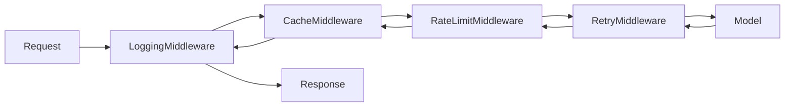
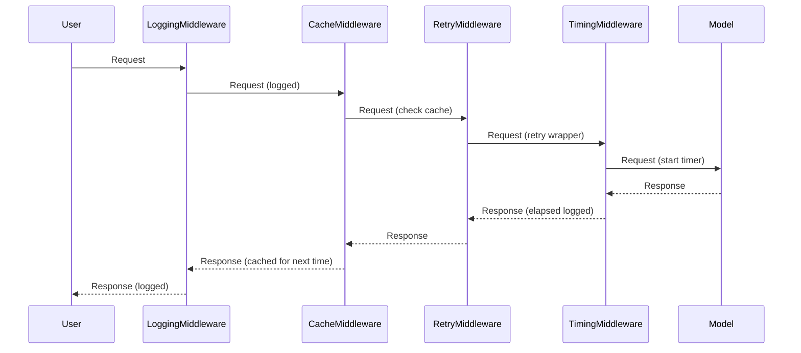

# Middleware Guide

Creating custom middleware and using Flux's built-in middleware for logging, caching, rate limiting, and retries.

---

## Overview

Middleware in Flux intercepts every request and response flowing through an agent. You can use it to add cross-cutting concerns without modifying agent logic.



---

## Prerequisites

- Python 3.10+
- Flux installed (`pip install flux-agents`)

---

## 1 -- Built-in Middleware

Flux ships four ready-to-use middleware classes:

### LoggingMiddleware

Logs every request and response for debugging and auditing.

```python
from flux import LoggingMiddleware

middleware = LoggingMiddleware()
```

### CacheMiddleware

Caches model responses so identical requests are served from cache without hitting the model API.

```python
from flux import CacheMiddleware

middleware = CacheMiddleware()
```

### RateLimitMiddleware

Limits how many requests a client can make within a time window.

```python
from flux import RateLimitMiddleware

# Allow 10 requests per minute
middleware = RateLimitMiddleware(max_requests=10, window_seconds=60)
```

### RetryMiddleware

Automatically retries failed requests with exponential backoff.

```python
from flux import RetryMiddleware

# Retry up to 3 times on transient errors
middleware = RetryMiddleware(max_retries=3, backoff_factor=2.0)
```

---

## 2 -- Custom Middleware

Implement the `Middleware` protocol to create your own. Every middleware receives a request context, a `next` function to call the next middleware (or the model), and returns a response.

```python
from flux.middleware.base import Middleware, RequestContext, Response, NextFn
import time


class TimingMiddleware(Middleware):
    """Measures and logs the time taken by each request."""

    async def handle(self, ctx: RequestContext, next_fn: NextFn) -> Response:
        start = time.perf_counter()
        response = await next_fn(ctx)
        elapsed = time.perf_counter() - start
        print(f"[Timing] {ctx.request_type} completed in {elapsed:.3f}s")
        return response
```

### Middleware Protocol

| Component | Description |
|---|---|
| `RequestContext` | Contains request metadata (model name, message count, etc.) |
| `NextFn` | Callable that invokes the next middleware or the model |
| `Response` | The model's response, which you can inspect or modify |

---

## 3 -- Compose Middleware

Chain multiple middleware together. They execute in the order you provide them.

```python
from flux import (
    LoggingMiddleware,
    CacheMiddleware,
    RetryMiddleware,
    RateLimitMiddleware,
)

middleware_stack = [
    LoggingMiddleware(),                              # 1. Log first
    CacheMiddleware(),                                # 2. Check cache
    RateLimitMiddleware(max_requests=10, window=60),  # 3. Rate limit
    RetryMiddleware(max_retries=3),                   # 4. Retry on failure
    TimingMiddleware(),                               # 5. Custom timing
]
```

!!! info "Execution order"
    Middleware wraps like layers. The first middleware in the list is the outermost layer -- it sees the request first and the response last. Think of it as a Russian nesting doll: Logging wraps Cache wraps RateLimit wraps Retry wraps the Model.

---

## 4 -- Attach Middleware to an Agent

```python
from flux import Agent
from flux.models.ollama import OllamaModel

agent = Agent(
    name="protected_agent",
    instructions="You are a helpful assistant.",
    model=OllamaModel(model="llama3.2"),
    middleware=[
        LoggingMiddleware(),
        CacheMiddleware(),
        RetryMiddleware(max_retries=3),
    ],
)
```

---

## 5 -- Full Working Example

```python
"""Custom TimingMiddleware with built-in middleware stack."""

import asyncio
import time
from flux import Agent, Runner
from flux.middleware.base import Middleware, RequestContext, Response, NextFn
from flux.models.ollama import OllamaModel


# --- Custom Middleware ------------------------------------------------

class TimingMiddleware(Middleware):
    """Measures and logs the time taken by each request."""

    async def handle(self, ctx: RequestContext, next_fn: NextFn) -> Response:
        start = time.perf_counter()
        response = await next_fn(ctx)
        elapsed = time.perf_counter() - start
        print(f"[Timing] {ctx.request_type} completed in {elapsed:.3f}s")
        return response


# --- Agent with middleware -------------------------------------------

agent = Agent(
    name="middleware_agent",
    instructions="You are a helpful assistant.",
    model=OllamaModel(model="llama3.2"),
    middleware=[
        TimingMiddleware(),
    ],
)


# --- Main ------------------------------------------------------------

async def main():
    result = await Runner.run(agent, "What is 2 + 2?")
    print(result.final_output)

asyncio.run(main())
```

---

## 6 -- Middleware Composition Diagram



---

## Next Steps

- Use [streaming](streaming.md) with middleware to log individual tokens
- Build a [RAG pipeline](rag.md) with cache middleware to avoid repeated search queries
- Add [guardrails](weather-agent.md#3-add-input-guardrails) alongside middleware for input validation
