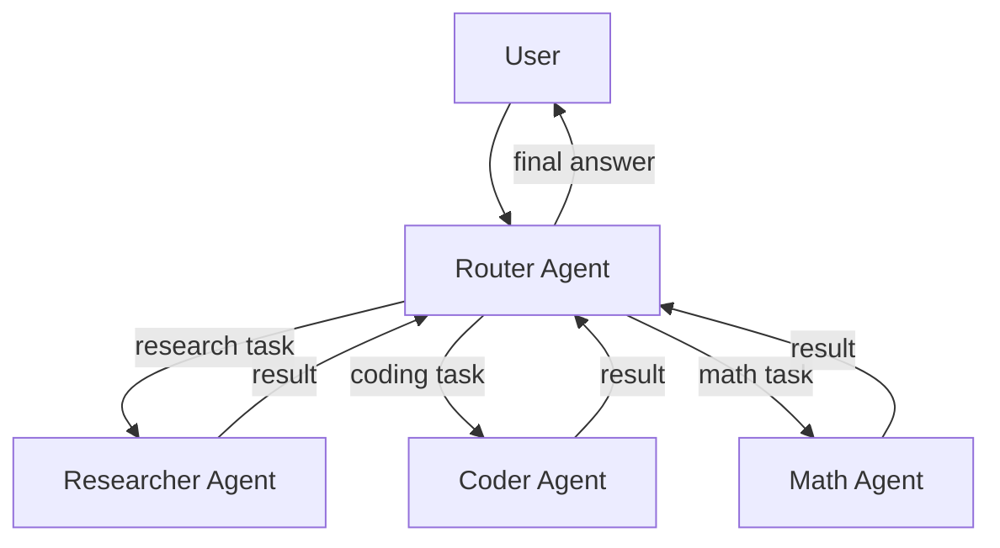
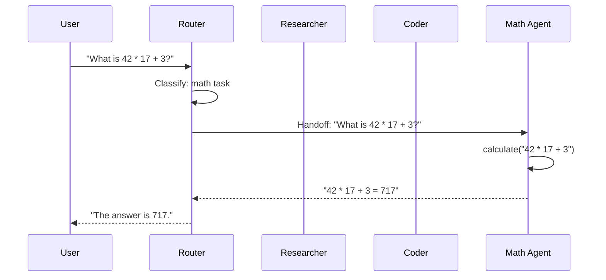

# Multi-Agent Systems

Building complex multi-agent systems with handoffs, routing, and collaboration using Flux.

---

## Overview

Flux lets you compose multiple specialized agents into a system where a **router** agent delegates tasks to the right **specialist**. This guide covers the core multi-agent patterns:

1. **Router pattern** -- a coordinator agent that hands off to specialists
2. **Specialist agents** -- agents with focused instructions and tools
3. **Conditional handoffs** -- routing decisions based on context
4. **Agent communication** -- how agents pass information via handoffs



---

## Prerequisites

- Python 3.10+
- Flux installed (`pip install flux-agents`)
- An Ollama instance running locally (or swap in `OpenAIModel` / `AnthropicModel`)

---

## 1 -- Define Specialist Agents

Each specialist has a focused system prompt, optional tools, and a clear scope of responsibility.

```python
from flux import Agent, tool
from flux.models.ollama import OllamaModel

@tool
def search_web(query: str) -> str:
    """Search the web for information on a topic.

    Args:
        query: The search query.
    """
    return f"Search results for '{query}': Found relevant articles and data."

@tool
def write_code(description: str) -> str:
    """Write code based on a description.

    Args:
        description: What the code should do.
    """
    return f"# Generated code\n# {description}\nprint('Hello from generated code')"

@tool
def calculate(expression: str) -> str:
    """Evaluate a mathematical expression.

    Args:
        expression: The math expression to evaluate.
    """
    try:
        result = eval(expression)  # noqa: S307 -- demo only
        return str(result)
    except Exception as e:
        return f"Error: {e}"


# --- Specialists -----------------------------------------------------

researcher = Agent(
    name="researcher",
    instructions=(
        "You are a research specialist. Use the search_web tool to find "
        "information. Provide well-sourced, factual answers."
    ),
    model=OllamaModel(model="llama3.2"),
    tools=[search_web],
)

coder = Agent(
    name="coder",
    instructions=(
        "You are a coding specialist. Use the write_code tool to generate "
        "code. Explain your approach clearly."
    ),
    model=OllamaModel(model="llama3.2"),
    tools=[write_code],
)

math_agent = Agent(
    name="math_agent",
    instructions=(
        "You are a math specialist. Use the calculate tool to evaluate "
        "expressions. Show your work step by step."
    ),
    model=OllamaModel(model="llama3.2"),
    tools=[calculate],
)
```

---

## 2 -- Set Up Handoffs

A `Handoff` connects a source agent to a target agent. The router uses handoffs to delegate.

```python
from flux.handoffs.handoff import Handoff

router = Agent(
    name="router",
    instructions=(
        "You are a router agent. Analyze the user's request and delegate "
        "it to the right specialist:\n"
        "- Use the researcher for factual questions or information lookups\n"
        "- Use the coder for programming or code generation tasks\n"
        "- Use the math_agent for mathematical calculations\n"
        "After receiving the specialist's response, relay it to the user."
    ),
    model=OllamaModel(model="llama3.2"),
    handoffs=(
        Handoff(source=router, target=researcher),
        Handoff(source=router, target=coder),
        Handoff(source=router, target=math_agent),
    ),
)
```

---

## 3 -- Run the Multi-Agent System

```python
import asyncio
from flux import Runner

async def main():
    # Research task
    result = await Runner.run(router, "What is retrieval-augmented generation?")
    print("Research:", result.final_output)

    # Coding task
    result = await Runner.run(router, "Write a Python function to reverse a string")
    print("\nCoding:", result.final_output)

    # Math task
    result = await Runner.run(router, "What is 42 * 17 + 3?")
    print("\nMath:", result.final_output)

asyncio.run(main())
```

---

## 4 -- Conditional Handoffs

You can make handoff decisions based on the content of the user's message by embedding logic in the router's instructions.

```python
router = Agent(
    name="router",
    instructions=(
        "You are an intelligent router. Analyze each request:\n\n"
        "1. If the request asks about a person, place, or factual topic -> hand off to researcher\n"
        "2. If the request asks to write, fix, or explain code -> hand off to coder\n"
        "3. If the request involves numbers, equations, or math -> hand off to math_agent\n"
        "4. If unsure, answer the question yourself.\n\n"
        "Always relay the specialist's complete response to the user."
    ),
    model=OllamaModel(model="llama3.2"),
    handoffs=(
        Handoff(source=router, target=researcher),
        Handoff(source=router, target=coder),
        Handoff(source=router, target=math_agent),
    ),
)
```

---

## 5 -- Streaming Multi-Agent Output

Stream responses even when agents hand off control.

```python
async def stream_multi_agent(query: str):
    result = await Runner.run_streamed(router, query)
    async for event in result.stream_events():
        if hasattr(event, "delta_text"):
            print(event.delta_text, end="", flush=True)
    print()

asyncio.run(stream_multi_agent("Calculate the factorial of 20"))
```

---

## 6 -- Full Working Example

```python
"""Multi-agent system with routing and handoffs."""

import asyncio
from flux import Agent, Runner, tool
from flux.handoffs.handoff import Handoff
from flux.models.ollama import OllamaModel


# --- Tools -----------------------------------------------------------

@tool
def search_web(query: str) -> str:
    """Search the web for information.

    Args:
        query: The search query.
    """
    return f"Search results for '{query}': Found relevant articles."

@tool
def write_code(description: str) -> str:
    """Write code based on a description.

    Args:
        description: What the code should do.
    """
    return f"# Generated code\n# {description}\nprint('Hello')"

@tool
def calculate(expression: str) -> str:
    """Evaluate a mathematical expression.

    Args:
        expression: The math expression to evaluate.
    """
    try:
        return str(eval(expression))  # noqa: S307
    except Exception as e:
        return f"Error: {e}"


# --- Specialists -----------------------------------------------------

researcher = Agent(
    name="researcher",
    instructions="You are a research specialist. Use search_web to find information.",
    model=OllamaModel(model="llama3.2"),
    tools=[search_web],
)

coder = Agent(
    name="coder",
    instructions="You are a coding specialist. Use write_code to generate code.",
    model=OllamaModel(model="llama3.2"),
    tools=[write_code],
)

math_agent = Agent(
    name="math_agent",
    instructions="You are a math specialist. Use calculate to evaluate expressions.",
    model=OllamaModel(model="llama3.2"),
    tools=[calculate],
)


# --- Router ----------------------------------------------------------

router = Agent(
    name="router",
    instructions=(
        "You are a router. Analyze the request and delegate to the right "
        "specialist: researcher for facts, coder for code, math_agent for "
        "math. Relay the specialist's response to the user."
    ),
    model=OllamaModel(model="llama3.2"),
    handoffs=(
        Handoff(source=router, target=researcher),
        Handoff(source=router, target=coder),
        Handoff(source=router, target=math_agent),
    ),
)


# --- Main ------------------------------------------------------------

async def main():
    result = await Runner.run(router, "What is 42 * 17 + 3?")
    print(result.final_output)

asyncio.run(main())
```

---

## Mermaid: Multi-Agent Handoff Flow



---

## Next Steps

- Add [guardrails](weather-agent.md#3-add-input-guardrails) to validate inputs at the router level
- Use [sessions](chatbot.md) to maintain conversation context across handoffs
- Apply [middleware](middleware.md) to log handoff decisions
