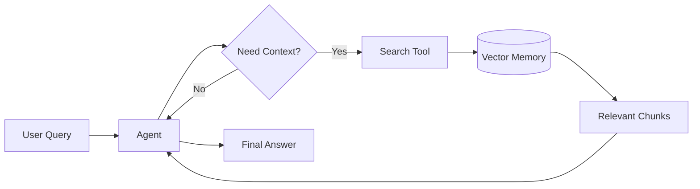
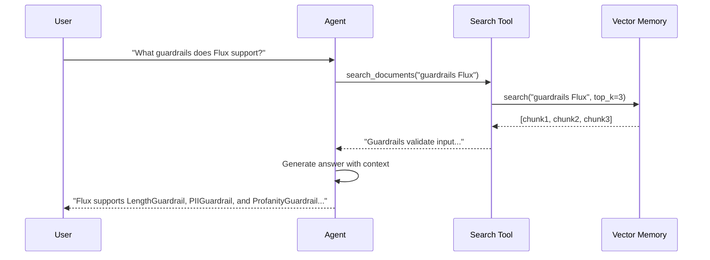

# RAG Pipeline Guide

Building a Retrieval-Augmented Generation pipeline with Flux agents, memory, and tools.

---

## Overview

Retrieval-Augmented Generation (RAG) lets an LLM answer questions grounded in your own documents. In Flux you combine:

1. **Memory** -- vector storage for document chunks
2. **Tools** -- custom search functions exposed to the agent
3. **Agent** -- orchestrates retrieval and generation



---

## Prerequisites

- Python 3.10+
- Flux installed (`pip install flux-agents`)
- An embedding-compatible model or local Ollama instance

---

## 1 -- Prepare Your Documents

Documents are split into chunks and stored in vector memory. Each chunk is a string with optional metadata.

```python
documents = [
    "Flux is a Python framework for building AI agents with tools and guardrails.",
    "Flux supports Ollama, OpenAI, and Anthropic as model providers.",
    "Handoffs allow agents to transfer control to specialist agents.",
    "Guardrails validate input and output to ensure safe agent behavior.",
    "Streaming provides real-time token-by-token output from agents.",
    "Sessions store conversation history across multiple turns.",
    "Middleware intercepts requests and responses for logging, caching, and retries.",
]
```

---

## 2 -- Set Up Vector Memory

Flux provides `Memory` as a pluggable storage layer. You can back it with a vector database or use a simple in-memory implementation.

```python
from flux.memory import Memory

memory = Memory()

# Add documents -- each gets an embedding and is stored for retrieval
for i, doc in enumerate(documents):
    memory.add(doc, metadata={"source": f"doc_{i}", "topic": "flux"})
```

!!! info "Vector backends"
    Flux's `Memory` class can be extended with vector backends like Chroma, Qdrant, or Pinecone. The interface stays the same: `add()` to store, `search()` to retrieve.

---

## 3 -- Create a Search Tool

Wrap the memory search in a `@tool` so the agent can call it during a conversation.

```python
from flux import tool

@tool
def search_documents(query: str) -> str:
    """Search the document store for information matching the query.

    Args:
        query: The search query to find relevant documents.
    """
    results = memory.search(query, top_k=3)
    if not results:
        return "No relevant documents found."
    return "\n---\n".join(results)
```

---

## 4 -- Build the RAG Agent

Combine the search tool with an agent that knows when and how to use it.

```python
from flux import Agent
from flux.models.ollama import OllamaModel

rag_agent = Agent(
    name="rag_agent",
    instructions=(
        "You are a knowledgeable assistant that answers questions using the "
        "provided documents. Always use the search_documents tool to find "
        "relevant information before answering. If the documents do not contain "
        "relevant information, say so honestly."
    ),
    model=OllamaModel(model="llama3.2"),
    tools=[search_documents],
)
```

---

## 5 -- Run the Pipeline

```python
import asyncio
from flux import Runner

async def main():
    query = "What guardrails does Flux support?"
    result = await Runner.run(rag_agent, query)
    print(result.final_output)

asyncio.run(main())
```

---

## 6 -- Streaming RAG

For real-time output while the agent retrieves and generates:

```python
async def stream_rag(query: str):
    result = await Runner.run_streamed(rag_agent, query)
    async for event in result.stream_events():
        if hasattr(event, "delta_text"):
            print(event.delta_text, end="", flush=True)
    print()

asyncio.run(stream_rag("How does streaming work in Flux?"))
```

---

## 7 -- Full Working Example

```python
"""Minimal RAG pipeline with Flux."""

import asyncio
from flux import Agent, Runner, tool
from flux.memory import Memory
from flux.models.ollama import OllamaModel

# --- Documents -------------------------------------------------------

documents = [
    "Flux is a Python framework for building AI agents with tools and guardrails.",
    "Flux supports Ollama, OpenAI, and Anthropic as model providers.",
    "Handoffs allow agents to transfer control to specialist agents.",
    "Guardrails validate input and output to ensure safe agent behavior.",
    "Streaming provides real-time token-by-token output from agents.",
    "Sessions store conversation history across multiple turns.",
    "Middleware intercepts requests and responses for logging, caching, and retries.",
]

# --- Memory ----------------------------------------------------------

memory = Memory()
for i, doc in enumerate(documents):
    memory.add(doc, metadata={"source": f"doc_{i}", "topic": "flux"})

# --- Tools -----------------------------------------------------------

@tool
def search_documents(query: str) -> str:
    """Search the document store for information matching the query.

    Args:
        query: The search query to find relevant documents.
    """
    results = memory.search(query, top_k=3)
    if not results:
        return "No relevant documents found."
    return "\n---\n".join(results)

# --- Agent -----------------------------------------------------------

rag_agent = Agent(
    name="rag_agent",
    instructions=(
        "You are a knowledgeable assistant that answers questions using the "
        "provided documents. Always use the search_documents tool to find "
        "relevant information before answering."
    ),
    model=OllamaModel(model="llama3.2"),
    tools=[search_documents],
)

# --- Main ------------------------------------------------------------

async def main():
    result = await Runner.run(rag_agent, "What guardrails does Flux support?")
    print(result.final_output)

asyncio.run(main())
```

---

## Mermaid: RAG Data Flow



---

## Next Steps

- Add [guardrails](weather-agent.md#3-add-input-guardrails) to validate queries
- Use [sessions](chatbot.md) to remember previous questions in the RAG conversation
- Apply [middleware](middleware.md) to cache repeated search results
