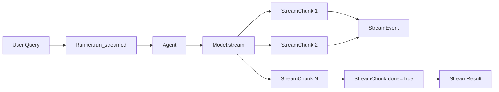
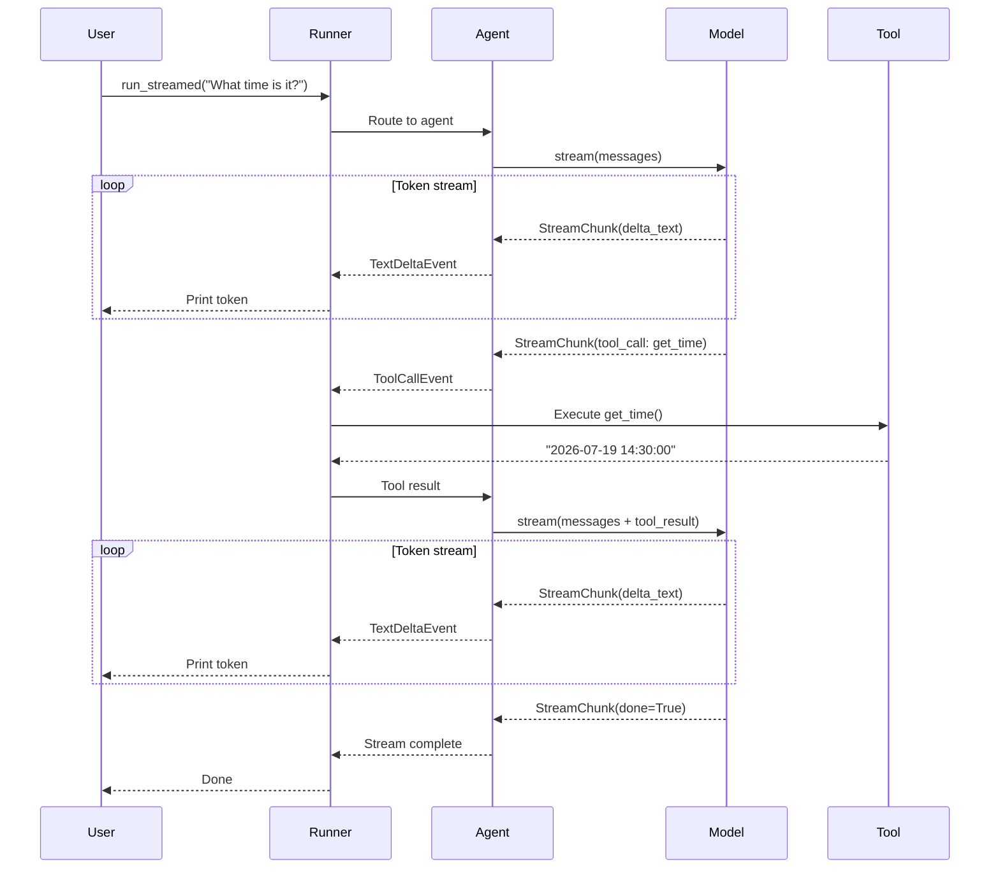

# Streaming Guide

Real-time streaming with Flux agents -- token-by-token output, stream events, and UI rendering.

---

## Overview

Streaming delivers model output incrementally as tokens are generated, rather than waiting for the full response. This gives users immediate feedback and enables real-time UI rendering.



---

## Prerequisites

- Python 3.10+
- Flux installed (`pip install flux-agents`)
- A model that supports streaming (all Flux built-in models do)

---

## 1 -- Basic Streaming

Use `Runner.run_streamed()` instead of `Runner.run()`. The result is a `StreamResult` you iterate over.

```python
import asyncio
from flux import Agent, Runner
from flux.models.ollama import OllamaModel

agent = Agent(
    name="stream_agent",
    instructions="You are a helpful assistant.",
    model=OllamaModel(model="llama3.2"),
)

async def main():
    result = await Runner.run_streamed(agent, "Tell me a short joke")
    async for event in result.stream_events():
        if hasattr(event, "delta_text"):
            print(event.delta_text, end="", flush=True)
    print()  # newline after stream

asyncio.run(main())
```

---

## 2 -- Stream Event Types

Flux defines several stream event types in `flux.streaming.events`:

| Event Class | Description |
|---|---|
| `TextDeltaEvent` | A chunk of generated text (`.delta_text`) |
| `ToolCallEvent` | A tool call request from the model (`.tool_name`, `.arguments`) |
| `StreamEvent` | Base class for all stream events |

```python
from flux.streaming.events import TextDeltaEvent, ToolCallEvent, StreamEvent
```

### Handling Different Event Types

```python
async for event in result.stream_events():
    if isinstance(event, TextDeltaEvent):
        print(event.delta_text, end="", flush=True)
    elif isinstance(event, ToolCallEvent):
        print(f"\n[Tool Call] {event.tool_name}({event.arguments})")
```

---

## 3 -- Streaming with Tools

When the model calls a tool during a stream, you will see `ToolCallEvent` events interleaved with text deltas. Flux handles tool execution automatically.

```python
from flux import Agent, Runner, tool
from flux.models.ollama import OllamaModel

@tool
def get_random_fact() -> str:
    """Get a random interesting fact."""
    return "Honey never spoils. Archaeologists found 3,000-year-old honey in Egyptian tombs that was still edible."

agent = Agent(
    name="fact_agent",
    instructions="Use the get_random_fact tool to share interesting facts.",
    model=OllamaModel(model="llama3.2"),
    tools=[get_random_fact],
)

async def main():
    result = await Runner.run_streamed(agent, "Tell me a random fact")
    async for event in result.stream_events():
        if isinstance(event, TextDeltaEvent):
            print(event.delta_text, end="", flush=True)
        elif isinstance(event, ToolCallEvent):
            print(f"\n[Calling tool: {event.tool_name}]")
    print()

asyncio.run(main())
```

---

## 4 -- Streaming with Sessions

Streaming works with sessions for multi-turn conversations.

```python
from flux import Agent, Runner, InMemorySession
from flux.models.ollama import OllamaModel

agent = Agent(
    name="chatbot",
    instructions="You are a helpful chatbot.",
    model=OllamaModel(model="llama3.2"),
)

async def main():
    session = InMemorySession()

    # Turn 1
    result1 = await Runner.run_streamed(agent, "Hi, I'm Bob!", session=session)
    print("Bot: ", end="")
    async for event in result1.stream_events():
        if hasattr(event, "delta_text"):
            print(event.delta_text, end="", flush=True)
    print("\n")

    # Turn 2
    result2 = await Runner.run_streamed(agent, "What's my name?", session=session)
    print("Bot: ", end="")
    async for event in result2.stream_events():
        if hasattr(event, "delta_text"):
            print(event.delta_text, end="", flush=True)
    print()

asyncio.run(main())
```

---

## 5 -- Real-Time UI Rendering

Accumulate tokens to build a live display that updates as the model generates.

```python
async def render_streaming_ui(query: str):
    """Simulate a real-time UI that updates token by token."""
    result = await Runner.run_streamed(agent, query)

    buffer = ""
    print("\033c", end="")  # clear terminal
    async for event in result.stream_events():
        if hasattr(event, "delta_text"):
            buffer += event.delta_text
            # Re-render the full response (in a real UI, update a widget)
            print(f"\r{buffer}", end="", flush=True)
    print("\n")  # done
```

---

## 6 -- Streaming with Middleware

Middleware works transparently with streaming. For example, a logging middleware logs the request while the stream flows through.

```python
from flux import Agent, Runner, LoggingMiddleware
from flux.models.ollama import OllamaModel

agent = Agent(
    name="stream_agent",
    instructions="You are a helpful assistant.",
    model=OllamaModel(model="llama3.2"),
    middleware=[LoggingMiddleware()],
)

async def main():
    result = await Runner.run_streamed(agent, "Explain quantum computing in one sentence")
    async for event in result.stream_events():
        if hasattr(event, "delta_text"):
            print(event.delta_text, end="", flush=True)
    print()

asyncio.run(main())
```

---

## 7 -- Full Working Example

```python
"""Streaming demo with tools and session persistence."""

import asyncio
from flux import Agent, Runner, tool, InMemorySession
from flux.models.ollama import OllamaModel
from flux.streaming.events import TextDeltaEvent, ToolCallEvent


# --- Tools -----------------------------------------------------------

@tool
def get_time() -> str:
    """Get the current date and time."""
    from datetime import datetime
    return datetime.now().strftime("%Y-%m-%d %H:%M:%S")

@tool
def reverse_string(text: str) -> str:
    """Reverse a string.

    Args:
        text: The string to reverse.
    """
    return text[::-1]


# --- Agent -----------------------------------------------------------

agent = Agent(
    name="stream_agent",
    instructions=(
        "You are a helpful assistant with access to tools. "
        "Use tools when appropriate and explain what you are doing."
    ),
    model=OllamaModel(model="llama3.2"),
    tools=[get_time, reverse_string],
)


# --- Main ------------------------------------------------------------

async def main():
    session = InMemorySession()

    # Turn 1 -- uses get_time tool
    print("--- Turn 1 ---")
    result1 = await Runner.run_streamed(
        agent, "What time is it right now?", session=session
    )
    async for event in result1.stream_events():
        if isinstance(event, TextDeltaEvent):
            print(event.delta_text, end="", flush=True)
        elif isinstance(event, ToolCallEvent):
            print(f"\n[Calling: {event.tool_name}]")
    print("\n")

    # Turn 2 -- uses reverse_string tool
    print("--- Turn 2 ---")
    result2 = await Runner.run_streamed(
        agent, "Can you reverse the word 'hello'?", session=session
    )
    async for event in result2.stream_events():
        if isinstance(event, TextDeltaEvent):
            print(event.delta_text, end="", flush=True)
        elif isinstance(event, ToolCallEvent):
            print(f"\n[Calling: {event.tool_name}]")
    print()

    # Turn 3 -- session remembers context
    print("--- Turn 3 ---")
    result3 = await Runner.run_streamed(
        agent, "What time did I ask about earlier?", session=session
    )
    async for event in result3.stream_events():
        if isinstance(event, TextDeltaEvent):
            print(event.delta_text, end="", flush=True)
    print()


if __name__ == "__main__":
    asyncio.run(main())
```

---

## Mermaid: Streaming Event Flow



---

## Next Steps

- Add [middleware](middleware.md) to log streaming latency per token
- Build a [chatbot](chatbot.md) with streaming and session persistence
- Implement a [custom provider](custom-provider.md) with streaming support
