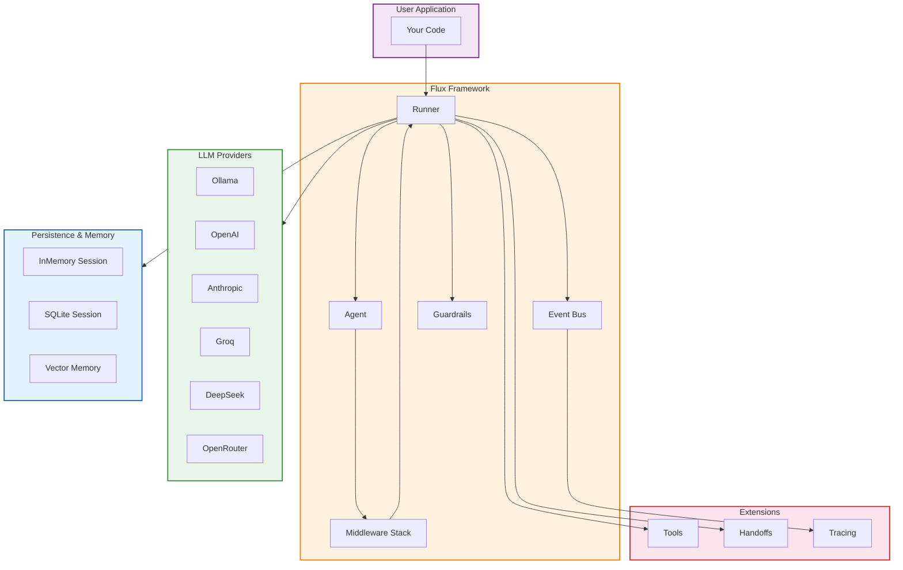

---
hide:
  - navigation
  - toc
---

<style>
  .md-typeset .hero-banner {
    text-align: center;
    padding: 4rem 2rem 3rem;
    background: linear-gradient(135deg, rgba(103, 58, 183, 0.08) 0%, rgba(255, 193, 7, 0.06) 100%);
    border-radius: 1rem;
    margin-bottom: 2.5rem;
  }
  .md-typeset .hero-banner h1 {
    font-size: 3rem;
    font-weight: 800;
    letter-spacing: -0.03em;
    margin-bottom: 0.25rem;
  }
  .md-typeset .hero-banner .hero-subtitle {
    font-size: 1.15rem;
    color: var(--md-default-fg-color--light);
    margin-top: 0.5rem;
    letter-spacing: 0.04em;
    font-weight: 500;
  }
  .md-typeset .hero-logo {
    font-size: 5rem;
    margin-bottom: 0.5rem;
  }
  .md-typeset .feature-grid .grid-item {
    border: 1px solid var(--md-default-fg-color--lightest);
    border-radius: 0.75rem;
    padding: 1.5rem;
    transition: box-shadow 0.25s ease, border-color 0.25s ease;
    height: 100%;
  }
  .md-typeset .feature-grid .grid-item:hover {
    box-shadow: 0 4px 20px rgba(0,0,0,0.08);
    border-color: var(--md-accent-fg-color);
  }
  .md-typeset .feature-grid .grid-item h3 {
    margin-bottom: 0.4rem;
  }
  .md-typeset .quick-links .grid-item {
    text-align: center;
    border: 1px solid var(--md-default-fg-color--lightest);
    border-radius: 0.75rem;
    padding: 1.5rem 1rem;
    transition: box-shadow 0.25s ease, border-color 0.25s ease;
  }
  .md-typeset .quick-links .grid-item:hover {
    box-shadow: 0 4px 20px rgba(0,0,0,0.08);
    border-color: var(--md-accent-fg-color);
  }
  .md-typeset .quick-links .grid-item h3 {
    margin-bottom: 0.3rem;
  }
  .md-typeset .section-title {
    text-align: center;
    margin-bottom: 2rem;
  }
  .md-typeset .section-title h2 {
    font-size: 1.8rem;
    font-weight: 700;
  }
  .md-typeset .section-title p {
    color: var(--md-default-fg-color--light);
    font-size: 1.05rem;
  }
  .md-typeset .roadmap-item {
    display: flex;
    align-items: flex-start;
    gap: 0.75rem;
    margin-bottom: 0.75rem;
  }
  .md-typeset .roadmap-icon {
    font-size: 1.2rem;
    margin-top: 0.15rem;
  }
</style>

<!-- ─────────────────────────── HERO ─────────────────────────── -->

<div class="hero-banner" markdown>

<div class="hero-logo" markdown>
:material-robot:{ .md-icon style="color: var(--md-accent-fg-color); font-size: 5rem;" }
</div>

# Flux Agents

**A Python-first Agentic AI Framework**

<span class="hero-subtitle">
Provider-agnostic · Async-first · Middleware-driven · Zero core dependencies
</span>

<div style="margin-top: 1.5rem;" markdown>

[:material-rocket-launch: Getting Started](getting-started/installation.md){ .md-button .md-button--primary }
[:material-github: View on GitHub](https://github.com/Hafiz-Muhammad-Umar12/Flux-Framework){ .md-button }
[:material-api: API Reference](api-reference/agents.md){ .md-button }

</div>
</div>

---

<!-- ─────────────────────── QUICK START ─────────────────────── -->

<div class="section-title" markdown>

## Up and Running in 30 Seconds

Install, import, and get a response from any supported provider.

</div>

=== "Install"

    ```bash
    pip install flux-agents
    ```

=== "Code"

    ```python
    from flux import Agent, Runner

    agent = Agent(name="assistant", instructions="You are helpful")
    result = Runner.run_sync(agent, "Hello!")
    print(result.final_output)
    ```

=== "Async"

    ```python
    import asyncio
    from flux import Agent, Runner

    async def main():
        agent = Agent(name="assistant", instructions="You are helpful")
        result = await Runner.run(agent, "Hello!")
        print(result.final_output)

    asyncio.run(main())
    ```

=== "Streaming"

    ```python
    import asyncio
    from flux import Agent, Runner

    async def main():
        agent = Agent(name="assistant", instructions="Tell me a joke")
        stream = await Runner.run_streamed(agent, "Tell me a joke")
        async for event in stream:
            if hasattr(event, "delta"):
                print(event.delta, end="", flush=True)
        print()

    asyncio.run(main())
    ```

---

<!-- ─────────────────────── FEATURES GRID ─────────────────────── -->

<div class="section-title" markdown>

## Everything You Need to Build Agentic Systems

Flux gives you a complete toolkit for building, testing, and deploying AI agents --
from single-purpose assistants to complex multi-agent pipelines.

</div>

<div class="grid cards" markdown>

-   :material-power-plug:{ .lg .middle } **Provider Agnostic**

    ---

    Switch between Ollama, OpenAI, Anthropic, Groq, DeepSeek, and OpenRouter
    with a single import change. No vendor lock-in, ever.

    [:octicons-arrow-right-24: Providers](core-concepts/providers.md)

-   :material-lightning-bolt:{ .lg .middle } **Async First**

    ---

    Non-blocking by default for maximum throughput. Need synchronous code?
    `Runner.run_sync()` is always available.

    [:octicons-arrow-right-24: Runners](api-reference/agents.md)

-   :material-shape:{ .lg .middle } **Protocol Based**

    ---

    Structural typing via `Protocol` -- no inheritance required. Any class with
    the right methods is a valid Tool, Model, or Session.

    [:octicons-arrow-right-24: Protocols](core-concepts/protocols.md)

-   :material-puzzle:{ .lg .middle } **Middleware**

    ---

    Composable middleware for logging, caching, retry, and rate-limiting.
    Wrap any agent run with zero coupling to the core framework.

    [:octicons-arrow-right-24: Middleware](core-concepts/middleware.md)

-   :material-broadcast:{ .lg .middle } **Event Driven**

    ---

    Decoupled event bus for observability and analytics. Subscribe to agent,
    tool, and session events without modifying the runner.

    [:octicons-arrow-right-24: Events](core-concepts/events.md)

-   :material-wrench:{ .lg .middle } **Tools**

    ---

    Decorate any function with `@tool` and it becomes callable by agents.
    Built-in tools for shell, file I/O, and more.

    [:octicons-arrow-right-24: Tools](core-concepts/tools.md)

-   :material-swap-horizontal:{ .lg .middle } **Handoffs**

    ---

    Agent-to-agent routing for multi-agent systems. Let a router delegate to
    specialist agents automatically.

    [:octicons-arrow-right-24: Handoffs](core-concepts/handoffs.md)

-   :material-shield-check:{ .lg .middle } **Guardrails**

    ---

    Input and output validation built in. Length checks, PII detection,
    profanity filtering, and custom guardrails.

    [:octicons-arrow-right-24: Guardrails](core-concepts/guardrails.md)

-   :material-database:{ .lg .middle } **Sessions**

    ---

    In-memory sessions for ephemeral chats and SQLite-backed sessions for
    persistence across restarts.

    [:octicons-arrow-right-24: Sessions](core-concepts/sessions.md)

-   :material-brain:{ .lg .middle } **Memory**

    ---

    Conversation memory and vector-based retrieval for long-term knowledge
    across sessions.

    [:octicons-arrow-right-24: Memory](core-concepts/memory.md)

-   :material-water:{ .lg .middle } **Streaming**

    ---

    Real-time token streaming with structured events. Get partial responses
    as they are generated.

    [:octicons-arrow-right-24: Streaming](guides/streaming.md)

-   :material-clipboard-text-search:{ .lg .middle } **Tracing**

    ---

    Console and file-based tracing for debugging and auditing. Capture every
    model call, tool invocation, and handoff.

    [:octicons-arrow-right-24: Tracing](core-concepts/middleware.md)

</div>

---

<!-- ─────────────────────── ARCHITECTURE ─────────────────────── -->

<div class="section-title" markdown>

## Architecture at a Glance

A clean, layered design where every component is optional and composable.

</div>



---

<!-- ─────────────────────── WHY FLUX? ─────────────────────── -->

<div class="section-title" markdown>

## Why Flux?

Six design principles that set Flux apart.

</div>

<div class="grid cards" markdown>

-   :material-shape-plus:{ .lg .middle } **Protocol over ABC**

    ---

    No inheritance required. Any class with the right methods works as a
    Model, Tool, or Session. Your code stays yours -- no framework coupling.

    ```python
    # Works immediately -- no import, no base class
    class MyModel:
        async def complete(self, request): ...
        async def stream(self, request): ...
    ```

-   :material-lightning-bolt-outline:{ .lg .middle } **Async First**

    ---

    Every code path is async for maximum concurrency. Sync wrappers are
    provided for scripts and notebooks, so you never pay for what you don't
    use.

    ```python
    # Async (default)
    result = await Runner.run(agent, "Hello!")
    # Sync wrapper
    result = Runner.run_sync(agent, "Hello!")
    ```

-   :material-package-variant:{ .lg .middle } **Zero Core Dependencies**

    ---

    The base framework ships with zero third-party dependencies. Provider
    packages are installed on demand -- no bloated environments.

    ```bash
    # Minimal install
    pip install flux-agents
    # Add only what you need
    pip install flux-agents[ollama]
    pip install flux-agents[openai]
    ```

-   :material-puzzle-outline:{ .lg .middle } **Middleware over Hooks**

    ---

    Composable middleware wraps the entire run cycle. Modify requests, log
    calls, add caching, or retry failures -- all without touching the runner.

    ```python
    from flux import RetryMiddleware, CacheMiddleware

    agent = Agent(
        name="cached",
        instructions="Be helpful",
        middleware=[CacheMiddleware(ttl=300), RetryMiddleware(max_retries=3)],
    )
    ```

-   :material-lock-outline:{ .lg .middle } **Immutable Agents**

    ---

    Agents are immutable dataclasses. Share them across threads without fear.
    Use `clone()` to create modified copies safely.

    ```python
    agent = Agent(name="bot", instructions="Helpful")
    specialist = agent.clone(name="specialist", instructions="Expert mode")
    ```

-   :material-broadcast-outline:{ .lg .middle } **Event-Driven**

    ---

    A decoupled event bus for observability, analytics, and custom hooks.
    Subscribe from anywhere -- no framework modification needed.

    ```python
    from flux import get_event_bus

    bus = get_event_bus()
    bus.on("agent.start", lambda e: print(f"Started: {e.data}"))
    bus.on("tool.end", lambda e: log_to_analytics(e))
    ```

</div>

---

<!-- ─────────────────────── INSTALLATION ─────────────────────── -->

<div class="section-title" markdown>

## Installation

One command to start. Add providers as you need them.

</div>

=== "Core"

    ```bash
    pip install flux-agents
    ```

    !!! info "Zero Dependencies"
        The core package has no third-party dependencies.
        Provider SDKs are installed separately.

=== "Ollama"

    ```bash
    pip install flux-agents[ollama]
    ```

    ```python
    from flux.models.ollama import OllamaModel

    model = OllamaModel(model="qwen2:1.5b")
    agent = Agent(name="local", instructions="Be helpful", model=model)
    ```

=== "OpenAI"

    ```bash
    pip install flux-agents[openai]
    ```

    ```python
    from flux.models.openai_provider import OpenAIModel

    model = OpenAIModel(model="gpt-4o-mini")
    agent = Agent(name="gpt", instructions="Be helpful", model=model)
    ```

=== "Anthropic"

    ```bash
    pip install flux-agents[anthropic]
    ```

    ```python
    from flux.models.anthropic import AnthropicModel

    model = AnthropicModel(model="claude-sonnet-4-20250514")
    agent = Agent(name="claude", instructions="Be helpful", model=model)
    ```

=== "All Providers"

    ```bash
    pip install flux-agents[full]
    ```

---

<!-- ─────────────────────── MORE EXAMPLES ─────────────────────── -->

<div class="section-title" markdown>

## See It in Action

Real patterns you can copy into your projects.

</div>

=== "Tools"

    ```python
    from flux import Agent, Runner, tool

    @tool
    def calculator(expression: str) -> str:
        """Evaluate a math expression."""
        return str(eval(expression))

    agent = Agent(
        name="math_bot",
        instructions="Use calculator for math",
        tools=[calculator],
    )

    result = Runner.run_sync(agent, "What is 15 * 23?")
    print(result.final_output)
    ```

=== "Handoffs"

    ```python
    import asyncio
    from flux import Agent, Runner
    from flux.handoffs.handoff import Handoff

    async def main():
        coder = Agent(name="coder", instructions="Write code")
        writer = Agent(name="writer", instructions="Write content")

        router = Agent(
            name="router",
            instructions="Route to specialist",
            handoffs=(
                Handoff(source=router, target=coder),
                Handoff(source=router, target=writer),
            ),
        )

        result = await Runner.run(router, "Write Python hello world")
        print(f"Handled by: {result.last_agent.name}")

    asyncio.run(main())
    ```

=== "Guardrails"

    ```python
    from flux import Agent, Runner, LengthGuardrail, PIIGuardrail

    agent = Agent(
        name="safe_bot",
        instructions="Be helpful",
        guardrails=(
            LengthGuardrail(max_chars=5000),
            PIIGuardrail(),
        ),
    )

    result = Runner.run_sync(agent, "Tell me about Python")
    ```

=== "Sessions"

    ```python
    import asyncio
    from flux import Agent, Runner, SQLiteSession

    async def main():
        agent = Agent(name="bot", instructions="Remember everything")
        session = SQLiteSession(db_path="chat.db")

        r1 = await Runner.run(agent, "My name is Sara", session=session)
        r2 = await Runner.run(agent, "What is my name?", session=session)
        print(f"Bot: {r2.final_output}")

    asyncio.run(main())
    ```

=== "Middleware"

    ```python
    from flux import Agent
    from flux.middleware.base import Middleware, NextFn, RequestContext, Response

    class TimingMiddleware:
        async def process(self, ctx: RequestContext, next: NextFn) -> Response:
            import time
            start = time.time()
            response = await next(ctx)
            print(f"Elapsed: {time.time() - start:.2f}s")
            return response

    agent = Agent(
        name="timed",
        instructions="Be helpful",
        middleware=[TimingMiddleware()],
    )
    ```

=== "Custom Model"

    ```python
    from flux import Agent, Runner
    from flux.models.base import ModelRequest, ModelResponse, StreamChunk

    class MyModel:
        async def complete(self, request: ModelRequest) -> ModelResponse:
            return ModelResponse(content="Hello from my model!")

        async def stream(self, request: ModelRequest):
            yield StreamChunk(delta_text="Hello!", done=True)

    agent = Agent(name="custom", instructions="Be helpful", model=MyModel())
    result = Runner.run_sync(agent, "Hi")
    print(result.final_output)
    ```

---

<!-- ─────────────────────── QUICK LINKS ─────────────────────── -->

<div class="section-title" markdown>

## Explore the Documentation

</div>

<div class="grid cards quick-links" markdown>

-   :material-rocket-launch:{ .lg .middle } **Getting Started**

    ---

    Installation, quickstart, and your first agent.

    [:octicons-arrow-right-24: Getting Started](getting-started/installation.md)

-   :material-book-open-variant:{ .lg .middle } **Core Concepts**

    ---

    Agents, tools, providers, sessions, middleware, and more.

    [:octicons-arrow-right-24: Core Concepts](core-concepts/agents.md)

-   :material-api:{ .lg .middle } **API Reference**

    ---

    Complete class and function documentation.

    [:octicons-arrow-right-24: API Reference](api-reference/agents.md)

-   :material-compass:{ .lg .middle } **Guides**

    ---

    Step-by-step tutorials for real-world patterns.

    [:octicons-arrow-right-24: Guides](guides/weather-agent.md)

-   :material-language-python:{ .lg .middle } **Examples**

    ---

    Copy-paste code samples for every feature.

    [:octicons-arrow-right-24: Examples](examples/hello-world.md)

-   :material-cog:{ .lg .middle } **Architecture**

    ---

    Design decisions, directory structure, and execution flow.

    [:octicons-arrow-right-24: Architecture](contributing/architecture.md)

</div>

---

<!-- ─────────────────────── COMMUNITY ─────────────────────── -->

<div class="section-title" markdown>

## Community

</div>

<div class="grid cards" markdown>

-   :material-github:{ .lg .middle } **GitHub**

    ---

    Source code, issue tracker, and release notes. Contributions are welcome.

    [:octicons-arrow-right-24: flux-agents/flux](https://github.com/Hafiz-Muhammad-Umar12/Flux-Framework)

-   :material-pypi:{ .lg .middle } **PyPI**

    ---

    Published packages for core and all provider extras.

    [:octicons-arrow-right-24: flux-agents on PyPI](https://pypi.org/project/flux-agents/)

-   :material-twitter:{ .lg .middle } **Twitter / X**

    ---

    Announcements, tips, and community highlights.

    [:octicons-arrow-right-24: @flux_agents](https://x.com/muhaammad_umar_)

</div>

---

<!-- ─────────────────────── ROADMAP ─────────────────────── -->

<div class="section-title" markdown>

## Roadmap

What is coming next for Flux Agents.

</div>

!!! abstract "Upcoming Features"

    <div class="roadmap-item">
    <span class="roadmap-icon">:material-check-circle-outline:</span>
    <div>

    **v0.2 -- Structured Output &amp; Pydantic Integration**

    Define output schemas with Pydantic models. Agents will return validated,
    typed data instead of raw strings.

    </div>
    </div>

    <div class="roadmap-item">
    <span class="roadmap-icon">:material-clock-outline:</span>
    <div>

    **v0.2 -- Agent Cloning with Presets**

    Pre-built agent templates for common patterns: chatbot, researcher,
    coder, and summarizer.

    </div>
    </div>

    <div class="roadmap-item">
    <span class="roadmap-icon">:material-clock-outline:</span>
    <div>

    **v0.3 -- HTTP Server &amp; REST API**

    Built-in HTTP server to expose agents as API endpoints with streaming
    support.

    </div>
    </div>

    <div class="roadmap-item">
    <span class="roadmap-icon">:material-clock-outline:</span>
    <div>

    **v0.3 -- MCP (Model Context Protocol) Support**

    Connect Flux agents to MCP servers for tool and resource discovery across
    the ecosystem.

    </div>
    </div>

    <div class="roadmap-item">
    <span class="roadmap-icon">:material-clock-outline:</span>
    <div>

    **v0.4 -- Evaluation &amp; Benchmarking**

    Built-in evaluation harness to test agent accuracy, latency, and cost
    across providers.

    </div>
    </div>

    <div class="roadmap-item">
    <span class="roadmap-icon">:material-clock-outline:</span>
    <div>

    **v0.4 -- Multi-Modal Support**

    Vision and audio inputs through provider-specific multi-modal APIs.

    </div>
    </div>

!!! tip "Get Involved"

    Flux is open source and community-driven. Check the
    [Contributing guide](contributing/contributing.md) to get started,
    or open an issue on [GitHub](https://github.com/flux-agents/flux/issues)
    to request a feature.

---

<!-- ─────────────────────── FOOTER CTA ─────────────────────── -->

<div style="text-align: center; padding: 3rem 1rem 2rem;" markdown>

### Ready to build your first agent?

[:material-rocket-launch: Get Started Now](getting-started/installation.md){ .md-button .md-button--primary }

</div>
